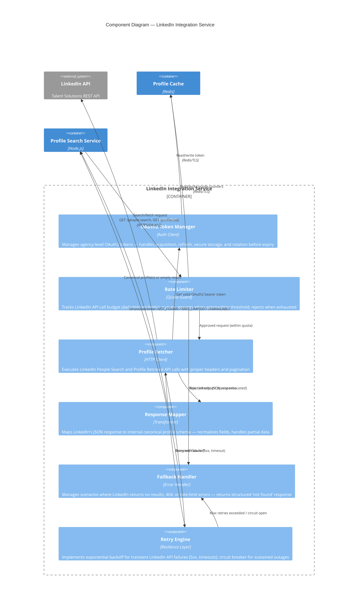

# C4 Component Diagram — LinkedIn Integration Service

## Description
Internal components of the LinkedIn Integration microservice, responsible for managing OAuth2 credentials, executing LinkedIn API calls, handling rate limits, mapping response data, and gracefully managing cases where candidates have no LinkedIn profile.

## Domain Events Published

| Event | Trigger | Consumers |
|-------|---------|-----------|
| `LinkedInProfileFetched` | Successful profile retrieval from LinkedIn API | Profile Cache (store), Analytics |
| `LinkedInSearchExecuted` | People Search API call completed | Monitoring (quota tracking) |
| `LinkedInProfileNotFound` | LinkedIn returns 0 results for a candidate search | Profile Search (display "not found"), Candidate Index |
| `LinkedInRateLimitHit` | Daily/minute quota reached | Admin Alert, Queue Manager |
| `LinkedInApiUnavailable` | Circuit breaker opened after repeated failures | Admin Alert, Fallback Handler |
| `OAuthTokenRefreshed` | OAuth2 token successfully refreshed before expiry | Audit Log |

## Data Flow Characteristics

| Metric | Value |
|--------|-------|
| LinkedIn API rate limit | ~100 calls/day (varies by API tier; Talent Solutions allows more) |
| People Search latency | 500ms–2s (LinkedIn side) |
| Profile Retrieval latency | 300ms–1s (LinkedIn side) |
| Token refresh frequency | Every 60 days (LinkedIn OAuth2 token lifetime) |
| Circuit breaker threshold | Opens after 5 consecutive failures; half-open retry after 60s |
| Retry policy | Exponential backoff: 1s, 2s, 4s (max 3 retries) |
| Fallback response time | < 50ms (immediate structured error) |
