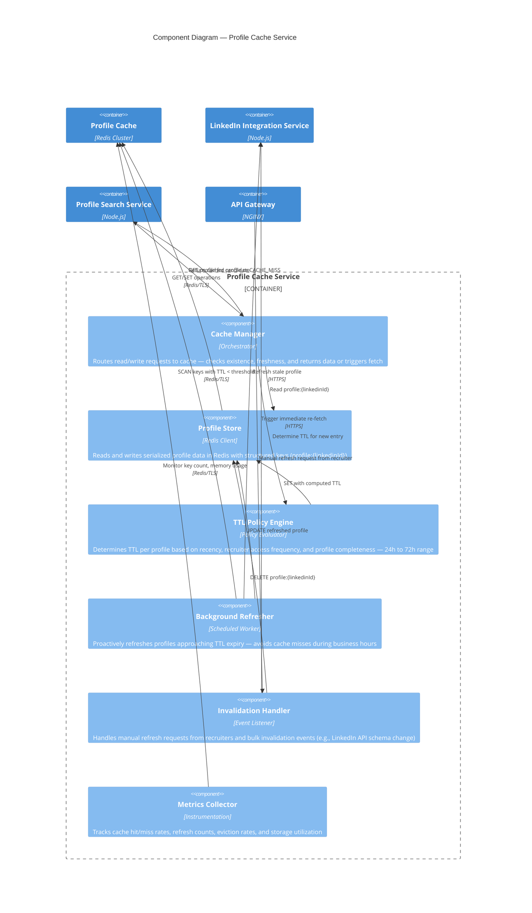

# C4 Component Diagram — Profile Cache Service

## Description
Internal components of the Profile Cache microservice, responsible for storing retrieved LinkedIn profiles with time-based expiry, serving cached data for repeated lookups, triggering background refresh of stale entries, and managing invalidation policies.

## Domain Events Published

| Event | Trigger | Consumers |
|-------|---------|-----------|
| `ProfileCacheHit` | Cached profile served to Profile Search Service | Monitoring (hit rate metrics) |
| `ProfileCacheMiss` | No cached profile found, triggering LinkedIn fetch | Monitoring, LinkedIn Integration |
| `ProfileCacheRefreshed` | Background refresher updated a stale profile | Audit Log |
| `ProfileCacheInvalidated` | Recruiter requested manual refresh or bulk invalidation | Audit Log, LinkedIn Integration |
| `ProfileCacheEvicted` | Profile expired by TTL or memory pressure | Monitoring (eviction rate) |
| `CacheCapacityWarning` | Redis memory usage exceeds 80% threshold | Admin Alert |

## Data Flow Characteristics

| Metric | Value |
|--------|-------|
| Cache hit rate target | > 80% (most candidates searched repeatedly) |
| Default TTL | 48 hours (adjustable per policy) |
| TTL range | 24–72 hours based on access frequency and profile completeness |
| Background refresh window | Profiles with < 4h remaining TTL during business hours |
| Max cached profiles | ~50,000 (agency's active candidate pool) |
| Average profile size | 5–15 KB (serialized JSON) |
| Redis memory budget | ~500 MB (50K profiles × 10 KB avg) |
| Cache read latency | < 5ms (Redis cluster) |
