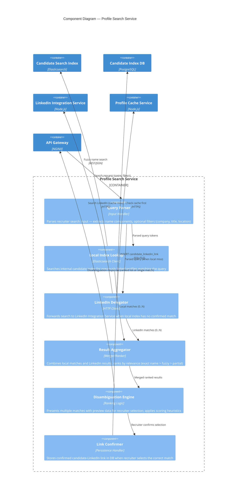

# C4 Component Diagram — Profile Search Service

## Description
Internal components of the Profile Search microservice, showing how a recruiter's name query is processed through parsing, local index lookup, LinkedIn delegation, and disambiguation before returning results.

## Domain Events Published

| Event | Trigger | Consumers |
|-------|---------|-----------|
| `CandidateSearched` | Recruiter submits a name search | Analytics, Audit Log |
| `ProfileLinkConfirmed` | Recruiter selects correct LinkedIn match | Candidate Index, ATS Sync |
| `NoProfileFound` | LinkedIn returns zero results for a query | Candidate Index (flag as "no LinkedIn") |
| `DisambiguationPresented` | Multiple matches returned to recruiter | Analytics (track disambiguation rate) |
| `SearchFromCache` | Result served from cache without LinkedIn call | Monitoring (cache hit tracking) |

## Data Flow Characteristics

| Metric | Value |
|--------|-------|
| Inbound throughput | ~10–50 searches/minute (agency-wide, business hours) |
| Local index size | 10,000–100,000 candidates (agency's historical database) |
| Elasticsearch response | < 50ms (fuzzy name match) |
| LinkedIn API delegation | < 2s (when cache miss, subject to LinkedIn latency) |
| Disambiguation rate | ~30% of searches (common names yield multiple results) |
| Link confirmation rate | ~85% (recruiters find correct profile on first search) |
