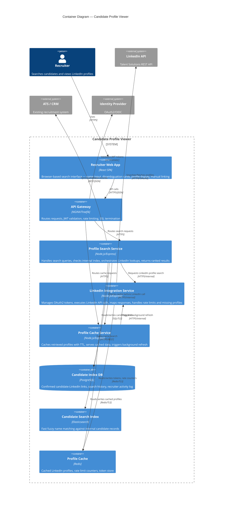

# C4 Container Diagram — Candidate Profile Viewer

## Description
Shows the high-level runtime containers that compose the Candidate Profile Viewer system — applications, services, databases, cache, and search infrastructure.

## Container Responsibilities

| Container | Scaling Strategy | Data Ownership |
|-----------|-----------------|----------------|
| Recruiter Web App | CDN for static assets; edge caching | None (stateless SPA) |
| API Gateway | Horizontal, multi-instance behind LB | None (stateless) |
| Profile Search Service | Horizontal (2–4 instances); stateless | Search orchestration logic |
| LinkedIn Integration Service | Single instance with queue (rate limit gated) | OAuth2 tokens, API quota state |
| Profile Cache Service | Horizontal (read-heavy) | Cache policy, TTL management |
| Candidate Index DB (PostgreSQL) | Primary + read replica | Candidate-LinkedIn links, search history |
| Candidate Search Index (Elasticsearch) | 3-node cluster, sharded by name prefix | Indexed candidate names, metadata |
| Profile Cache (Redis) | Clustered, sharded by candidate ID | Cached profiles (TTL: 24–72h), rate counters |
