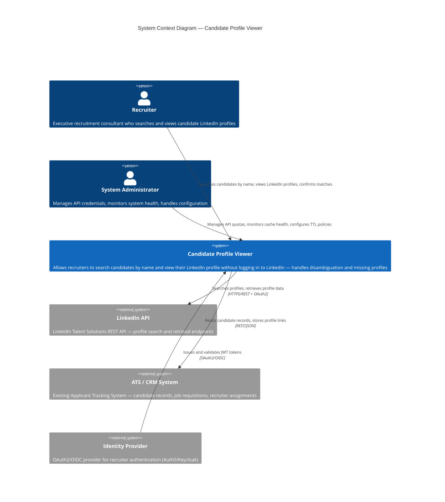

# C4 System Context Diagram — Candidate Profile Viewer

## Description
Shows the Candidate Profile Viewer module in context with its external actors and neighboring systems within the executive recruitment agency.

## Key Observations

- **2 actor types**: recruiters (primary users, ~50–200 per agency) who search and view profiles; administrators who manage API credentials and system configuration
- **1 primary external API**: LinkedIn Talent Solutions API — the core data source with strict rate limits (~100 calls/day per app depending on tier)
- **1 internal system integration**: ATS/CRM providing existing candidate records and storing confirmed LinkedIn profile links
- **1 identity provider**: External OAuth2/OIDC service for recruiter authentication (no LinkedIn login required for recruiters)
- All communication with LinkedIn API uses HTTPS with OAuth2 bearer tokens (agency-level credentials)
- The system boundary clearly separates the agency's internal tools from LinkedIn's external platform
- Missing LinkedIn profiles are handled within the system boundary — no error propagation to external systems
