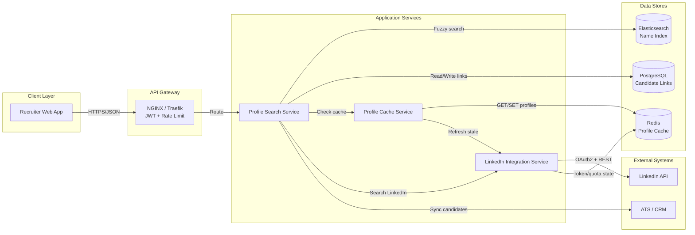
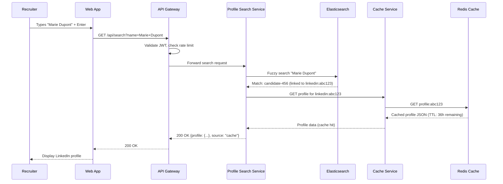
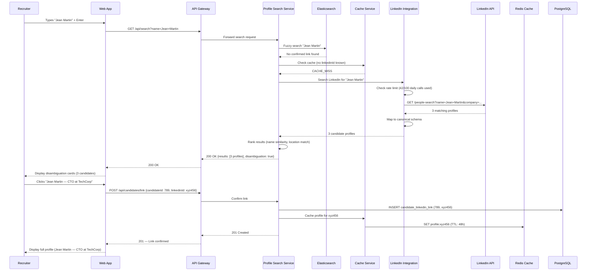
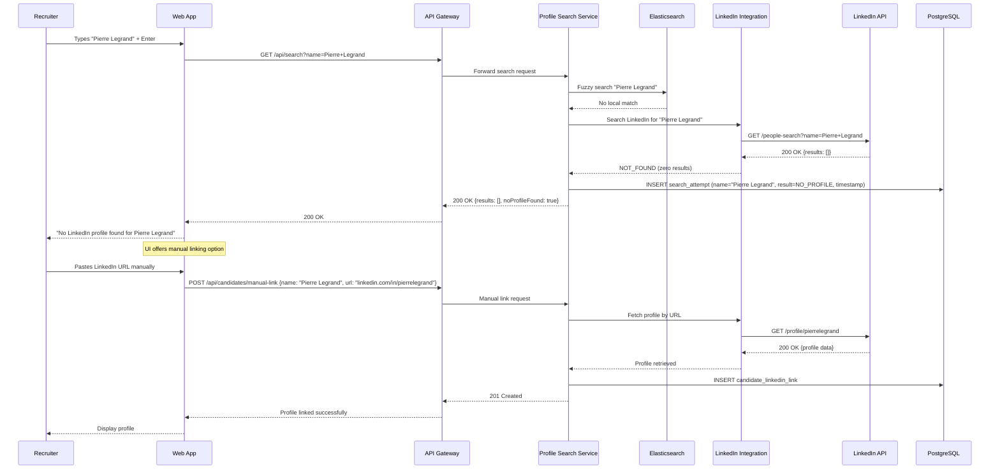
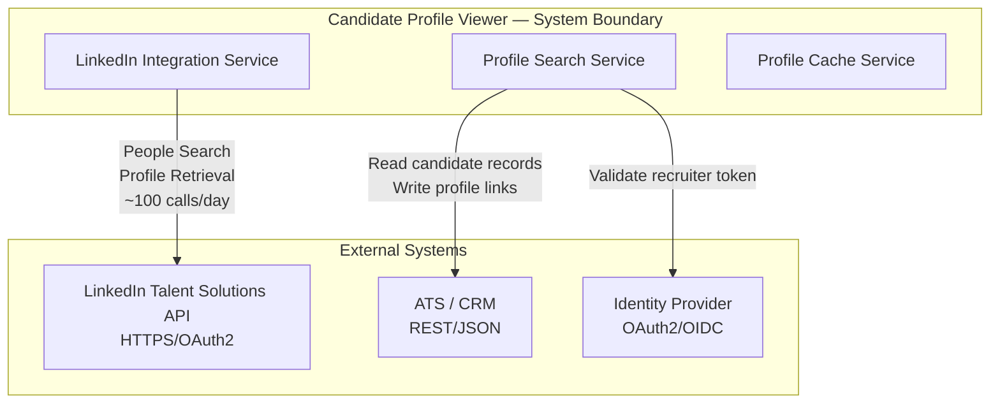

# Integration Patterns — Candidate Profile Viewer

## Description
Defines how the Candidate Profile Viewer modules communicate with each other and with external systems, using synchronous request-response patterns (primary) with caching and fallback strategies to handle LinkedIn API constraints.

## Service Communication Overview

## End-to-End Search Flow (Cache Hit)

## End-to-End Search Flow (Cache Miss + LinkedIn API)

## Missing Profile Flow (Candidate Not on LinkedIn)

## External System Integration

## Integration Patterns Summary

| Pattern | Usage | Rationale |
|---------|-------|-----------|
| **Cache-Aside** | Check Redis before calling LinkedIn API | Reduce API calls; respect rate limits; improve latency |
| **Circuit Breaker** | LinkedIn Integration → LinkedIn API | Fail fast when LinkedIn is unavailable; prevent cascading failures |
| **Retry + Exponential Backoff** | Transient LinkedIn API errors (5xx, timeout) | Handle temporary failures without overwhelming the API |
| **Rate Limiting (Client-Side)** | LinkedIn Integration tracks daily/minute budget | Stay within LinkedIn's API quota; queue low-priority requests |
| **Request-Response (Sync)** | All service-to-service calls | Simple search UX requires synchronous response; low throughput doesn't need async |
| **Graceful Degradation** | Missing profile → structured "not found" response | Recruiter gets clear feedback instead of errors |
| **Manual Fallback** | Recruiter pastes LinkedIn URL directly | Handles edge cases where automated search fails |
| **Write-Through Cache** | On profile fetch, write to cache immediately | Ensures subsequent lookups hit cache |
| **Background Refresh** | Pre-fetch profiles approaching TTL expiry | Avoid cache misses during business hours |
| **API Gateway** | All client-to-service calls | Centralized auth, rate limiting, routing |

## Data Flow Metrics

| Stage | Throughput | Latency (p99) |
|-------|-----------|---------------|
| Recruiter → API Gateway | ~50 req/min (peak) | < 100ms |
| API Gateway → Profile Search | ~50 req/min | < 20ms (routing) |
| Profile Search → Elasticsearch | ~50 queries/min | < 50ms |
| Profile Search → Cache (hit) | ~40 req/min (80% hit rate) | < 10ms |
| Profile Search → LinkedIn (miss) | ~10 req/min | < 2s |
| LinkedIn API response | ~100 calls/day (quota) | 500ms–2s |
| End-to-end (cache hit) | — | < 200ms |
| End-to-end (cache miss) | — | < 3s |
