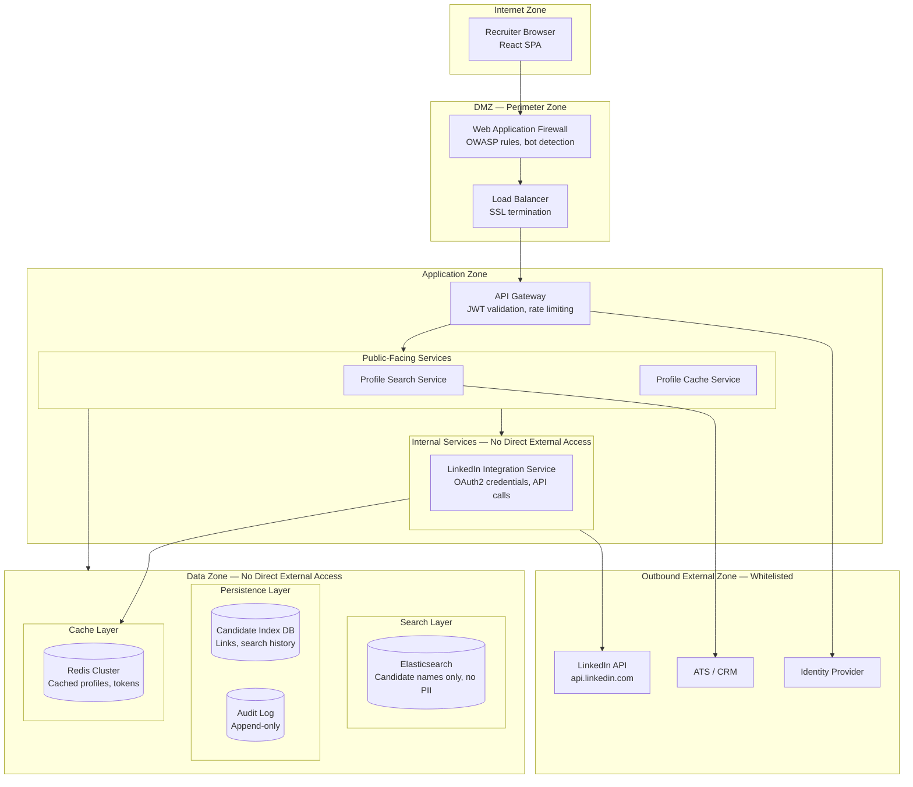
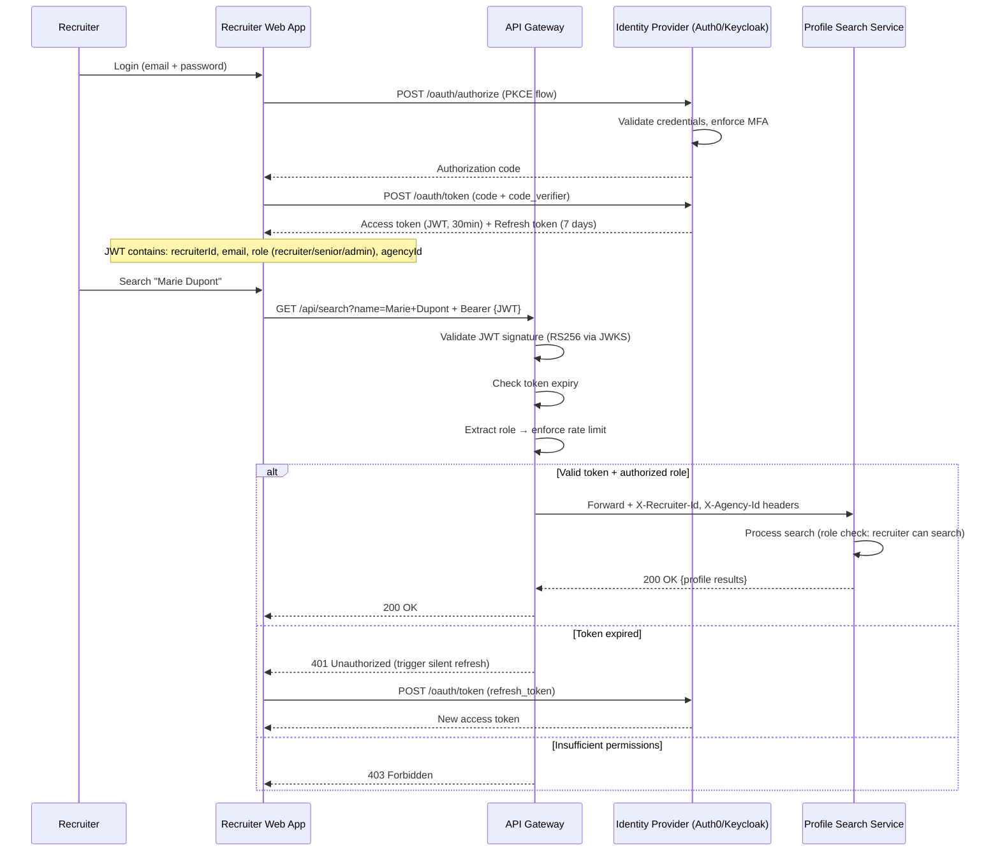
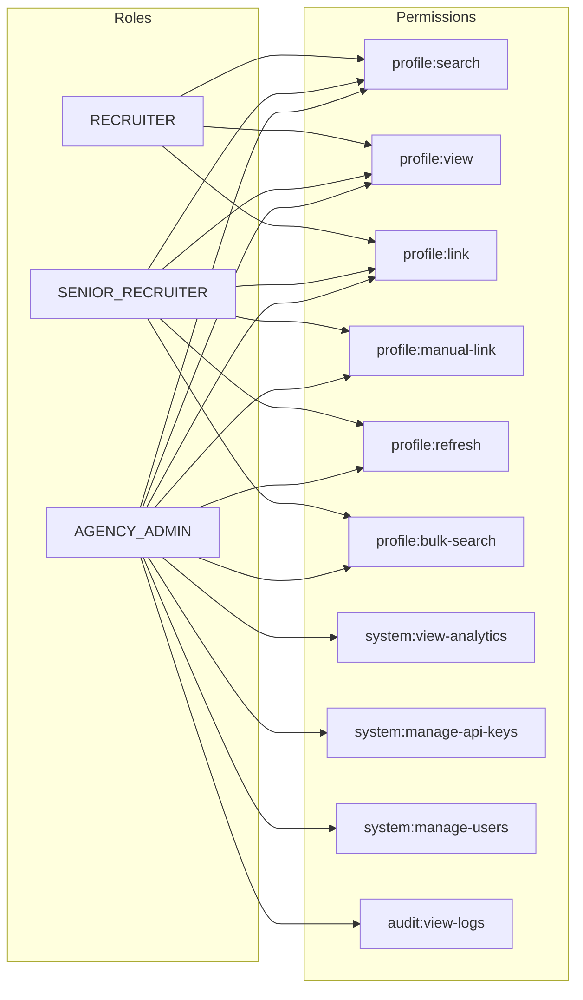

# Security Architecture Overlay — Candidate Profile Viewer

## Description
Cross-cutting security architecture showing network zones, authentication flows, encryption boundaries, access control enforcement points, and data privacy controls for the Candidate Profile Viewer system.

## Network Security Zones

## Authentication & Authorization Flow

## RBAC Model

## Role-Based Access Control

| Role | Profile Search | Manual Link | Force Refresh | Bulk Search | Admin Panel | Rate Limit |
|------|---------------|-------------|---------------|-------------|-------------|------------|
| **Recruiter** | Yes | No | No | No | No | 30 req/min |
| **Senior Recruiter** | Yes | Yes | Yes | Yes (10/batch) | No | 60 req/min |
| **Agency Admin** | Yes | Yes | Yes | Yes (50/batch) | Yes | 120 req/min |

## Encryption Strategy

| Layer | Mechanism | Scope |
|-------|-----------|-------|
| **In transit (external)** | TLS 1.3 | All browser ↔ API communication |
| **In transit (internal)** | mTLS | Service-to-service within Application Zone |
| **In transit (LinkedIn)** | TLS 1.3 + OAuth2 bearer | All outbound LinkedIn API calls |
| **At rest (database)** | AES-256 (TDE) | PostgreSQL — candidate links, search history |
| **At rest (cache)** | Redis AUTH + TLS | Cached profiles encrypted in transit; evicted by TTL |
| **OAuth2 tokens** | Encrypted at rest in Redis | LinkedIn API tokens (agency credentials) |
| **Secrets management** | HashiCorp Vault / K8s Secrets | API keys, DB credentials, JWT signing keys |
| **Elasticsearch** | TLS + authentication | Search queries and index data encrypted in transit |

## LinkedIn API Security Controls

| Concern | Mitigation |
|---------|-----------|
| **OAuth2 token exposure** | Tokens stored encrypted in Redis; never exposed to frontend; rotated before expiry |
| **Rate limit exhaustion** | Client-side quota tracking; queue + priority system; alert admin at 80% usage |
| **API credential leak** | Secrets in Vault; never in code/config; rotation every 90 days |
| **Data scope (LinkedIn ToS)** | Only fetch fields permitted by Talent Solutions agreement; no scraping |
| **Profile data retention** | Cached profiles auto-expire (TTL); no permanent storage of LinkedIn data |

## Security Controls Summary

| Threat | Mitigation |
|--------|-----------|
| **Brute-force login** | MFA enforced; account lockout after 5 failed attempts; rate limiting |
| **JWT token theft** | Short-lived tokens (30min); refresh rotation; PKCE for SPA |
| **Unauthorized profile access** | RBAC enforced at API Gateway; row-level recruiter isolation |
| **LinkedIn credential compromise** | Encrypted storage; auto-rotation; single agency-level key (not per-user) |
| **SQL injection** | Parameterized queries; ORM layer; input validation on search terms |
| **XSS in profile display** | Content Security Policy; HTML sanitization of LinkedIn data before render |
| **SSRF via manual LinkedIn URL** | URL validation (must match linkedin.com/in/* pattern); no arbitrary URL fetch |
| **DDoS on search endpoint** | WAF + rate limiting at gateway; per-recruiter quotas |
| **Insider threat** | All searches logged to append-only audit DB; admin actions require MFA step-up |
| **Data breach (cached profiles)** | Profiles are non-sensitive business data; TTL ensures auto-deletion; no passwords stored |

## Compliance & Data Privacy

| Requirement | Implementation |
|-------------|---------------|
| **GDPR — Data minimization** | Cache only necessary profile fields (name, title, company, skills, photo URL); no private data |
| **GDPR — Right to erasure** | Candidate can request deletion → purge from cache + DB + search index |
| **GDPR — Lawful basis** | Legitimate interest (recruitment); documented in privacy policy |
| **LinkedIn ToS compliance** | Use only official API; no scraping; respect rate limits; display attribution |
| **Audit trail** | All profile searches, link confirmations, and admin actions logged immutably |
| **Data retention** | Cached profiles: 72h max; Search history: 1 year; Audit logs: 3 years |
| **Breach notification** | Automated detection; < 72h disclosure SLA per GDPR Art. 33 |
