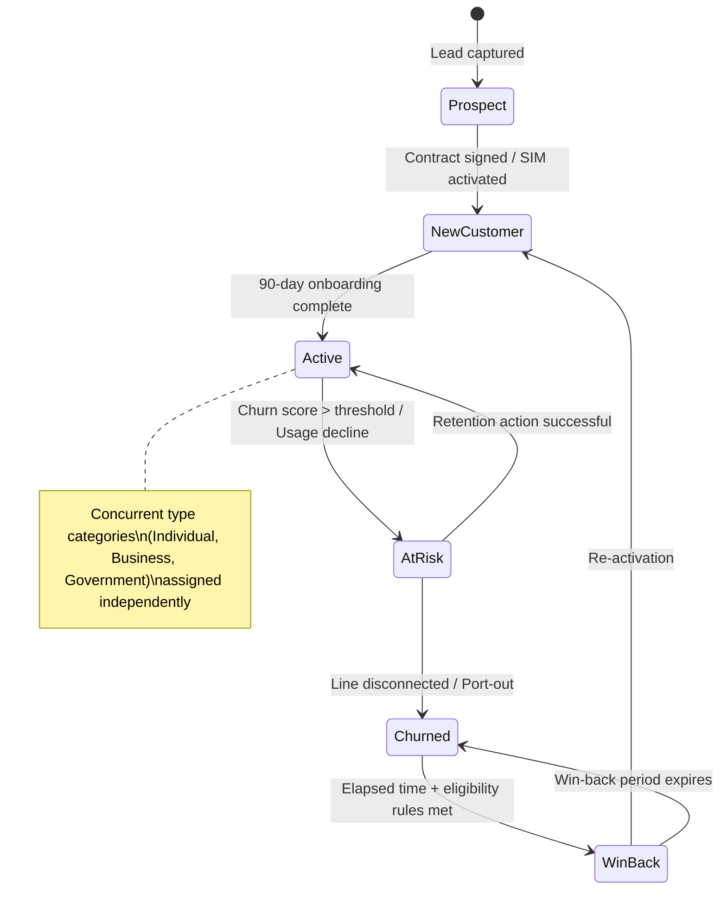

# C4 Component Diagram — Category Engine

## Description
Internal components of the Category Engine service — the key architectural differentiator enabling multi-category customer management. This service manages which categories a customer belongs to, resolves conflicts when categories overlap, handles transitions between categories, and provides the category context that the Policy Engine uses to determine applicable actions.

```mermaid
C4Component
    title Component Diagram — Category Engine

    Container_Boundary(category_svc, "Category Engine Service") {
        Component(category_api, "Category Management API", "REST Controller", "CRUD operations on category definitions — create, update, activate, deprecate categories")
        Component(membership_api, "Membership API", "REST/gRPC Controller", "Assigns/removes customers to/from categories, queries current memberships")
        Component(resolution_api, "Category Resolution API", "gRPC Controller", "Resolves the effective category set for a customer — called by Policy Engine and Campaign Service")

        Component(taxonomy_manager, "Category Taxonomy Manager", "Domain Service", "Manages category hierarchy, parent-child relationships, mutual exclusions, and prerequisites")
        Component(membership_engine, "Membership Engine", "Domain Service", "Evaluates membership rules — automatic assignment based on customer attributes, manual overrides, temporal validity")
        Component(conflict_resolver, "Conflict Resolution Engine", "Domain Service", "Resolves conflicts when categories have incompatible policies — priority, merge, override strategies")
        Component(transition_manager, "Transition Manager", "Domain Service", "Orchestrates category transitions (Prospect→Individual→Business) with guard conditions and side-effects")
        Component(segmentation_engine, "Segmentation Engine", "Domain Service", "Evaluates dynamic segments based on behavioral data — auto-assigns categories based on usage patterns")
        Component(event_publisher, "Event Publisher", "Kafka Producer", "Publishes CategoryAssigned, CategoryRemoved, CategoryTransitioned, ConflictResolved events")

        Component(category_repo, "Category Repository", "JPA/EF Repository", "Persists category definitions, hierarchy, rules")
        Component(membership_repo, "Membership Repository", "JPA/EF Repository", "Persists customer-category assignments with temporal validity")
    }

    ContainerDb(categoryDb, "Category DB", "PostgreSQL", "Category definitions, memberships, transition history, conflict logs")
    Container(cache, "Cache", "Redis", "Resolved category sets cache, membership lookups")
    Container(broker, "Message Broker", "Kafka", "Category change events")
    Container(customerService, "Customer Management Service", "Spring Boot/.NET", "Customer master data provider")
    Container(policyEngine, "Marketing Policy Engine", "Spring Boot/.NET", "Consumes resolved categories to evaluate policies")

    Rel(category_api, taxonomy_manager, "Manages taxonomy")
    Rel(membership_api, membership_engine, "Delegates assignment logic")
    Rel(resolution_api, conflict_resolver, "Resolves effective categories")
    Rel(resolution_api, cache, "Checks cached resolutions first", "Redis protocol")

    Rel(membership_engine, segmentation_engine, "Triggers re-evaluation on attribute change")
    Rel(membership_engine, transition_manager, "Initiates transitions when rules met")
    Rel(transition_manager, membership_engine, "Executes assignment/removal")
    Rel(conflict_resolver, taxonomy_manager, "Reads priority and exclusion rules")

    Rel(membership_engine, membership_repo, "Persists assignments")
    Rel(taxonomy_manager, category_repo, "Persists definitions")
    Rel(membership_repo, categoryDb, "SQL queries", "TLS")
    Rel(category_repo, categoryDb, "SQL queries", "TLS")

    Rel(transition_manager, event_publisher, "Publishes transition events")
    Rel(membership_engine, event_publisher, "Publishes assignment events")
    Rel(conflict_resolver, event_publisher, "Publishes resolution events")
    Rel(event_publisher, broker, "Produces messages", "Kafka/TLS")

    Rel(membership_engine, customerService, "Fetches customer attributes for rule evaluation", "gRPC")
    Rel(policyEngine, resolution_api, "Requests resolved category set for policy evaluation", "gRPC")
```

## Category Taxonomy

```mermaid
graph TD
    ROOT[All Customers]
    
    ROOT --> LIFECYCLE[Lifecycle Stage]
    ROOT --> TYPE[Customer Type]
    ROOT --> VALUE[Value Tier]
    ROOT --> CHANNEL[Acquisition Channel]
    
    LIFECYCLE --> PROSPECT[Prospect]
    LIFECYCLE --> NEW[New Customer < 90 days]
    LIFECYCLE --> ACTIVE[Active]
    LIFECYCLE --> AT_RISK[At-Risk]
    LIFECYCLE --> CHURNED[Churned]
    LIFECYCLE --> WINBACK[Win-Back Target]
    
    TYPE --> INDIVIDUAL[Individual]
    TYPE --> BUSINESS[Business]
    TYPE --> ENTERPRISE[Enterprise]
    TYPE --> GOVERNMENT[Government Agency]
    TYPE --> ASSOCIATION[Association/NGO]
    TYPE --> MVNO[Wholesale/MVNO]
    
    VALUE --> VIP[VIP/Platinum]
    VALUE --> HIGH[High Value]
    VALUE --> MEDIUM[Medium Value]
    VALUE --> LOW[Low Value]
    
    CHANNEL --> STORE[Retail Store]
    CHANNEL --> DIGITAL[Digital/App]
    CHANNEL --> DEALER[Dealer/Partner]
    CHANNEL --> CORPORATE[Corporate Sales]
```

## Conflict Resolution Strategies

| Strategy | When Applied | Example |
|----------|-------------|---------|
| **Priority Override** | Categories have conflicting discount policies | Government (priority 1) overrides Business (priority 2) discount — customer gets government rate |
| **Merge (Additive)** | Categories grant non-conflicting benefits | VIP + Business → customer gets VIP lounge access AND business reporting tools |
| **Most Favorable** | Pricing conflicts between categories | Individual has 20% discount, Enterprise has 30% → customer gets 30% |
| **Most Restrictive** | Compliance/regulatory conflicts | Government requires data residency + Individual wants international roaming → data residency wins |
| **Custom Rule** | Complex scenarios requiring business logic | Association member who is also Government → specific named offer set defined by Marketing |

## Category Membership Rules

| Rule Type | Evaluation | Example |
|-----------|-----------|---------|
| **Attribute-Based (Automatic)** | Customer attributes match predefined criteria | CNPJ present + >50 lines → auto-assign "Enterprise" |
| **Behavioral (Dynamic)** | Usage patterns trigger assignment | ARPU > R$500/month for 3 months → auto-assign "High Value" |
| **Manual (Override)** | Agent or manager explicitly assigns | Account manager assigns "VIP" to strategic customer |
| **Temporal (Time-Bound)** | Effective dates define validity | "New Customer" category valid for 90 days post-activation |
| **Event-Triggered** | Lifecycle events cause transitions | Contract signed → remove "Prospect", add "Active" + "New Customer" |

## Category Transition State Machine

## Scaling Considerations

| Scenario | Strategy |
|----------|----------|
| High-volume membership queries (millions of customers) | Redis cache for resolved category sets with TTL-based invalidation |
| Bulk re-segmentation (monthly behavioral scoring) | Batch processing via Kafka consumer groups, parallel partition processing |
| New category onboarding | Configuration-only — add taxonomy entry, define rules, no code deployment |
| Real-time category transitions (contract events) | Event-driven, sub-second transition execution via Kafka |
| Category resolution under load (campaign targeting) | Pre-computed materialized views for common category combinations |
