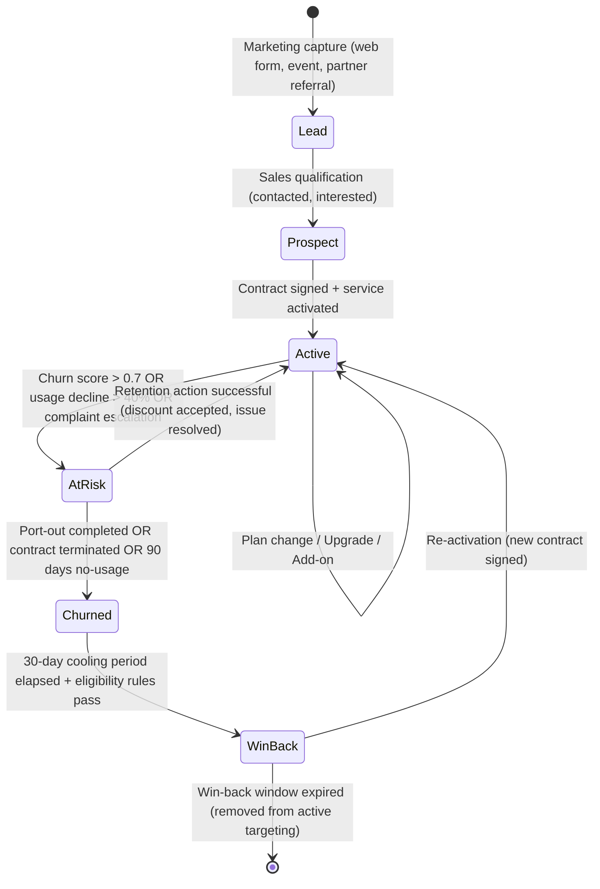
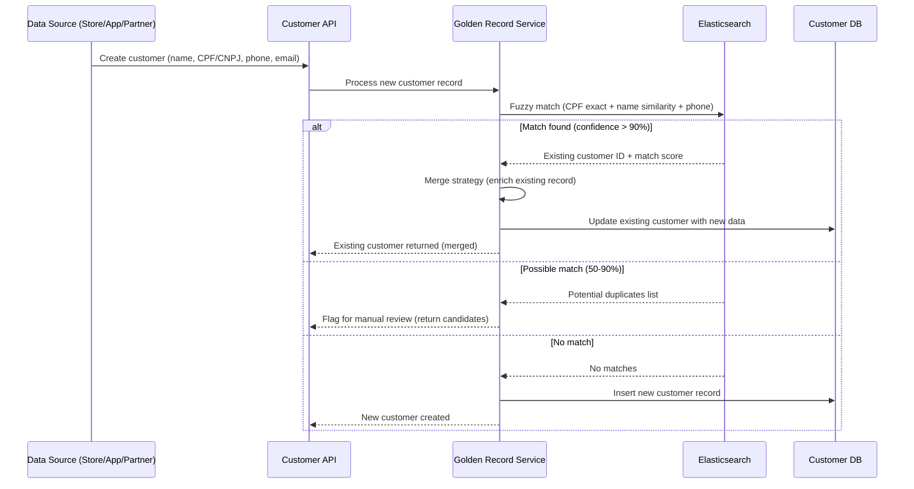

# C4 Component Diagram — Customer Management Service

## Description
Internal components of the Customer Management Service — the core data service providing golden record management, customer 360-degree view, interaction history, and lifecycle state tracking for millions of telecom customers across all categories.

```mermaid
C4Component
    title Component Diagram — Customer Management Service

    Container_Boundary(customer_svc, "Customer Management Service") {
        Component(customer_api, "Customer API", "REST Controller", "CRUD operations on customer master data — create, update, merge, search")
        Component(contact_api, "Contact Management API", "REST Controller", "Manages customer contact points — phones, emails, addresses, preferences")
        Component(interaction_api, "Interaction API", "REST Controller", "Records and queries customer interactions across all channels")
        Component(lifecycle_api, "Lifecycle API", "REST/gRPC Controller", "Customer lifecycle state transitions and 360-view aggregation")

        Component(golden_record, "Golden Record Service", "Domain Service", "Deduplication, merge logic, master data quality — single source of truth per customer")
        Component(lifecycle_engine, "Lifecycle State Machine", "Domain Service", "Manages customer states: Lead→Prospect→Active→At-Risk→Churned→Win-Back with guard conditions")
        Component(view360, "360-View Aggregator", "Domain Service", "Assembles complete customer context from all services — billing, usage, interactions, categories, offers")
        Component(interaction_manager, "Interaction Manager", "Domain Service", "Records all customer touchpoints — calls, chats, store visits, app sessions, campaign responses")
        Component(consent_manager, "Consent Manager", "Domain Service", "Manages LGPD/GDPR consent per channel and purpose — opt-in/opt-out, consent history")
        Component(event_publisher, "Event Publisher", "Kafka Producer", "Publishes CustomerCreated, CustomerUpdated, CustomerMerged, LifecycleTransitioned events")

        Component(customer_repo, "Customer Repository", "JPA/EF Repository", "CRUD on customer master table with row-level access control")
        Component(interaction_repo, "Interaction Repository", "MongoDB Client", "Stores unstructured interaction history — high volume, append-heavy")
        Component(graph_client, "Relationship Graph Client", "Neo4j Client", "Manages customer relationships, organizational hierarchies, household links")
    }

    ContainerDb(customerDb, "Customer DB", "PostgreSQL", "Customer master data, contacts, lifecycle states, consent records")
    ContainerDb(interactionStore, "Interaction Store", "MongoDB", "Interaction history, communication logs")
    ContainerDb(graphDb, "Relationship Graph", "Neo4j", "Customer relationships, org hierarchies")
    Container(searchEngine, "Search Engine", "Elasticsearch", "Full-text customer search, fuzzy matching")
    Container(cache, "Cache", "Redis", "Customer context cache, 360-view cache")
    Container(broker, "Message Broker", "Kafka", "Customer lifecycle events")
    Container(categoryEngine, "Category Engine", "Spring Boot/.NET", "Category memberships")
    Container(bssIntegration, "BSS/OSS Integration", "Spring Boot/.NET", "Billing and usage data")

    Rel(customer_api, golden_record, "Delegates create/update/merge")
    Rel(contact_api, customer_repo, "Manages contact records")
    Rel(interaction_api, interaction_manager, "Delegates interaction recording")
    Rel(lifecycle_api, lifecycle_engine, "Delegates state transitions")
    Rel(lifecycle_api, view360, "Assembles 360-view")

    Rel(golden_record, customer_repo, "Persists master data")
    Rel(golden_record, searchEngine, "Indexes for dedup matching", "HTTPS")
    Rel(golden_record, graph_client, "Updates relationship graph")
    Rel(lifecycle_engine, customer_repo, "Persists state changes")
    Rel(lifecycle_engine, event_publisher, "Publishes transitions")
    Rel(interaction_manager, interaction_repo, "Appends interactions")
    Rel(consent_manager, customer_repo, "Persists consent records")

    Rel(view360, cache, "Caches assembled 360-view", "Redis protocol")
    Rel(view360, categoryEngine, "Fetches current categories", "gRPC")
    Rel(view360, bssIntegration, "Fetches billing/usage summary", "gRPC")
    Rel(view360, interaction_repo, "Fetches recent interactions")

    Rel(customer_repo, customerDb, "SQL queries", "TLS")
    Rel(interaction_repo, interactionStore, "Document queries", "TLS")
    Rel(graph_client, graphDb, "Cypher queries", "Bolt/TLS")
    Rel(event_publisher, broker, "Produces messages", "Kafka/TLS")
```

## Customer Lifecycle State Machine

## Customer 360-Degree View Composition

| Data Source | Information | Freshness |
|-------------|-------------|-----------|
| **Customer Master (PostgreSQL)** | Identity, contacts, addresses, lifecycle state, consent | Real-time |
| **Category Engine** | Current category memberships, effective segments | Real-time (cached 5min) |
| **BSS — Billing** | Current plan, ARPU, payment history, balance, invoices | Near real-time (15min sync) |
| **BSS — Usage** | Data/voice/SMS consumption, roaming, last activity | Near real-time (hourly) |
| **Interaction Store (MongoDB)** | Last 10 interactions, open tickets, NPS scores | Real-time |
| **Campaign Service** | Active offers, campaign enrollment, redemption history | Real-time |
| **Relationship Graph (Neo4j)** | Household members, corporate hierarchy, referral links | Real-time |
| **Analytics Platform** | Churn score, lifetime value, propensity scores | Daily batch |

## Golden Record Deduplication

## Domain Events Published

| Event | Trigger | Consumers |
|-------|---------|-----------|
| `CustomerCreated` | New customer record established | Category Engine (initial assignment), Campaign (welcome flow), Analytics |
| `CustomerUpdated` | Master data change (address, contact, plan) | Category Engine (re-evaluate), BSS Sync, Notification |
| `CustomerMerged` | Duplicate records consolidated | All services (update references), Analytics (recalculate) |
| `LifecycleTransitioned` | State change (e.g., Active → At-Risk) | Category Engine, Campaign (trigger retention), Analytics |
| `ConsentChanged` | Customer updates communication preferences | Channel Service (update dispatch rules), Campaign (adjust targeting) |
| `InteractionRecorded` | New touchpoint logged | Analytics (update engagement score), 360-View (refresh cache) |

## Scaling Considerations

| Scenario | Strategy |
|----------|----------|
| Millions of customer lookups (agent portal, campaign targeting) | Redis cache for 360-view, Elasticsearch for search, read replicas |
| High-volume interaction recording (call center + app sessions) | MongoDB append-only with time-based sharding, async write via Kafka |
| Golden record matching at onboarding scale | Elasticsearch fuzzy matching with pre-computed phonetic indices |
| 360-view assembly latency (multiple data sources) | Parallel async fetch with timeout fallback, progressive rendering |
| LGPD erasure requests | Soft-delete with cascading event to all downstream systems |
