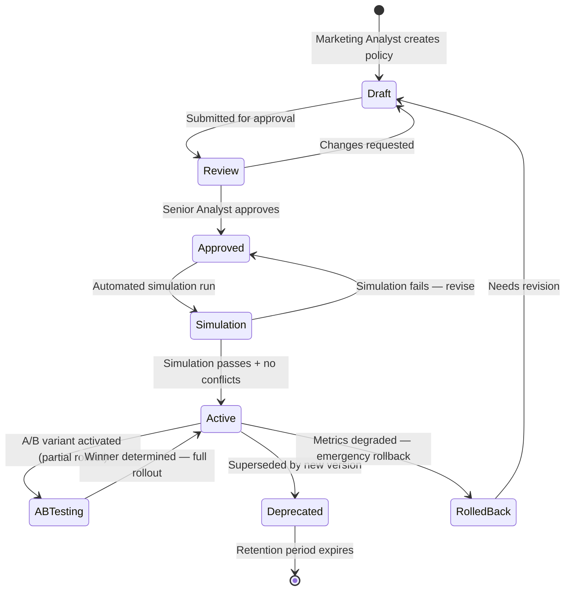
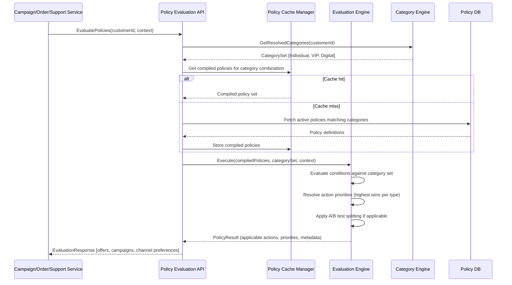

# C4 Component Diagram — Marketing Policy Engine

## Description
Internal components of the Marketing Policy Engine — the system that allows Marketing Business Analysts to define, version, test, and activate commercial policies without developer intervention. Policies map customer category combinations to specific actions (campaigns, offers, retention programs, onboarding flows). When marketing strategy changes, analysts update policies through a governed workflow — the platform adapts at runtime without redeployment.

```mermaid
C4Component
    title Component Diagram — Marketing Policy Engine

    Container_Boundary(policy_svc, "Marketing Policy Engine Service") {
        Component(policy_api, "Policy Management API", "REST Controller", "CRUD operations on policies — create, version, activate, deprecate, rollback")
        Component(eval_api, "Policy Evaluation API", "gRPC/REST Controller", "Evaluates applicable actions for a customer's resolved category set — called by Campaign, Order, and Support services")
        Component(builder_ui, "Policy Builder Backend", "Low-Code UI Backend", "Visual policy builder for Marketing Analysts — condition trees, action mappings, priority rules")

        Component(policy_compiler, "Policy Compiler", "Build Service", "Compiles declarative policy definitions into optimized evaluation artifacts (decision trees)")
        Component(eval_engine, "Policy Evaluation Engine", "Core Engine", "Executes compiled policies against customer category context — returns applicable actions with priority")
        Component(conflict_detector, "Policy Conflict Detector", "Validation Service", "Detects conflicting policies for overlapping category sets before activation")
        Component(ab_testing, "A/B Testing Manager", "Domain Service", "Manages policy variants, traffic splitting, statistical significance calculation")
        Component(simulation_engine, "Policy Simulation Engine", "Isolated Runtime", "Simulates policy outcomes against historical customer data before production activation")
        Component(version_manager, "Policy Version Manager", "Domain Service", "Manages policy lifecycle: Draft→Review→Approved→Active→Deprecated with approval gates")
        Component(cache_manager, "Policy Cache Manager", "Cache Layer", "Caches compiled policies in Redis — invalidates on version change, supports blue-green activation")
        Component(event_publisher, "Event Publisher", "Kafka Producer", "Publishes PolicyActivated, PolicyDeprecated, PolicyRolledBack, ABTestCompleted events")

        Component(policy_repo, "Policy Repository", "JPA/EF Repository", "Persists policy definitions, versions, evaluation audit logs, A/B test results")
    }

    ContainerDb(policyDb, "Policy DB", "PostgreSQL", "Policy definitions, versions, conditions, actions, audit logs")
    Container(cache, "Cache", "Redis", "Compiled policy cache")
    Container(broker, "Message Broker", "Kafka", "Policy change events")
    Container(categoryEngine, "Category Engine", "Spring Boot/.NET", "Provides resolved category sets")
    Container(campaignService, "Campaign & Action Service", "Spring Boot/.NET", "Consumes evaluated policies to execute actions")

    Rel(policy_api, version_manager, "Manages policy lifecycle")
    Rel(policy_api, policy_compiler, "Triggers compilation on save")
    Rel(policy_api, conflict_detector, "Validates before activation")
    Rel(builder_ui, policy_api, "Submits policy definitions")

    Rel(eval_api, cache_manager, "Checks cached policies first")
    Rel(eval_api, eval_engine, "Delegates evaluation")
    Rel(eval_engine, categoryEngine, "Fetches resolved category set", "gRPC")

    Rel(policy_compiler, simulation_engine, "Validates compiled policies")
    Rel(version_manager, ab_testing, "Coordinates A/B variants")
    Rel(version_manager, policy_repo, "Persists versions")
    Rel(version_manager, cache_manager, "Invalidates on publish")
    Rel(version_manager, event_publisher, "Publishes lifecycle events")
    Rel(cache_manager, cache, "GET/SET compiled policies", "Redis protocol")
    Rel(policy_repo, policyDb, "SQL queries", "TLS")
    Rel(event_publisher, broker, "Produces messages", "Kafka/TLS")

    Rel(campaignService, eval_api, "Requests applicable actions for customer", "gRPC")
```



## Policy Structure

A policy consists of:

```
Policy {
  id, name, version, status
  conditions: [                          // Category combination conditions
    { categorySet: ["Business", "VIP"], operator: "ALL" },
    { categorySet: ["Government"], operator: "ANY" },
    { excludeCategories: ["Churned"] }
  ]
  actions: [                             // What happens when conditions match
    { type: "OFFER", offerId: "BIZ_VIP_DISCOUNT_30", priority: 1 },
    { type: "CAMPAIGN_ENROLL", campaignId: "loyalty_platinum", priority: 2 },
    { type: "CHANNEL_PREFERENCE", channels: ["WhatsApp", "Email"], priority: 3 }
  ]
  metadata: {
    effectiveFrom, effectiveTo,
    abTestGroup, rolloutPercentage,
    createdBy, approvedBy
  }
}
```

## Policy Lifecycle



## Policy Evaluation Flow



## Who Defines Policies?

| Role | Responsibility | Access Level |
|------|---------------|--------------|
| **Marketing Business Analyst** | Authors policy conditions and actions, defines category-to-action mappings | Full CRUD on policies within assigned category scope |
| **Senior Marketing Analyst** | Approves policies for production, reviews cross-category consistency, resolves conflicts | Approve/reject across all categories |
| **Marketing Director** | Defines high-level strategy translated into policy frameworks | Read-only + approval for strategic policies |
| **Platform Architect** | Maintains evaluation engine, action type definitions, integration contracts | Code-level changes to engine |
| **Data Analyst** | Monitors A/B test results, recommends winning variants, validates simulation outcomes | Read + execute simulations |

## Policy Conflict Examples

| Conflict | Detection | Resolution |
|----------|-----------|------------|
| Two policies grant different discount % for same category set | Pre-activation conflict scan | Higher priority policy wins; alert to analyst |
| New policy overlaps with existing active policy | Real-time conflict detector | Analyst must explicitly choose: override, coexist, or merge |
| A/B test variant contradicts base policy | Compile-time validation | Variant must be compatible subset of base policy actions |
| Deprecated policy still referenced by active campaign | Dependency check before deprecation | Block deprecation until campaign ends or migrates |

## Scaling Considerations

| Scenario | Strategy |
|----------|----------|
| High evaluation throughput (millions of customers × multiple touchpoints) | Redis-cached compiled policies, pre-computed results for top category combinations |
| Policy hot-reload (marketing changes policies during business hours) | Blue-green cache invalidation — new version activates atomically |
| A/B test traffic splitting at scale | Deterministic hashing on customerId — consistent assignment without state |
| Simulation against millions of historical records | Batch processing in isolated compute pool, no production impact |
| Campaign launch spike (new policy → mass re-evaluation) | Async re-evaluation via Kafka consumer groups, eventual consistency acceptable |
