# C4 Container Diagram — Telecom CRM Platform

## Description
Shows the high-level runtime containers that compose the CRM platform — applications, microservices, databases, message broker, policy engine, and infrastructure components.

```mermaid
C4Container
    title Container Diagram — Telecom CRM Platform

    Person(internalUser, "Internal User", "Sales Rep, Support Agent, Marketing Analyst, Channel Manager, Compliance Officer")
    Person(externalUser, "External User", "Customer (Individual, Business, Government), Dealer/Partner")

    System_Boundary(crm, "Telecom CRM Platform") {
        Container(agentPortal, "Agent Portal", "Angular/React SPA", "Internal CRM interface for sales, support, campaign management, policy configuration")
        Container(customerApp, "Customer Self-Service", "React Native / Web SPA", "Customer-facing app and web portal for account management, offers, support")
        Container(partnerPortal, "Partner Portal", "Angular/React SPA", "Dealer and MVNO partner interface for order submission and commission tracking")
        Container(apiGateway, "API Gateway", "Kong/NGINX", "Routes requests, rate limiting, SSL termination, token validation, channel resolution")

        Container(customerService, "Customer Management Service", "Spring Boot/.NET", "Customer identity, master data, 360-view, interaction history, lifecycle state machine")
        Container(categoryEngine, "Category Engine", "Spring Boot/.NET", "Multi-category membership management, category resolution, conflict handling, transition workflows")
        Container(policyEngine, "Marketing Policy Engine", "Spring Boot/.NET + Drools/OPA", "Policy definition, versioning, evaluation, A/B testing, action resolution for category combinations")
        Container(campaignService, "Campaign & Action Service", "Spring Boot/.NET", "Campaign orchestration, offer management, triggered actions, batch execution, outcome tracking")
        Container(channelService, "Channel Orchestration Service", "Spring Boot/.NET", "Omnichannel communication dispatch, frequency capping, preference management")
        Container(orderService, "Order Management Service", "Spring Boot/.NET", "Order lifecycle, plan changes, device orders, number portability requests")
        Container(analyticsService, "Analytics Service", "Spring Boot/.NET", "Segmentation, campaign performance, churn early warning, CQRS read models")
        Container(notificationService, "Notification Service", "Spring Boot/.NET", "Real-time and scheduled notification dispatch across all channels")
        Container(integrationService, "BSS/OSS Integration Service", "Spring Boot/.NET", "Adapter layer for billing, provisioning, product catalog, payment systems")

        ContainerDb(customerDb, "Customer DB", "PostgreSQL", "Customer master data, contacts, lifecycle states — row-level security")
        ContainerDb(categoryDb, "Category DB", "PostgreSQL", "Category definitions, membership records, transition history")
        ContainerDb(policyDb, "Policy DB", "PostgreSQL", "Policy definitions, versions, evaluation audit logs, A/B test results")
        ContainerDb(campaignDb, "Campaign DB", "PostgreSQL", "Campaigns, offers, action logs, outcome records")
        ContainerDb(interactionStore, "Interaction Store", "MongoDB", "Interaction history, communication logs, unstructured customer data")
        ContainerDb(graphDb, "Relationship Graph", "Neo4j", "Customer relationships, organizational hierarchies, influence networks")

        Container(cache, "Cache", "Redis", "Session store, policy evaluation cache, customer context cache, rate limiting")
        Container(searchEngine, "Search Engine", "Elasticsearch", "Customer search, interaction full-text search, campaign targeting queries")
        Container(broker, "Message Broker", "Apache Kafka", "Event bus — customer lifecycle events, policy changes, campaign triggers")
        Container(idp, "Identity Provider", "Keycloak", "OAuth2/OIDC, RBAC, MFA, multi-tenant SSO (internal + partners + customers)")
    }

    System_Ext(bss, "BSS — Billing", "Billing, payments, revenue")
    System_Ext(oss, "OSS — Network", "Provisioning, activation")
    System_Ext(commChannels, "Communication Channels", "SMS, Email, Push, WhatsApp")
    System_Ext(paymentGw, "Payment Gateway", "Card/bank processing")
    System_Ext(regulatory, "Regulatory Authority", "Compliance filings")
    System_Ext(analytics, "Data Analytics Platform", "ML models, scoring")

    Rel(internalUser, agentPortal, "Uses", "HTTPS")
    Rel(externalUser, customerApp, "Uses", "HTTPS")
    Rel(externalUser, partnerPortal, "Uses", "HTTPS")
    Rel(agentPortal, apiGateway, "API calls", "HTTPS/JSON")
    Rel(customerApp, apiGateway, "API calls", "HTTPS/JSON")
    Rel(partnerPortal, apiGateway, "API calls", "HTTPS/JSON")
    Rel(apiGateway, idp, "Validates tokens", "HTTPS")

    Rel(apiGateway, customerService, "Routes", "gRPC/HTTPS")
    Rel(apiGateway, categoryEngine, "Routes", "gRPC/HTTPS")
    Rel(apiGateway, policyEngine, "Routes", "gRPC/HTTPS")
    Rel(apiGateway, campaignService, "Routes", "gRPC/HTTPS")
    Rel(apiGateway, orderService, "Routes", "gRPC/HTTPS")
    Rel(apiGateway, analyticsService, "Routes", "gRPC/HTTPS")

    Rel(customerService, customerDb, "Reads/Writes", "SQL/TLS")
    Rel(customerService, graphDb, "Reads/Writes", "Bolt/TLS")
    Rel(customerService, interactionStore, "Reads/Writes", "HTTPS")
    Rel(categoryEngine, categoryDb, "Reads/Writes", "SQL/TLS")
    Rel(policyEngine, policyDb, "Reads/Writes", "SQL/TLS")
    Rel(campaignService, campaignDb, "Reads/Writes", "SQL/TLS")

    Rel(customerService, categoryEngine, "Resolves categories", "gRPC")
    Rel(categoryEngine, policyEngine, "Evaluates policies for categories", "gRPC")
    Rel(campaignService, policyEngine, "Gets eligible actions", "gRPC")
    Rel(campaignService, channelService, "Dispatches communications", "gRPC")
    Rel(channelService, commChannels, "Sends messages", "HTTPS/SMTP/API")

    Rel(policyEngine, cache, "Caches compiled policies", "Redis protocol")
    Rel(customerService, cache, "Caches customer context", "Redis protocol")
    Rel(customerService, searchEngine, "Indexes/searches customers", "HTTPS")

    Rel(customerService, broker, "Publishes lifecycle events", "Kafka")
    Rel(categoryEngine, broker, "Publishes category change events", "Kafka")
    Rel(policyEngine, broker, "Publishes policy activation events", "Kafka")
    Rel(campaignService, broker, "Publishes campaign events", "Kafka")
    Rel(notificationService, broker, "Subscribes to all trigger events", "Kafka")
    Rel(analyticsService, broker, "Subscribes for CQRS projections", "Kafka")

    Rel(integrationService, bss, "Billing queries/commands", "REST/SOAP")
    Rel(integrationService, oss, "Provisioning commands", "REST/SOAP")
    Rel(orderService, integrationService, "Delegates to BSS/OSS", "gRPC")
    Rel(integrationService, paymentGw, "Processes payments", "HTTPS/PCI")
    Rel(analyticsService, regulatory, "Submits filings", "HTTPS/mTLS")
    Rel(analyticsService, analytics, "Sends events, receives scores", "Kafka/REST")
```

## Container Responsibilities

| Container | Scaling Strategy | Data Ownership |
|-----------|-----------------|----------------|
| Agent Portal | CDN-distributed static assets | None (stateless) |
| Customer Self-Service | CDN + geo-replicated | None (stateless) |
| Partner Portal | CDN-distributed | None (stateless) |
| API Gateway | Horizontal, multi-region | None (stateless) |
| Customer Management Service | Horizontal (read-heavy, millions of lookups) | Customer master data, interactions |
| Category Engine | Horizontal with cached resolutions | Category definitions, memberships |
| Marketing Policy Engine | Horizontal with cached compiled policies | Policy definitions, versions, evaluation history |
| Campaign & Action Service | Burst scaling during campaign launches | Campaign records, offer redemptions |
| Channel Orchestration Service | Horizontal (high-throughput messaging) | Channel preferences, frequency caps |
| Order Management Service | Horizontal (burst during promotions) | Order records, provisioning status |
| Analytics Service | Horizontal read replicas, CQRS | Read-only projections, reports |
| BSS/OSS Integration Service | Horizontal with circuit breakers | None (adapter, stateless) |
| Message Broker | Clustered, partitioned by topic | Event log (retention-based) |
| Identity Provider | HA pair, session-aware | User sessions, roles, permissions |

## Communication Patterns

| Pattern | Between | Purpose |
|---------|---------|---------|
| Synchronous gRPC | Category Engine → Policy Engine | Real-time policy evaluation during customer interactions |
| Synchronous gRPC | Campaign Service → Channel Service | Immediate action dispatch for triggered campaigns |
| Async Events (Kafka) | Customer Service → All consumers | Customer lifecycle events propagation |
| Async Events (Kafka) | Policy Engine → Campaign Service | Policy activation triggers campaign recalculation |
| Request/Response REST | Integration Service → BSS/OSS | Billing queries, provisioning commands |
| Pub/Sub | All services → Analytics | Event stream for CQRS read model construction |
