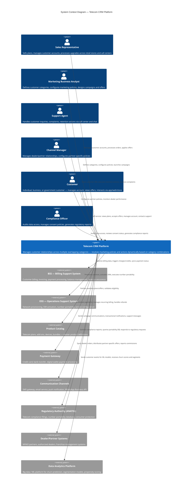

# C4 System Context Diagram — Telecom CRM Platform

## Description
Shows the CRM platform in context with its external actors (users) and neighboring systems it integrates with.

## Key Observations

- **6 actor types** representing internal commercial staff, partners, customers, and compliance roles
- **8 external system integrations** spanning the telecom BSS/OSS stack, payments, communications, regulatory, and analytics
- The CRM is the central commercial hub connecting customer management to telecom operations
- Marketing Business Analyst is the key differentiator — they configure categories and policies without developer involvement
- Customers interact through multiple channels (app, web, store, call center) creating a true omnichannel model
- Regulatory compliance (ANATEL/equivalent) is a first-class concern with direct integration
- The platform bridges commercial intent (marketing policies) with operational execution (BSS/OSS provisioning)
