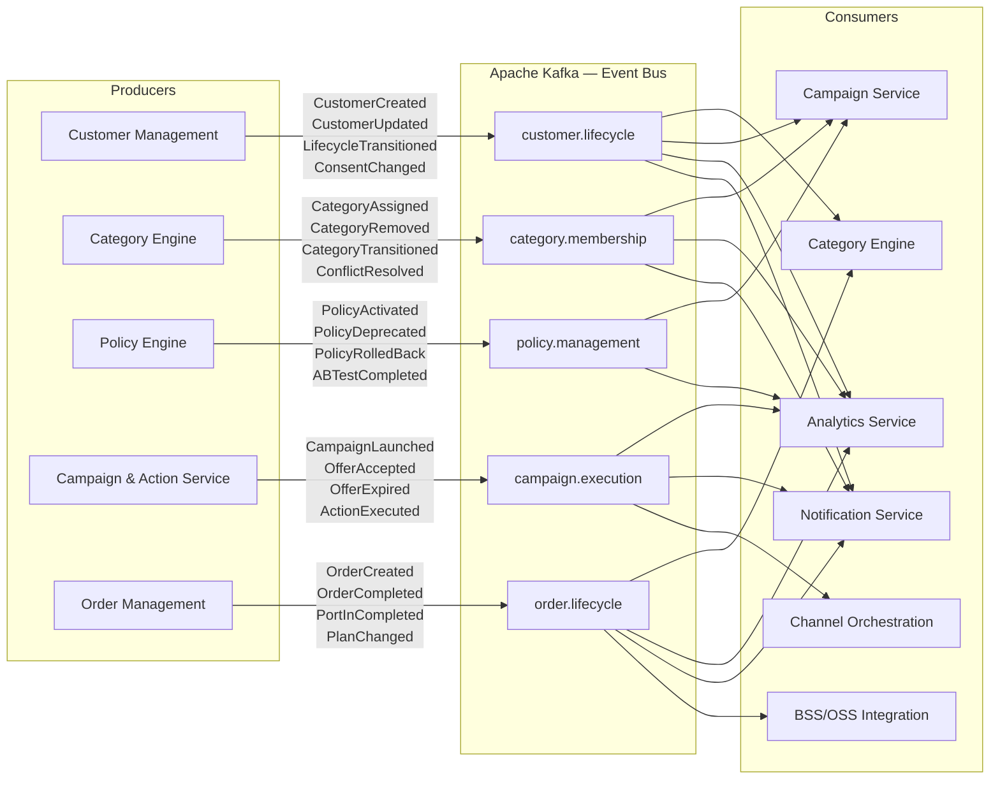
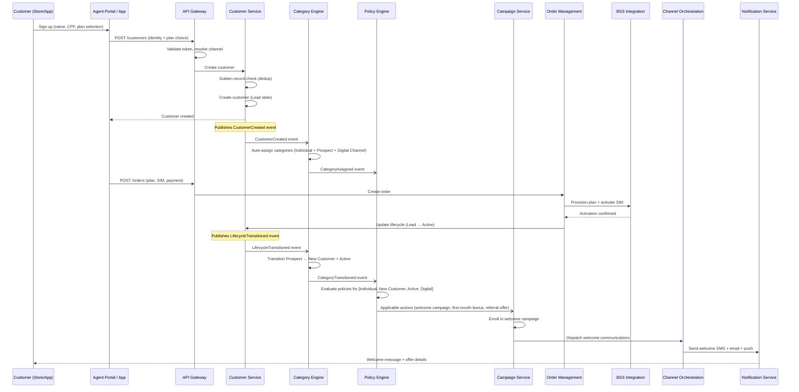
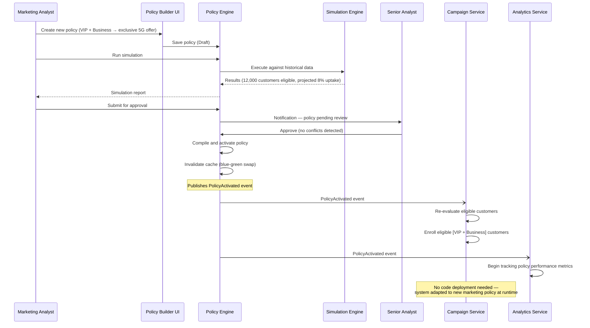
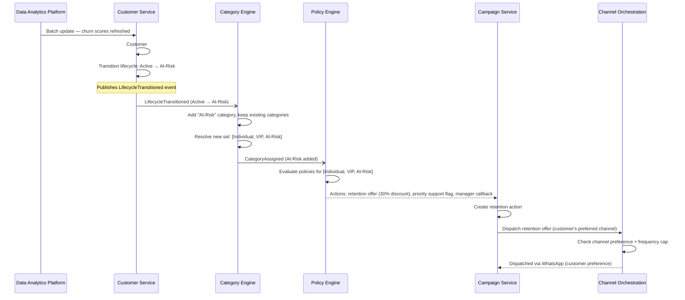
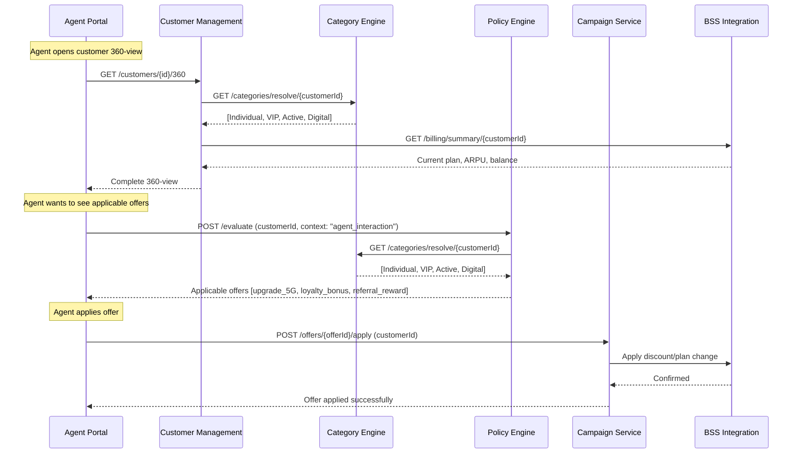

# Integration Patterns — Telecom CRM Platform

## Description
Defines how the platform's modules communicate with each other and with external systems (BSS/OSS, communication channels, regulatory), using event-driven and synchronous patterns to support multi-category customer management and policy-driven action execution.

## Event-Driven Architecture (Inter-Module)

## End-to-End: New Customer Onboarding Flow

## Policy Change Propagation Flow

## Category Transition Triggered Actions

## Synchronous API Calls (Cross-Service)

## External System Integration

```mermaid
graph TB
    subgraph Platform["Telecom CRM Platform"]
        INTEGRATION[BSS/OSS Integration Service]
        ORDER[Order Management]
        CHANNEL[Channel Orchestration]
        ANALYTICS[Analytics Service]
        NOTIF[Notification Service]
    end

    subgraph External["External Systems"]
        BSS[BSS — Billing<br/>Rating, invoicing, payment, balance]
        OSS[OSS — Network<br/>Provisioning, activation, portability]
        PRODUCT[Product Catalog<br/>Plans, add-ons, devices, bundles]
        PAY_GW[Payment Gateway<br/>Card, bank transfer, digital wallet]
        SMS_GW[SMS Gateway<br/>Bulk + transactional SMS]
        EMAIL_GW[Email Service<br/>Transactional + marketing email]
        PUSH[Push Notification<br/>FCM/APNs]
        WHATSAPP[WhatsApp Business API<br/>Conversational + broadcast]
        REGULATORY[Regulatory Authority<br/>ANATEL — compliance, portability DB]
        ML_PLATFORM[Data Analytics / ML<br/>Churn models, segmentation, scoring]
    end

    INTEGRATION -->|REST/SOAP + Circuit Breaker<br/>Billing queries, charges, credits| BSS
    INTEGRATION -->|REST/SOAP + Circuit Breaker<br/>SIM activation, number port, provisioning| OSS
    INTEGRATION -->|REST API<br/>Plan catalog sync, eligibility check| PRODUCT
    INTEGRATION -->|REST + PCI-DSS<br/>Payment processing, refunds| PAY_GW

    CHANNEL -->|SMPP/REST API<br/>Campaign + transactional SMS| SMS_GW
    CHANNEL -->|SMTP/REST API<br/>Email delivery| EMAIL_GW
    CHANNEL -->|REST API<br/>Push notifications| PUSH
    CHANNEL -->|WhatsApp Cloud API<br/>Rich messaging| WHATSAPP

    ANALYTICS -->|REST + mTLS<br/>Regulatory filings, portability reports| REGULATORY
    ANALYTICS -->|Kafka + REST<br/>Events out, scores in| ML_PLATFORM
```

## Integration Patterns Summary

| Pattern | Usage | Rationale |
|---------|-------|-----------|
| **Pub/Sub (Kafka)** | Inter-service event notifications | Loose coupling, independent scaling, event replay for analytics |
| **Synchronous gRPC** | Category resolution + policy evaluation in real-time flows | Low-latency, type-safe, required during customer interactions |
| **API Gateway** | All client-to-service calls | Centralized auth, rate limiting, channel/partner routing |
| **Circuit Breaker** | BSS/OSS and external system calls | Telecom backend systems have variable SLAs; graceful degradation |
| **Saga Pattern** | Order processing (customer creation → provisioning → billing activation) | Distributed transaction consistency with compensation |
| **CQRS** | Analytics/reporting service | Separate read models for dashboards, campaign metrics, regulatory |
| **Retry + Dead Letter Queue** | Failed event processing, BSS timeouts | Guaranteed delivery with error isolation |
| **Outbox Pattern** | Customer lifecycle events | Exactly-once event publishing with transactional guarantees |
| **Anti-Corruption Layer** | BSS/OSS integration | Isolate legacy SOAP/proprietary protocols from modern domain model |
| **Event Sourcing** | Customer lifecycle + category transitions | Complete audit trail, point-in-time reconstruction, temporal queries |
| **Webhook** | Partner order notifications, payment confirmations | Real-time partner integration without polling |
| **Batch + Streaming** | Analytics scoring (daily batch) + real-time triggers | Balance between ML model freshness and operational cost |

## Data Flow Metrics

| Stage | Expected Throughput | Target Latency |
|-------|-------------------|----------------|
| Customer 360-view assembly | 50,000 requests/hour | < 500ms |
| Category resolution (single customer) | 100,000 resolutions/hour | < 100ms |
| Policy evaluation (single customer) | 100,000 evaluations/hour | < 200ms |
| Campaign action dispatch | 500,000 messages/hour (peak campaign) | < 5 seconds |
| Customer creation (onboarding) | 10,000 activations/hour (peak promo) | < 3 seconds |
| BSS billing query | 200,000 queries/hour | < 1 second |
| Order provisioning (SIM activation) | 5,000 activations/hour | < 30 seconds |
| Churn score batch update | 10M customers/nightly batch | < 4 hours |
| Real-time event processing | 1M events/hour | < 1 second (end-to-end) |
| Regulatory report generation | Daily/monthly/quarterly | < 1 hour |
