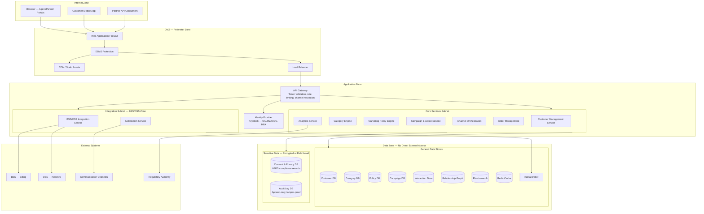
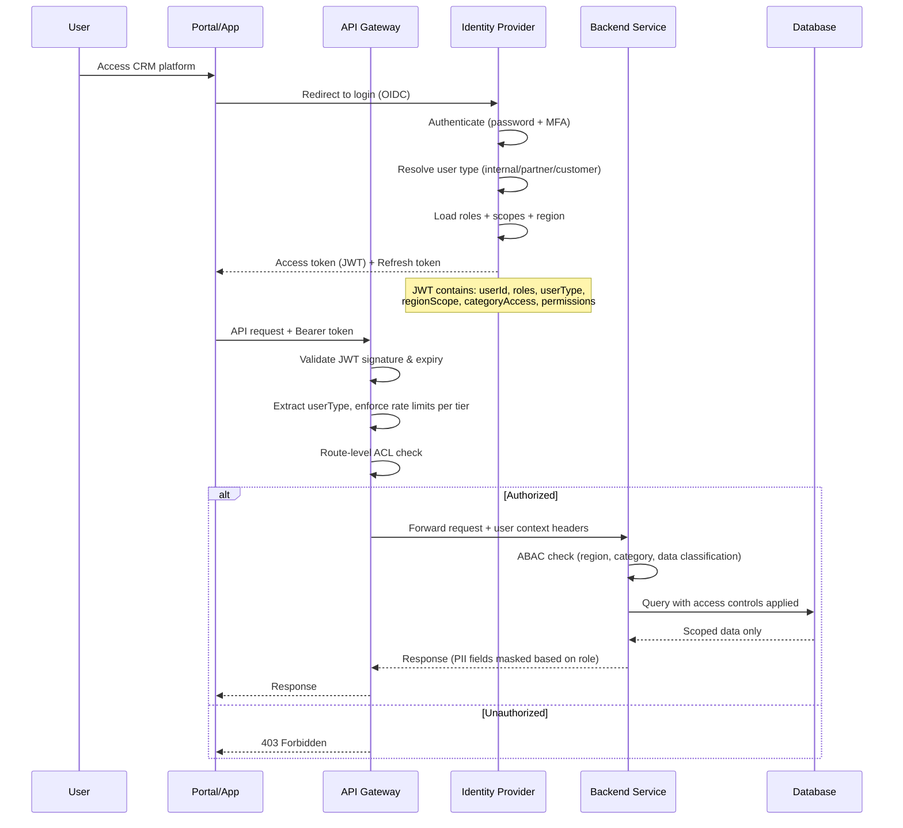

# Security Architecture Overlay — Telecom CRM Platform

## Description
Cross-cutting security architecture showing network zones, authentication flows, encryption boundaries, data isolation, LGPD/GDPR compliance, and telecom-specific regulatory requirements for a CRM handling PII data of millions of customers across multiple categories and partner organizations.

## Network Security Zones



## Authentication & Authorization Flow



## RBAC Model

```mermaid
graph LR
    subgraph Roles
        R1[CUSTOMER]
        R2[SALES_REPRESENTATIVE]
        R3[SUPPORT_AGENT]
        R4[MARKETING_ANALYST]
        R5[SENIOR_MARKETING_ANALYST]
        R6[CHANNEL_MANAGER]
        R7[COMPLIANCE_OFFICER]
        R8[PLATFORM_ADMIN]
    end

    subgraph Modules
        M1[Customer Self-Service]
        M2[Customer Management]
        M3[Category Engine]
        M4[Policy Engine]
        M5[Campaign Management]
        M6[Order Management]
        M7[Analytics & Reporting]
        M8[System Configuration]
        M9[Partner Portal]
    end

    R1 -->|view own account, accept offers, manage preferences| M1

    R2 -->|create/update customers, place orders| M2
    R2 -->|view categories (read-only)| M3
    R2 -->|view applicable offers for customer| M5
    R2 -->|create/manage orders| M6

    R3 -->|view/update customer data, record interactions| M2
    R3 -->|execute retention actions| M5
    R3 -->|view orders (read-only)| M6

    R4 -->|define categories, membership rules| M3
    R4 -->|create/edit policies, manage campaigns| M4
    R4 -->|full CRUD campaigns and offers| M5
    R4 -->|view analytics| M7

    R5 -->|approve policies for production| M4
    R5 -->|cross-category policy review| M5
    R5 -->|full analytics access| M7

    R6 -->|manage partner configurations| M9
    R6 -->|view partner-scoped analytics| M7

    R7 -->|audit all modules (read-only)| M7
    R7 -->|manage consent policies| M2
    R7 -->|view audit logs| M8

    R8 -->|full system configuration| M8
    R8 -->|all modules access| M7
```

## Data Classification & Protection

| Classification | Examples | Protection Level | Access |
|---------------|----------|-----------------|--------|
| **Public** | Plan names, general offer descriptions | Standard encryption at rest | Any authenticated user |
| **Internal** | Category definitions, policy rules, campaign metrics | Encrypted at rest, access-logged | Internal users only |
| **Confidential** | Customer names, contact info, interaction history | Field-level encryption, masked in UI | Role-based + need-to-know |
| **Restricted** | CPF/CNPJ, financial data, consent records, government customer data | HSM-backed encryption, strict audit | Explicitly authorized + justification |
| **Regulated** | Lawful interception metadata, portability records | Isolated storage, dual-authorization access | Compliance + Legal only |

## LGPD/GDPR Compliance Controls

| Requirement | Implementation |
|-------------|----------------|
| **Consent Management** | Per-purpose, per-channel consent tracking; consent versioning; withdrawal propagation to all services |
| **Data Minimization** | Collect only required fields per category; periodic review of stored data necessity |
| **Right to Access (DSAR)** | Automated data export across all stores (PostgreSQL + MongoDB + Neo4j + Elasticsearch) |
| **Right to Erasure** | Cascading soft-delete with legal hold check; hard-delete after retention period; event broadcast to all consumers |
| **Data Portability** | Export in machine-readable format (JSON/CSV) via self-service portal |
| **Purpose Limitation** | Data tagged with collection purpose; queries validated against declared purpose |
| **Breach Notification** | Automated detection + 72-hour notification workflow to authority and affected customers |
| **DPO Integration** | Compliance Officer role with audit access to all data processing records |
| **Consent by Category** | Different consent requirements per customer category (Individual vs. Business vs. Government) |

## Encryption Strategy

| Layer | Method | Key Management |
|-------|--------|----------------|
| In transit (external) | TLS 1.3 | PKI certificates, auto-rotation |
| In transit (internal) | mTLS | Service mesh certificates (Istio) |
| At rest (general) | AES-256 (database-level TDE) | Cloud KMS managed |
| At rest (PII fields) | AES-256 (column-level) | Per-classification keys, Key Vault |
| At rest (restricted — CPF, financial) | AES-256 (field-level) | HSM-backed keys |
| Documents/interactions | AES-256 (object-level) | Per-customer keys wrapped by master key |
| Kafka messages | Envelope encryption | Topic-level keys, rotated monthly |
| Redis cache | In-memory encryption for PII | Ephemeral keys, TTL-bound |
| Backups | AES-256 | Offline master key, split custody |

## Telecom-Specific Security Controls

| Control | Implementation |
|---------|----------------|
| **Number Portability Data** | Encrypted, access-logged, regulatory retention (5 years) |
| **Lawful Interception Compliance** | Metadata-only storage, dual-authorization access, separate audit trail |
| **SIM Swap Fraud Prevention** | Multi-factor verification on SIM change requests, cooling period |
| **Dealer/Partner Data Isolation** | Partners see only their customers; API key scoping + tenant isolation |
| **Government Customer Protection** | Enhanced access controls, separate data classification, additional audit |
| **Anti-Fraud Detection** | Real-time anomaly detection on account changes, device changes, high-value transactions |

## Security Controls by Role

| Role | Data Access Scope | MFA Required | Session Timeout |
|------|-------------------|--------------|-----------------|
| Platform Admin | All data, system config | Yes (hardware key) | 15 min |
| Compliance Officer | All data (read-only), audit logs | Yes (hardware key) | 30 min |
| Senior Marketing Analyst | Policies + aggregated analytics (no PII) | Yes (TOTP) | 60 min |
| Marketing Analyst | Policies + category config (no customer PII) | Yes (TOTP) | 60 min |
| Sales Representative | Assigned region customers, full PII | Yes (TOTP) | 30 min |
| Support Agent | Customer in active interaction only | Yes (TOTP) | 30 min |
| Channel Manager | Partner-scoped data only | Yes (TOTP) | 60 min |
| Customer | Own data only | Optional (TOTP/biometric) | 24 hours (app) |
| Partner/Dealer | Partner-assigned customer subset | Yes (TOTP) | 30 min |
