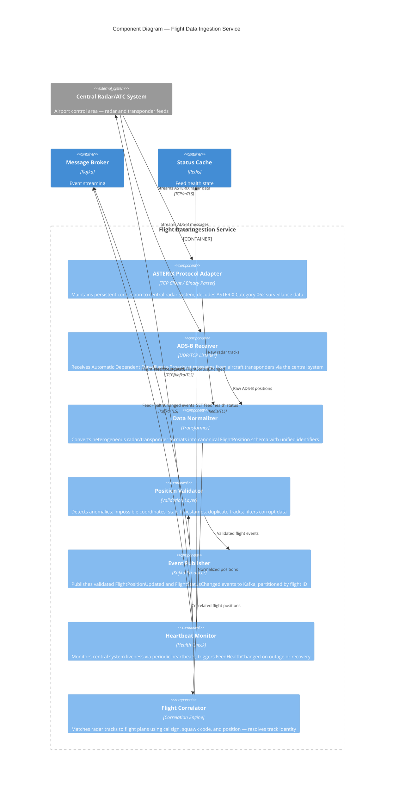

# C4 Component Diagram — Flight Data Ingestion Service

## Description
Internal components of the Flight Data Ingestion microservice, showing protocol adapters, data normalizers, validators, and publishers that transform raw radar/transponder data into canonical flight events.

## Domain Events Published

| Event | Trigger | Consumers |
|-------|---------|-----------|
| `FlightPositionUpdated` | Valid position update received for a tracked flight | Flight Status Processor |
| `FlightStatusChanged` | Major status transition detected (departed, landed, etc.) | Flight Status Processor, Distribution Service |
| `FeedHealthChanged` | Central system connection lost or restored | Airport Ops Dashboard, Monitoring |
| `TrackIdentified` | Radar track successfully correlated to a flight plan | Flight Status Processor |
| `TrackLost` | Radar track disappeared without expected landing | Flight Status Processor, Airport Ops |
| `DuplicateTrackDetected` | Multiple tracks appear for same flight — data quality issue | Airport Ops (monitoring alert) |

## Data Flow Characteristics

| Metric | Value |
|--------|-------|
| Inbound throughput | ~1,000–5,000 position updates/second (peak hours) |
| Flights tracked simultaneously | 200–500 (depending on airport size) |
| Kafka partitions | 32–64 (partitioned by flight ID hash) |
| Latency target | < 100ms from radar signal to Kafka publish |
| Availability | 99.99% — aviation-grade reliability requirement |
| Feed failover | Active-passive per ATC connection; < 3s switchover |
| Data validation reject rate | < 0.1% (corrupt/stale positions filtered) |
