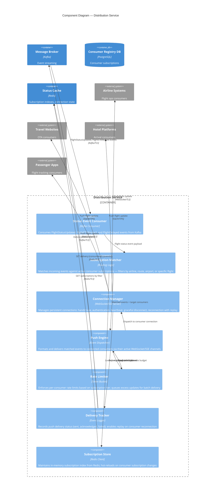

# C4 Component Diagram — Distribution Service

## Description
Internal components of the Distribution Service, showing how flight status updates are consumed from Kafka, matched to consumer subscriptions, and pushed in real-time via WebSocket/SSE connections to authorized external consumers.

## Subscription Model

| Filter Type | Example | Use Case |
|-------------|---------|----------|
| **By Airline** | `airline=AA` | American Airlines receives all their own flights |
| **By Route** | `origin=JFK&destination=LAX` | OTA showing JFK→LAX flights |
| **By Airport** | `airport=CDG&type=arrivals` | Hotel shuttle service at CDG |
| **By Flight** | `flightId=AA123` | Passenger tracking a specific flight |
| **By Region** | `region=europe` | Travel site covering European routes |
| **All Flights** | `filter=*` | Premium partners needing full airport feed |

## Delivery Guarantees

| Aspect | Design |
|--------|--------|
| **Semantics** | At-least-once delivery — consumers deduplicate by event sequence number |
| **Reconnection replay** | On reconnect, consumer receives missed events from last acknowledged offset (stored in Redis) |
| **Heartbeat** | Server sends ping every 30s; client must respond within 10s or connection is considered dead |
| **Backpressure** | If consumer falls behind, events are buffered up to 1000; beyond that, oldest events are dropped with a gap notification |
| **Rate limiting** | Per-consumer token bucket; excess events queued and delivered in next available window |
| **Circuit breaker** | If consumer fails to acknowledge 10 consecutive events, connection is suspended and admin alerted |
| **Graceful shutdown** | On server restart, consumers receive close frame with reconnect hint; replay from last ack |

## Consumer Tier Capabilities

| Tier | Max Connections | Push Rate | Filters | Replay Window |
|------|----------------|-----------|---------|---------------|
| **Basic** | 2 | 10 events/sec | By flight only | 5 minutes |
| **Standard** | 10 | 100 events/sec | By airline, route, airport | 30 minutes |
| **Premium** | Unlimited | 1,000 events/sec | All filters + wildcard | 24 hours |
| **Partner** | Unlimited | Unlimited | Full feed | 48 hours |

## Domain Events Published

| Event | Trigger | Consumers |
|-------|---------|-----------|
| `ConsumerConnected` | New WebSocket/SSE connection established | Monitoring, Admin Dashboard |
| `ConsumerDisconnected` | Connection closed (graceful or timeout) | Monitoring, Admin Dashboard |
| `DeliveryFailed` | Push to consumer failed after retries | Admin alerting, audit log |
| `RateLimitExceeded` | Consumer exceeded their tier's push rate | Consumer notification, admin log |
