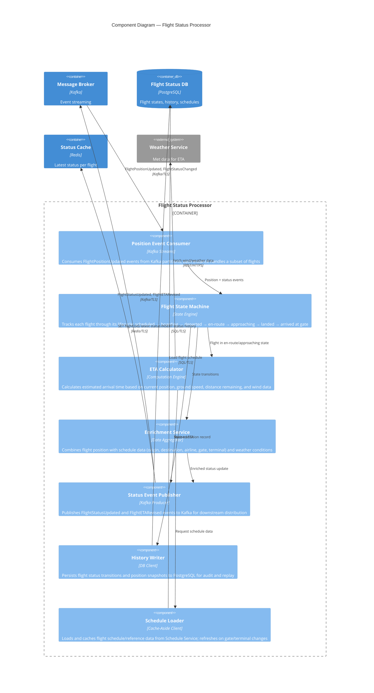
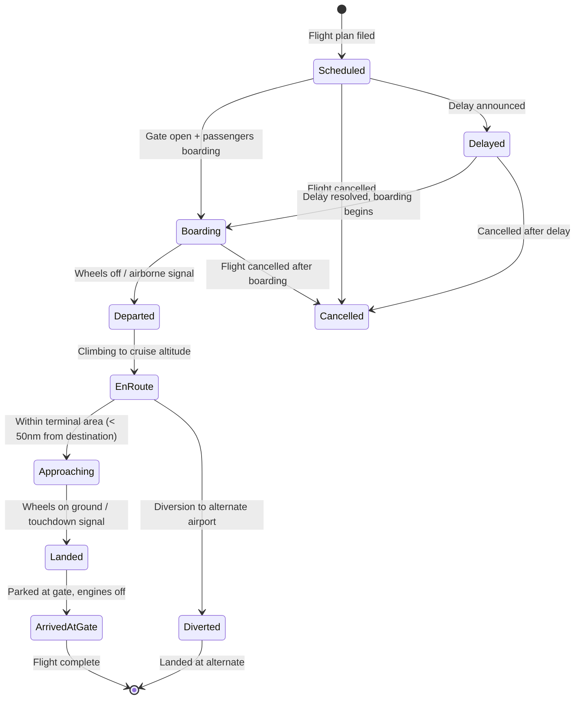

# C4 Component Diagram — Flight Status Processor

## Description
Internal components of the Flight Status Processor service, showing how raw flight position events are consumed, flights are tracked through their lifecycle state machine, ETAs are calculated, and enriched status updates are published for distribution.

## Flight Lifecycle State Machine

## Domain Events Published

| Event | Trigger | Consumers |
|-------|---------|-----------|
| `FlightStatusUpdated` | Flight transitions to a new lifecycle state | Distribution Service, Consumer API |
| `FlightETARevised` | ETA changes by > 5 minutes from previous estimate | Distribution Service, Consumer API |
| `FlightDelayed` | Delay detected (schedule vs. actual departure) | Distribution Service, Airlines |
| `FlightDiverted` | Flight diverts to alternate airport | Distribution Service, Airlines, Airport Ops |
| `FlightCancelled` | Flight removed from active tracking | Distribution Service, All consumers |
| `GateChanged` | Arrival/departure gate reassigned | Distribution Service, Airlines, Passenger Apps |

## Scaling Strategy

| Aspect | Design |
|--------|--------|
| Partitioning | Kafka partitions keyed by flight ID — each processor instance owns a flight subset |
| Flight capacity | ~500–2,000 active flights per instance (state machine ~1KB/flight) |
| Horizontal scale | Add Kafka consumer instances = linear throughput increase |
| Rebalancing | Kafka consumer group rebalance on scale-up; state rebuilt from recent events |
| Latency target | < 200ms from position event received to FlightStatusUpdated published |
| ETA recalculation | Every 60 seconds for en-route flights, every 30 seconds for approaching flights |
