# C4 Container Diagram — Flight Status Distribution System

## Description
Shows the high-level runtime containers that compose the Flight Status Distribution system — ingestion adapters, processing services, distribution gateways, databases, message broker, and cache infrastructure.

```mermaid
C4Container
    title Container Diagram — Flight Status Distribution

    Person(airlineOps, "Airline Operations Center", "Subscribes to real-time flight updates")
    Person(airportOps, "Airport Operations Staff", "Manages system and consumers")

    System_Boundary(flightSystem, "Flight Status Distribution System") {
        Container(adminDashboard, "Admin Dashboard", "React", "System health monitoring, consumer management, data quality oversight")
        Container(apiGateway, "API Gateway", "Kong/NGINX", "Routes requests, API key validation, rate limiting, SSL termination")

        Container(ingestionSvc, "Flight Data Ingestion Service", "Go/Rust", "Connects to central ATC system, parses ASTERIX/ADS-B protocols, normalizes and publishes flight events")
        Container(flightProcessor, "Flight Status Processor", "Spring Boot + Kafka Streams", "Maintains flight state machines, calculates ETAs, enriches with schedule data, publishes status updates")
        Container(distributionSvc, "Distribution Service", "Node.js", "Manages consumer subscriptions, pushes real-time updates via WebSocket/SSE, tracks delivery")
        Container(consumerApi, "Consumer REST API", "Spring Boot", "On-demand flight status queries, consumer registration, subscription management")
        Container(scheduleSvc, "Schedule Service", "Spring Boot", "Flight schedule management, gate/terminal assignments, reference data")

        Container(broker, "Message Broker", "Apache Kafka", "Event streaming: flight positions, status changes, ETA revisions, consumer notifications")
        ContainerDb(flightDb, "Flight Status DB", "PostgreSQL", "Current flight states, status history, schedule data")
        ContainerDb(consumerDb, "Consumer Registry DB", "PostgreSQL", "Consumer profiles, API keys, subscription rules, access tiers")
        Container(statusCache, "Status Cache", "Redis", "Latest flight status per flight, subscription indexes, connection state")
    }

    System_Ext(centralATC, "Central Radar/ATC System", "Real-time radar and transponder data")
    System_Ext(weatherService, "Weather Service", "Meteorological data")
    System_Ext(airlines, "Airline Systems", "Flight ops consumers")
    System_Ext(travelSites, "Travel Websites", "OTA consumers")
    System_Ext(hotelSites, "Hotel Platforms", "Arrival consumers")

    Rel(airportOps, adminDashboard, "Uses", "HTTPS")
    Rel(airlineOps, distributionSvc, "Subscribes to updates", "WebSocket/TLS")
    Rel(airlineOps, apiGateway, "Queries flight status", "HTTPS")

    Rel(centralATC, ingestionSvc, "Streams radar/ADS-B data", "ASTERIX/TCP, mTLS")
    Rel(weatherService, flightProcessor, "Weather updates", "REST/HTTPS")

    Rel(ingestionSvc, broker, "Publishes FlightPositionUpdated, FlightStatusChanged", "Kafka/TLS")
    Rel(flightProcessor, broker, "Consumes positions, publishes FlightStatusUpdated, FlightETARevised", "Kafka/TLS")
    Rel(flightProcessor, flightDb, "Reads schedule, writes flight state", "SQL/TLS")
    Rel(flightProcessor, statusCache, "Writes latest status", "Redis/TLS")

    Rel(distributionSvc, broker, "Consumes FlightStatusUpdated events", "Kafka/TLS")
    Rel(distributionSvc, statusCache, "Reads subscriptions, connection state", "Redis/TLS")
    Rel(distributionSvc, consumerDb, "Reads consumer subscriptions", "SQL/TLS")

    Rel(distributionSvc, airlines, "Pushes updates", "WebSocket/TLS")
    Rel(distributionSvc, travelSites, "Pushes updates", "SSE/HTTPS")
    Rel(distributionSvc, hotelSites, "Pushes updates", "SSE/HTTPS")

    Rel(apiGateway, consumerApi, "Routes", "HTTPS")
    Rel(apiGateway, scheduleSvc, "Routes", "HTTPS")
    Rel(consumerApi, flightDb, "Reads flight status", "SQL/TLS")
    Rel(consumerApi, statusCache, "Reads latest status", "Redis/TLS")
    Rel(consumerApi, consumerDb, "Reads/Writes consumer data", "SQL/TLS")
    Rel(scheduleSvc, flightDb, "Reads/Writes schedules", "SQL/TLS")
```

## Container Responsibilities

| Container | Scaling Strategy | Data Ownership |
|-----------|-----------------|----------------|
| Admin Dashboard | CDN for static assets | None (stateless) |
| API Gateway | Horizontal, multi-instance | None (stateless) |
| Flight Data Ingestion Service | Active-passive pair per ATC connection; failover < 3s | None (publishes to Kafka) |
| Flight Status Processor | Horizontally scaled by Kafka partitions (by flight ID) | In-memory flight state |
| Distribution Service | Horizontal, sticky sessions for WebSocket connections | Connection state in Redis |
| Consumer REST API | Horizontal (read-heavy workload) | None (reads from DB/cache) |
| Schedule Service | Horizontal (low write, high read) | Flight schedules, gates |
| Message Broker (Kafka) | Clustered, partitioned by flight ID | Event log (retention: 48 hours) |
| Flight Status DB | Primary + read replicas | Flight states, history, schedules |
| Consumer Registry DB | Primary + read replica | Consumer profiles, subscriptions |
| Status Cache (Redis) | Clustered, sharded by flight ID | Latest status, subscription indexes |
