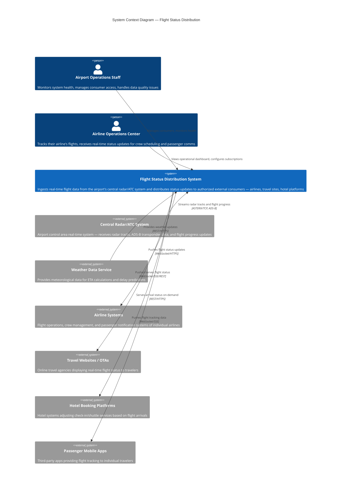

# C4 System Context Diagram — Flight Status Distribution System

## Description
Shows the Flight Status Distribution system in context with its external actors, the central airport radar/ATC system, and all external consumer systems that receive flight data.

## Key Observations

- **2 internal actor types**: Airport Operations Staff (system administrators) and Airline Operations Centers (power users with operational dashboards)
- **1 primary inbound data source**: Central Radar/ATC System providing real-time flight tracking data via proprietary protocols (ASTERIX, ADS-B)
- **1 secondary inbound source**: Weather Data Service for ETA enrichment
- **4 outbound consumer categories**: Airlines (operational), Travel Websites (informational), Hotel Platforms (logistics), Passenger Apps (personal tracking)
- **Dual distribution model**: Push (WebSocket/SSE) for real-time consumers, Pull (REST) for on-demand consumers
- The central ATC system is in a restricted network zone — the connection is highly secured (mTLS, IP whitelist)
- Consumer diversity requires flexible filtering — each consumer type needs different subsets of data
