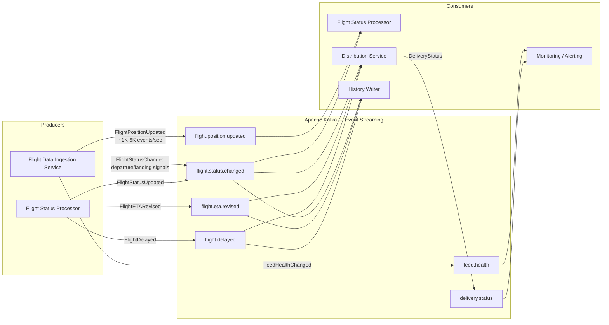
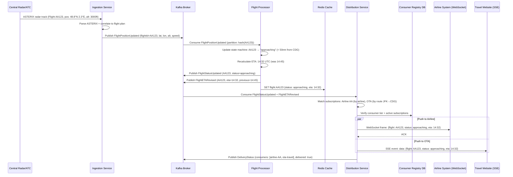
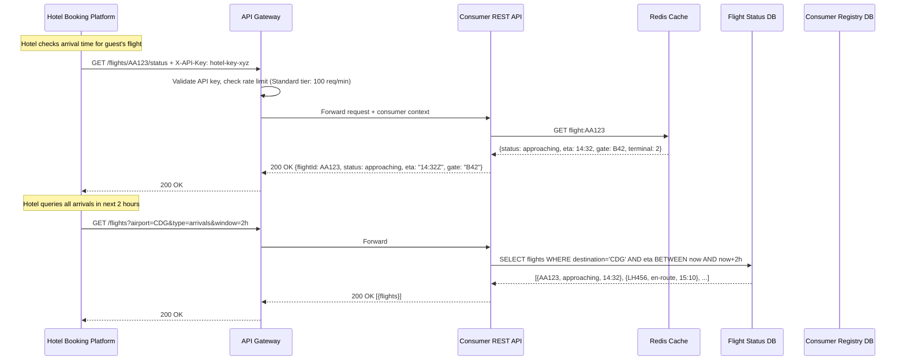
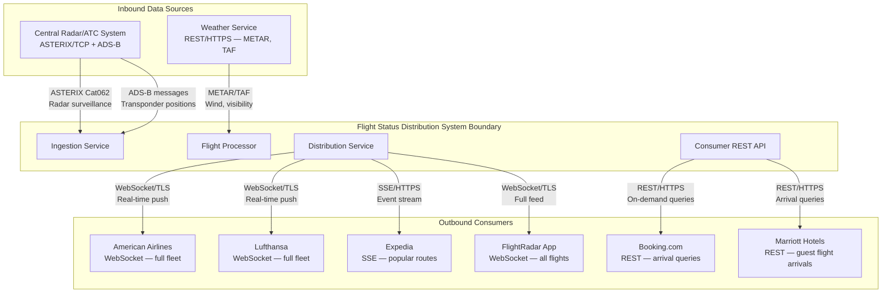

# Integration Patterns — Flight Status Distribution System

## Description
Defines how the Flight Status Distribution system modules communicate with each other and with external systems, using event-driven streaming, real-time push protocols, and synchronous API patterns.

## Event-Driven Architecture (Core Pipeline)

## End-to-End Flight Status Flow (Sequence)

## Synchronous API Calls

## External System Integration

## Integration Patterns Summary

| Pattern | Usage | Rationale |
|---------|-------|-----------|
| **Pub/Sub (Kafka)** | Position updates → Processor → Distribution | Loose coupling, independent scaling, replay capability |
| **Fan-out** | One FlightStatusUpdated → multiple consumer subscriptions | Single event triggers delivery to all subscribers for that flight/airline/route |
| **Protocol Adapter** | ASTERIX/ADS-B → canonical events | Isolates proprietary protocol complexity from business logic |
| **WebSocket (bidirectional)** | Airline systems, flight tracking apps | Low-latency push with acknowledgment; supports consumer commands (subscribe/unsubscribe) |
| **SSE (server-sent events)** | Travel websites, OTAs | Simple HTTP-based push; works through proxies; no client→server messaging needed |
| **Request/Response (REST)** | Hotel platforms, batch consumers | On-demand queries for consumers that don't need real-time push |
| **Cache-Aside** | Redis for latest flight status | Sub-millisecond reads for REST API; avoids querying the full pipeline |
| **Circuit Breaker** | Distribution → consumer connections | If a consumer is unreachable, stop pushing to avoid resource exhaustion |
| **Replay on Reconnect** | Consumer reconnects after disconnect | Guaranteed delivery — consumer receives missed events from last ACK offset |
| **Competing Consumers** | Multiple Distribution Service instances | Horizontal scaling of push delivery workload |
| **Event Sourcing** | Flight status history | Complete audit trail of all state transitions for compliance and debugging |

## Data Flow Metrics

| Stage | Throughput | Latency (p99) |
|-------|-----------|---------------|
| Radar → Kafka (ingestion) | 1K–5K events/sec | < 100ms |
| Kafka → Flight status processed | 1K–5K events/sec | < 200ms |
| Status change → Distribution push | ~100–500 status changes/min | < 300ms |
| End-to-end (radar signal → consumer notified) | — | < 1 second |
| REST API response (cache hit) | 10K req/sec | < 20ms |
| REST API response (DB query) | 2K req/sec | < 100ms |
