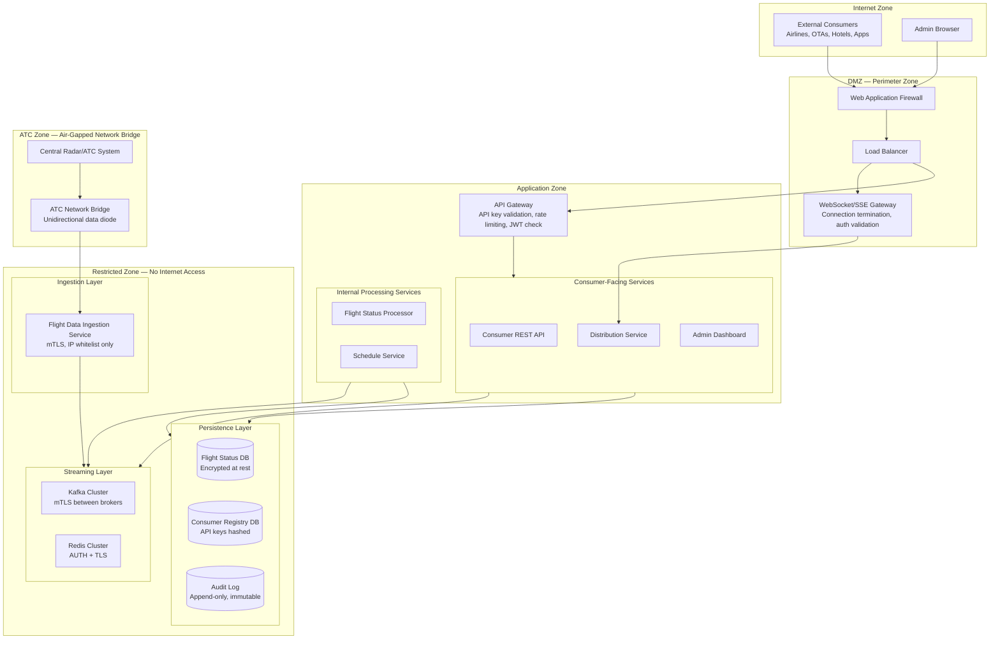
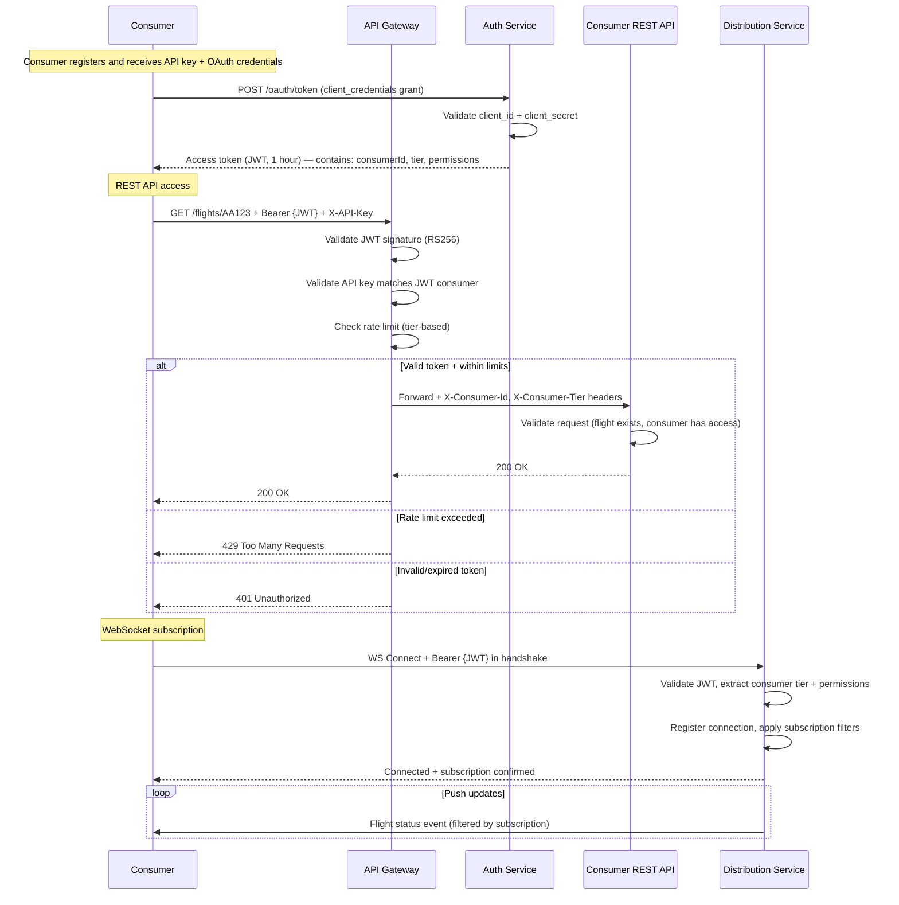
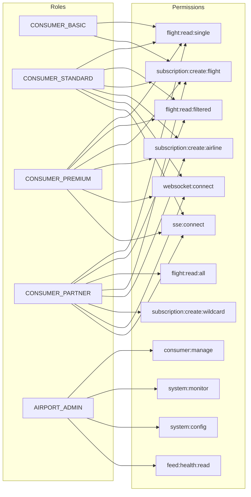

# Security Architecture Overlay — Flight Status Distribution System

## Description
Cross-cutting security architecture showing network zones, authentication flows, encryption boundaries, and access control enforcement points for the Flight Status Distribution system. Special emphasis on protecting the sensitive radar/ATC feed connection and managing multi-tenant consumer access.

## Network Security Zones

## Authentication & Authorization Flow

## RBAC Model

## Consumer Tier Access Control

| Tier | API Rate Limit | Push Connections | Data Access | Subscription Filters |
|------|---------------|-----------------|-------------|---------------------|
| **Basic** | 60 req/min | None (REST only) | Single flight lookup | By flight ID only |
| **Standard** | 600 req/min | 10 WebSocket/SSE | Filtered queries (airline, route) | By airline, route, airport |
| **Premium** | 6,000 req/min | Unlimited | Full query access | All filters including time windows |
| **Partner** | Unlimited | Unlimited | Full feed + historical data | Wildcard — receives all events |
| **Admin** | Unlimited | N/A | Full system access | N/A |

## Encryption Strategy

| Layer | Mechanism | Scope |
|-------|-----------|-------|
| **In transit (external)** | TLS 1.3 | All consumer ↔ API/WebSocket communication |
| **In transit (ATC feed)** | mTLS + data diode | Ingestion ↔ Central ATC system (unidirectional) |
| **In transit (internal)** | mTLS | Service-to-service, Kafka broker-to-broker |
| **At rest (database)** | AES-256 (Transparent Data Encryption) | All PostgreSQL databases |
| **At rest (API keys)** | bcrypt hash + salt | Consumer API keys in registry DB |
| **Kafka events** | TLS in transit; no PII in flight data | Position events contain only flight operational data |
| **Redis cache** | AUTH + TLS | In-transit encryption; flight data only (no PII) |
| **Secrets management** | HashiCorp Vault / K8s Secrets | API keys, DB credentials, JWT signing keys, TLS certs |

## Security Controls Summary

| Threat | Mitigation |
|--------|-----------|
| **Unauthorized access to flight data** | API key + OAuth2 JWT double validation; tier-based access control |
| **ATC feed interception** | mTLS + data diode (unidirectional); air-gapped network bridge; IP whitelist |
| **Consumer impersonation** | API key bound to JWT claims; key rotation every 90 days |
| **DDoS on API/WebSocket** | WAF + rate limiting at gateway + auto-scaling; per-consumer connection limits |
| **Data poisoning (fake positions)** | Ingestion service validates against known flight plans; anomaly detection on positions |
| **Insider threat** | Admin actions logged to append-only audit DB; least-privilege IAM; no direct DB access |
| **WebSocket hijacking** | JWT validated on handshake; connection bound to consumer IP; periodic re-auth |
| **Feed outage manipulation** | Heartbeat monitoring detects outages; staleness indicators shown to consumers |
| **SQL injection** | Parameterized queries, ORM layer, input validation |
| **Consumer data leakage** | Each consumer sees only their subscribed subset; no cross-tenant data exposure |

## Compliance & Audit

| Requirement | Implementation |
|-------------|---------------|
| **Audit trail** | All consumer access, subscription changes, and admin actions logged to immutable audit DB |
| **Data retention** | Flight status: 90 days; position history: 30 days; audit logs: 5 years; consumer data: account lifetime |
| **Aviation data regulations** | Compliance with ICAO Annex 10 for surveillance data handling; local civil aviation authority requirements |
| **Consumer data agreement** | Each consumer signs data usage agreement specifying allowed redistribution and display rules |
| **Incident response** | Automated detection of feed anomalies; < 5 min escalation SLA for ATC connection loss |
| **Key rotation** | Consumer API keys: 90 days; JWT signing keys: 30 days; TLS certs: annual; mTLS certs: annual |
