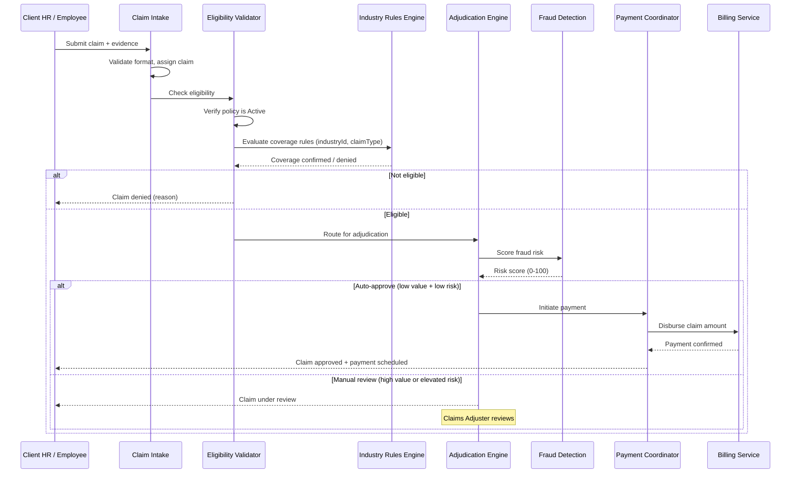

# C4 Component Diagram — Claims Processing Service

## Description
Internal components of the Claims Processing Service, showing the claim intake, eligibility validation against industry rules, adjudication engine with auto-approve routing, fraud detection, and payment disbursement integration.

```mermaid
C4Component
    title Component Diagram — Claims Processing Service

    Container_Boundary(claims_svc, "Claims Processing Service") {
        Component(claim_controller, "Claim Controller", "REST Controller", "Handles claim submission, status queries, document upload")
        Component(adjudication_controller, "Adjudication Controller", "REST Controller", "Handles manual review decisions by claims adjusters")
        Component(fraud_controller, "Fraud Alert Controller", "REST Controller", "Manages fraud flags, investigation assignments")

        Component(intake_service, "Claim Intake Service", "Domain Service", "Validates claim format, assigns claim number, routes to processing queue")
        Component(eligibility_validator, "Eligibility Validator", "Domain Service", "Checks policy status, coverage match, industry-specific eligibility via rules engine")
        Component(adjudication_engine, "Adjudication Engine", "Domain Service", "Routes claims: auto-approve (below threshold) vs. manual review (complex/high-value)")
        Component(fraud_detector, "Fraud Detection Module", "ML/Rules Service", "Pattern analysis, duplicate detection, anomaly scoring, watchlist matching")
        Component(payment_coordinator, "Payment Coordinator", "Domain Service", "Initiates claim payment via Billing service, tracks disbursement status")
        Component(event_publisher, "Event Publisher", "Kafka Producer", "Publishes ClaimSubmitted, ClaimApproved, ClaimDenied, FraudFlagged events")

        Component(claims_repo, "Claims Repository", "JPA/EF Repository", "CRUD operations on claims, adjudication records, audit trail")
        Component(doc_client, "Document Client", "HTTP Client", "Uploads/retrieves claim evidence documents from Document Store")
    }

    Container(rulesEngine, "Industry Rules Engine", "Spring Boot/.NET", "Industry-specific eligibility and coverage rules")
    Container(billingService, "Billing & Payments Service", "Spring Boot/.NET", "Payment processing and disbursement")
    ContainerDb(claimsDb, "Claims DB", "PostgreSQL", "Claims, decisions, payment records")
    Container(docStore, "Document Store", "MongoDB", "Claim evidence, medical reports")
    Container(broker, "Message Broker", "Kafka", "Event bus")
    Container(cache, "Cache", "Redis", "Fraud scoring cache, claim status cache")

    Rel(claim_controller, intake_service, "Delegates submission")
    Rel(adjudication_controller, adjudication_engine, "Delegates review decisions")
    Rel(fraud_controller, fraud_detector, "Manages fraud cases")

    Rel(intake_service, eligibility_validator, "Validates eligibility")
    Rel(intake_service, doc_client, "Stores evidence documents")
    Rel(eligibility_validator, rulesEngine, "Evaluates industry coverage rules", "gRPC")
    Rel(eligibility_validator, adjudication_engine, "Routes eligible claims")

    Rel(adjudication_engine, fraud_detector, "Scores for fraud risk")
    Rel(adjudication_engine, payment_coordinator, "Triggers payment on approval")
    Rel(fraud_detector, cache, "Caches fraud scores", "Redis")

    Rel(payment_coordinator, billingService, "Initiates disbursement", "gRPC/HTTPS")
    Rel(claims_repo, claimsDb, "SQL queries", "TLS")
    Rel(doc_client, docStore, "PUT/GET documents", "HTTPS")
    
    Rel(intake_service, event_publisher, "ClaimSubmitted")
    Rel(adjudication_engine, event_publisher, "ClaimApproved/Denied")
    Rel(fraud_detector, event_publisher, "FraudFlagged")
    Rel(event_publisher, broker, "Publishes events", "Kafka/TLS")
```

## Claim Processing Flow

## Adjudication Routing Rules

| Condition | Route | SLA |
|-----------|-------|-----|
| Claim amount < threshold AND fraud score < 30 | Auto-approve | Immediate |
| Claim amount < threshold AND fraud score 30-60 | Fast-track manual review | 24 hours |
| Claim amount ≥ threshold OR fraud score > 60 | Full manual review | 5 business days |
| Fraud score > 85 OR watchlist match | Fraud investigation | Hold + investigation |
| Repeat claim (same type within 90 days) | Elevated review | 48 hours |

## Domain Events Published

| Event | Trigger | Consumers |
|-------|---------|-----------|
| `ClaimSubmitted` | New claim passes intake validation | Notification (acknowledgment), Reporting |
| `ClaimApproved` | Adjudication approves (auto or manual) | Billing (payment), Document Gen (letter), Notification |
| `ClaimDenied` | Adjudication denies claim | Notification (denial letter), Reporting |
| `ClaimUnderReview` | Routed to manual review | Notification (status update) |
| `FraudFlagged` | Fraud score exceeds threshold | Notification (alert to adjuster), Compliance audit |
| `PaymentDisbursed` | Billing confirms payment sent | Notification (payment confirmation), Reporting |

## Fraud Detection Signals

| Signal | Detection Method | Weight |
|--------|-----------------|--------|
| Duplicate claim (same event, same insured) | Hash matching on claim details | High |
| Frequency anomaly (unusual claim rate) | Statistical analysis per insured | Medium |
| Amount anomaly (exceeds historical pattern) | Z-score against insured's history | Medium |
| Document inconsistency | OCR + metadata analysis | High |
| Watchlist match (known fraud actors) | Database lookup | Critical |
| Timing anomaly (claim too close to policy start) | Rule-based threshold | Low-Medium |
