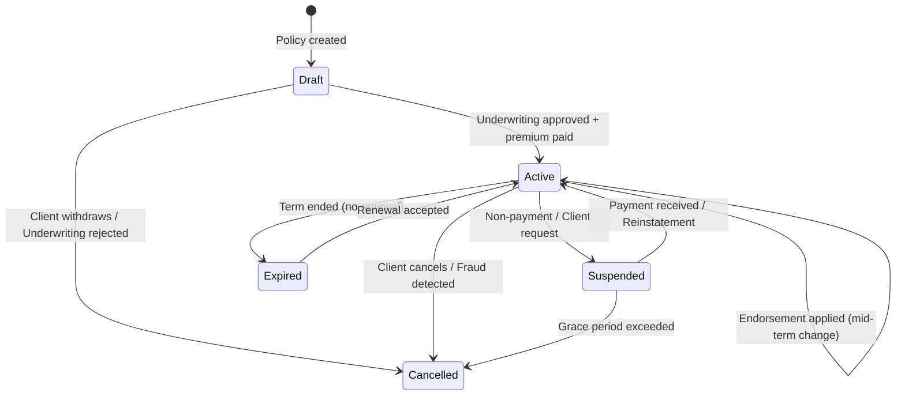

# C4 Component Diagram — Policy Lifecycle Service

## Description
Internal components of the Policy Lifecycle Service, showing the state machine, template management, endorsement processing, renewal engine, and versioning capabilities.

```mermaid
C4Component
    title Component Diagram — Policy Lifecycle Service

    Container_Boundary(policy_svc, "Policy Lifecycle Service") {
        Component(policy_controller, "Policy Controller", "REST Controller", "Handles HTTP requests for policy CRUD, status transitions, search")
        Component(endorsement_controller, "Endorsement Controller", "REST Controller", "Handles mid-term policy modification requests")
        Component(renewal_controller, "Renewal Controller", "REST Controller", "Manages renewal workflows — auto and manual")

        Component(state_machine, "Policy State Machine", "Domain Service", "Enforces valid transitions: Draft→Active→Suspended→Expired→Cancelled with guard conditions")
        Component(template_registry, "Policy Template Registry", "Domain Service", "Manages industry-agnostic policy structures, coverage skeletons, required fields")
        Component(endorsement_manager, "Endorsement Manager", "Domain Service", "Processes mid-term changes: beneficiary updates, coverage adjustments, rider additions")
        Component(renewal_engine, "Renewal Engine", "Domain Service", "Evaluates renewal eligibility, calculates adjusted premiums, generates renewal offers")
        Component(versioning_service, "Policy Versioning Service", "Domain Service", "Maintains complete audit trail of all policy changes with point-in-time reconstruction")
        Component(event_publisher, "Event Publisher", "Kafka Producer", "Publishes PolicyCreated, PolicyActivated, PolicyEndorsed, PolicyRenewed, PolicyCancelled events")

        Component(policy_repo, "Policy Repository", "JPA/EF Repository", "CRUD operations on policy tables with row-level security")
        Component(version_repo, "Version Repository", "JPA/EF Repository", "Stores policy version snapshots and change diffs")
    }

    Container(rulesEngine, "Industry Rules Engine", "Spring Boot/.NET", "Validates against industry-specific rules")
    ContainerDb(policyDb, "Policy DB", "PostgreSQL", "Policy records, endorsements, versions")
    Container(broker, "Message Broker", "Kafka", "Event bus")
    Container(cache, "Cache", "Redis", "Template cache, active policy cache")

    Rel(policy_controller, state_machine, "Delegates transitions")
    Rel(policy_controller, template_registry, "Fetches templates for new policies")
    Rel(endorsement_controller, endorsement_manager, "Delegates modifications")
    Rel(renewal_controller, renewal_engine, "Delegates renewal processing")

    Rel(state_machine, policy_repo, "Persists state changes")
    Rel(state_machine, versioning_service, "Records version on each transition")
    Rel(state_machine, rulesEngine, "Validates transition rules per industry", "gRPC")
    Rel(template_registry, cache, "Caches templates", "Redis protocol")
    Rel(endorsement_manager, policy_repo, "Updates policy records")
    Rel(endorsement_manager, versioning_service, "Records endorsement version")
    Rel(endorsement_manager, rulesEngine, "Validates endorsement rules", "gRPC")
    Rel(renewal_engine, policy_repo, "Reads expiring policies")
    Rel(renewal_engine, rulesEngine, "Evaluates renewal eligibility", "gRPC")
    Rel(versioning_service, version_repo, "Stores versions")

    Rel(policy_repo, policyDb, "SQL queries", "TLS")
    Rel(version_repo, policyDb, "SQL queries", "TLS")
    Rel(event_publisher, broker, "Publishes events", "Kafka/TLS")
    Rel(state_machine, event_publisher, "Triggers on state change")
    Rel(endorsement_manager, event_publisher, "Triggers on endorsement")
    Rel(renewal_engine, event_publisher, "Triggers on renewal")
```

## Policy State Machine

## Domain Events Published

| Event | Trigger | Consumers |
|-------|---------|-----------|
| `PolicyCreated` | New policy enters Draft state | Billing (quote), Notification, Reporting |
| `PolicyActivated` | Underwriting approved + paid | Billing (invoice), Document Gen, Client Service |
| `PolicyEndorsed` | Mid-term modification applied | Billing (recalculate), Document Gen, Notification |
| `PolicyRenewed` | Renewal accepted and effective | Billing (new term), Document Gen, Reporting |
| `PolicySuspended` | Non-payment or client request | Notification (warning), Claims (suspend eligibility) |
| `PolicyCancelled` | Termination finalized | Billing (refund calc), Notification, Reporting |
| `PolicyExpired` | Term ended without renewal | Notification (renewal offer), Reporting |

## Scaling Considerations

| Scenario | Strategy |
|----------|----------|
| Renewal surge (quarter/year-end) | Horizontal pod scaling, batch renewal processing |
| High read volume (policy lookups) | Redis cache for active policies, read replicas |
| Endorsement bursts (open enrollment) | Queue-based processing with priority lanes |
| Audit queries (compliance) | Separate version DB read replica, CQRS pattern |
