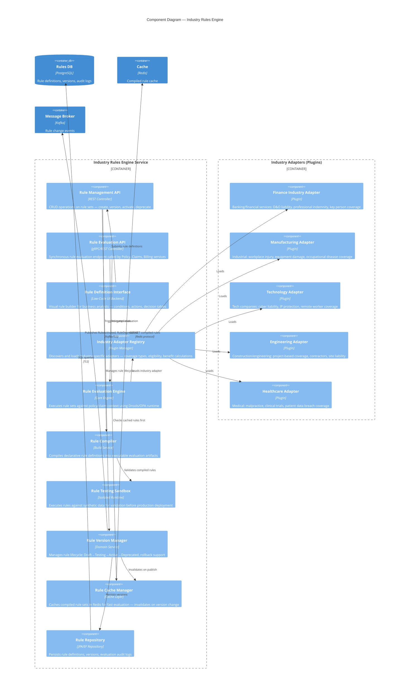
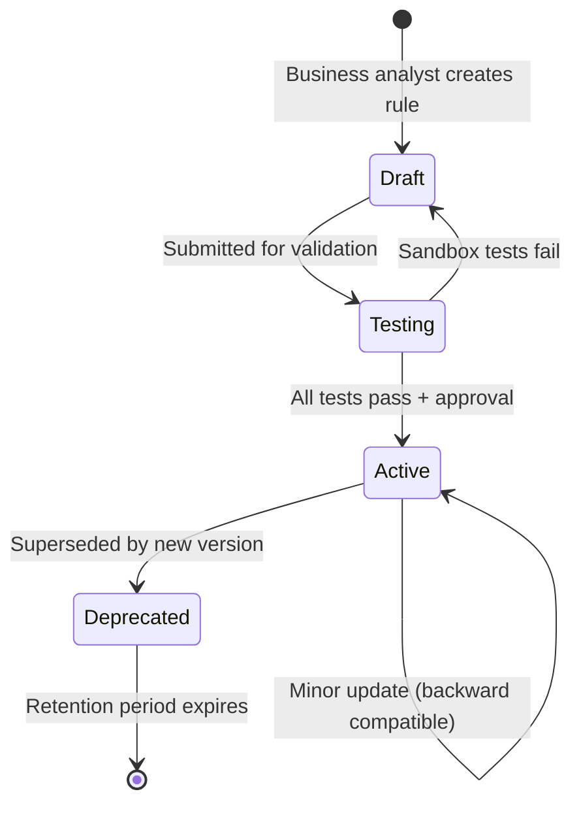
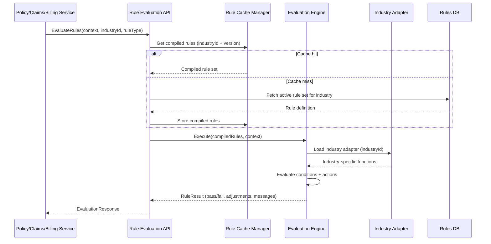

# C4 Component Diagram — Industry Rules Engine

## Description
Internal components of the Industry Rules Engine service — the key architectural differentiator that enables a single platform to serve multiple industries. Business analysts define rules per industry via a low-code interface; the engine evaluates those rules at runtime during policy creation, endorsement, claims, and billing operations.

## Industry Adapter Capabilities

| Industry | Coverage Types | Eligibility Rules | Benefit Calculation |
|----------|---------------|-------------------|---------------------|
| **Finance** | D&O liability, Professional indemnity, Fidelity bond, Key person | Role-based (executives, traders), Regulatory licensing | Tier-based by AUM, bonus structure inclusion |
| **Manufacturing** | Workplace injury, Equipment damage, Occupational disease, Product liability | Job classification (blue/white collar), Shift patterns, Hazard exposure | Risk-weighted by job category, safety record discount |
| **Technology** | Cyber liability, IP protection, Remote worker, E&O | Employment type (FTE, contractor), Remote/hybrid status | Revenue-based, data volume factor, remote work rider |
| **Engineering** | Project-based coverage, Contractor liability, Site safety, Environmental | Project duration, Contractor certification, Site classification | Project value percentage, contractor multiplier |
| **Healthcare** | Malpractice, Clinical trials, Patient data breach, Infectious disease | Medical specialty, Hospital affiliation, Research involvement | Specialty risk tier, claims history factor |

## Rule Definition Lifecycle

## Rule Evaluation Flow

## Who Defines Rules?

| Role | Responsibility | Access Level |
|------|---------------|--------------|
| **Industry Business Analyst** | Authors rule conditions, decision tables, coverage catalogs per industry | Full CRUD on rules within assigned industry |
| **Senior Business Analyst** | Approves rules for production deployment, cross-industry consistency review | Approve/reject across all industries |
| **Platform Architect** | Defines adapter interfaces, core evaluation engine, plugin contracts | Code-level changes to engine/adapters |
| **QA/Actuary** | Validates rule outcomes against expected actuarial models in sandbox | Read + execute sandbox tests |

## Scaling Considerations

| Scenario | Strategy |
|----------|----------|
| High evaluation throughput (policy creation surge) | Horizontal scaling + Redis-cached compiled rules |
| New industry onboarding | Deploy new adapter plugin, no core service redeploy |
| Rule hot-reload | Version-based cache invalidation, blue-green rule activation |
| Sandbox isolation | Separate container pool for sandbox execution (no production data access) |
