# C4 Container Diagram — Insurance Policy Management Platform

## Description
Shows the high-level runtime containers that compose the platform — applications, microservices, databases, message broker, and infrastructure components.

```mermaid
C4Container
    title Container Diagram — Insurance Policy Management Platform

    Person(internalUser, "Internal User", "Policy Admin, Claims Adjuster, Business Analyst, Compliance Officer")
    Person(externalUser, "External User", "Client HR Manager, Insured Employee")

    System_Boundary(ipm, "Insurance Policy Management Platform") {
        Container(adminPortal, "Admin Portal", "Angular/React SPA", "Internal portal for policy administration, claims review, rule management, reporting")
        Container(clientPortal, "Client Self-Service Portal", "Angular/React SPA", "External portal for client HR managers and insured employees")
        Container(apiGateway, "API Gateway", "Kong/NGINX", "Routes requests, rate limiting, SSL termination, token validation, tenant resolution")

        Container(policyService, "Policy Lifecycle Service", "Spring Boot/.NET", "Policy state machine, endorsements, renewals, versioning")
        Container(rulesEngine, "Industry Rules Engine", "Spring Boot/.NET + Drools/OPA", "Pluggable rule evaluation, industry adapters, rule definition interface")
        Container(clientService, "Client Management Service", "Spring Boot/.NET", "Client companies, employee census, industry classification")
        Container(claimsService, "Claims Processing Service", "Spring Boot/.NET", "Claim intake, eligibility validation, adjudication, fraud detection")
        Container(billingService, "Billing & Payments Service", "Spring Boot/.NET", "Premium calculation, invoicing, payment tracking, commissions")
        Container(docService, "Document Generation Service", "Spring Boot/.NET", "Policy certificates, endorsement letters, claim correspondence")
        Container(notificationService, "Notification Service", "Spring Boot/.NET", "Email, SMS, push notification dispatch")
        Container(reportingService, "Reporting Service", "Spring Boot/.NET", "Analytics dashboards, regulatory reports, CQRS read models")

        ContainerDb(policyDb, "Policy DB", "PostgreSQL", "Policies, endorsements, renewals, versions — row-level security by client")
        ContainerDb(rulesDb, "Rules DB", "PostgreSQL", "Industry rule sets, versions, evaluation history")
        ContainerDb(clientDb, "Client DB", "PostgreSQL", "Client companies, employees, beneficiaries")
        ContainerDb(claimsDb, "Claims DB", "PostgreSQL", "Claims, adjudication records, payment history")
        ContainerDb(docStore, "Document Store", "MongoDB", "Policy templates, generated documents, certificates")

        Container(cache, "Cache", "Redis", "Session store, rule evaluation cache, rate limiting counters")
        Container(broker, "Message Broker", "Apache Kafka", "Event bus — async communication between services")
        Container(idp, "Identity Provider", "Keycloak", "OAuth2/OIDC, RBAC, MFA, multi-tenant SSO")
    }

    System_Ext(clientHR, "Client HR Systems", "Employee census sync")
    System_Ext(payments, "Payment Gateway", "Premium collection, claim disbursement")
    System_Ext(regulatory, "Regulatory Authority", "Compliance filings")
    System_Ext(emailGw, "Email/SMS Gateway", "Notification delivery")

    Rel(internalUser, adminPortal, "Uses", "HTTPS")
    Rel(externalUser, clientPortal, "Uses", "HTTPS")
    Rel(adminPortal, apiGateway, "API calls", "HTTPS/JSON")
    Rel(clientPortal, apiGateway, "API calls", "HTTPS/JSON")
    Rel(apiGateway, idp, "Validates tokens", "HTTPS")

    Rel(apiGateway, policyService, "Routes", "gRPC/HTTPS")
    Rel(apiGateway, rulesEngine, "Routes", "gRPC/HTTPS")
    Rel(apiGateway, clientService, "Routes", "gRPC/HTTPS")
    Rel(apiGateway, claimsService, "Routes", "gRPC/HTTPS")
    Rel(apiGateway, billingService, "Routes", "gRPC/HTTPS")
    Rel(apiGateway, reportingService, "Routes", "gRPC/HTTPS")

    Rel(policyService, policyDb, "Reads/Writes", "SQL/TLS")
    Rel(policyService, rulesEngine, "Evaluates rules", "gRPC")
    Rel(rulesEngine, rulesDb, "Reads/Writes", "SQL/TLS")
    Rel(clientService, clientDb, "Reads/Writes", "SQL/TLS")
    Rel(claimsService, claimsDb, "Reads/Writes", "SQL/TLS")
    Rel(claimsService, rulesEngine, "Validates eligibility", "gRPC")
    Rel(billingService, rulesEngine, "Calculates premiums", "gRPC")
    Rel(docService, docStore, "Reads/Writes", "HTTPS")

    Rel(policyService, broker, "Publishes policy events", "Kafka")
    Rel(claimsService, broker, "Publishes claim events", "Kafka")
    Rel(billingService, broker, "Publishes payment events", "Kafka")
    Rel(notificationService, broker, "Subscribes to all events", "Kafka")
    Rel(reportingService, broker, "Subscribes for CQRS", "Kafka")
    Rel(docService, broker, "Subscribes to generation triggers", "Kafka")

    Rel(clientService, clientHR, "Syncs census data", "REST/SFTP")
    Rel(billingService, payments, "Processes payments", "HTTPS/API")
    Rel(reportingService, regulatory, "Submits filings", "HTTPS/mTLS")
    Rel(notificationService, emailGw, "Sends notifications", "SMTP/API")
```

## Container Responsibilities

| Container | Scaling Strategy | Data Ownership |
|-----------|-----------------|----------------|
| Admin Portal | CDN-distributed static assets | None (stateless) |
| Client Portal | CDN-distributed, geo-replicated | None (stateless) |
| API Gateway | Horizontal, multi-region | None (stateless) |
| Policy Lifecycle Service | Horizontal (read-heavy, burst during renewal periods) | Policy records, endorsements, versions |
| Industry Rules Engine | Horizontal with cached rule evaluation | Rule definitions, evaluation history |
| Client Management Service | Horizontal (scales with client onboarding) | Client companies, employees, beneficiaries |
| Claims Processing Service | Burst scaling during claim periods | Claims, adjudication records |
| Billing & Payments Service | Isolated high-security zone, scheduled scaling | Invoices, payment records, commissions |
| Document Generation Service | Queue-based auto-scaling | Generated documents (MongoDB) |
| Notification Service | Event-driven auto-scaling | None (stateless, reads from broker) |
| Reporting Service | Read-replica optimized, CQRS | Materialized views, analytics |
| Message Broker | Clustered, partitioned by topic | Event log (retention-based) |
| Identity Provider | HA pair, session-aware | User sessions, roles, tenant config |
