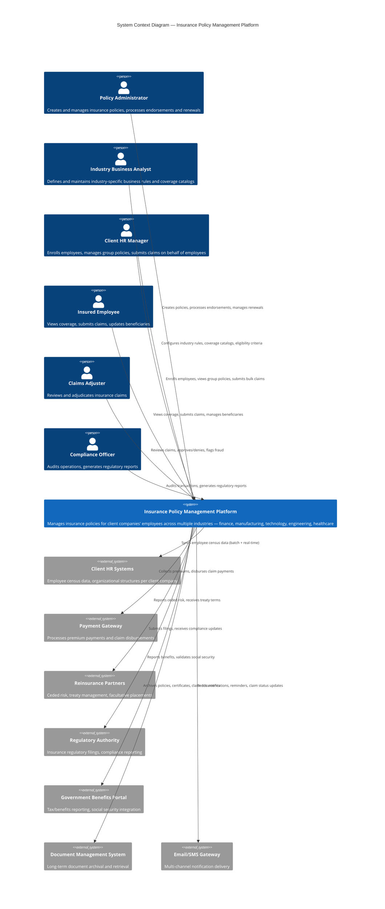

# C4 System Context Diagram — Insurance Policy Management Platform

## Description
Shows the Insurance Policy Management Platform in context with its external actors (users) and neighboring systems it integrates with.

## Key Observations

- **6 actor types** representing internal insurance staff, client-side users, and insured individuals
- **7 external system integrations** spanning client data sync, payments, regulatory, and document management
- The platform is the central hub connecting policy administration to client companies across multiple industries
- Industry Business Analyst is a key differentiator — they configure rules without developer involvement
- Client HR Managers interact on behalf of their employees, creating a B2B2C model
- Regulatory compliance is a first-class concern with direct integration to government authorities
