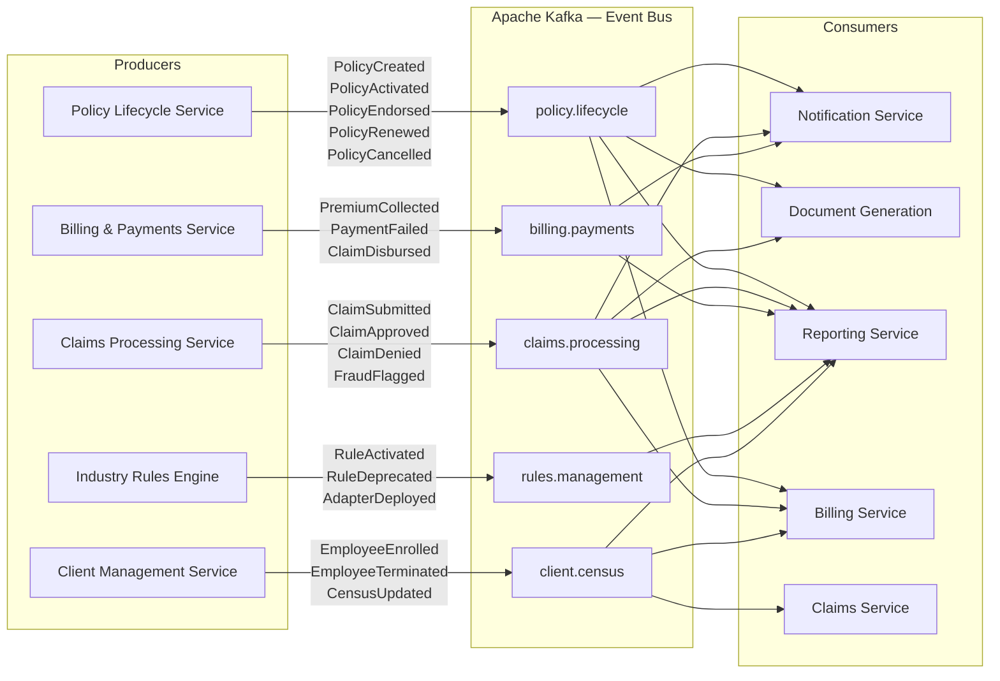
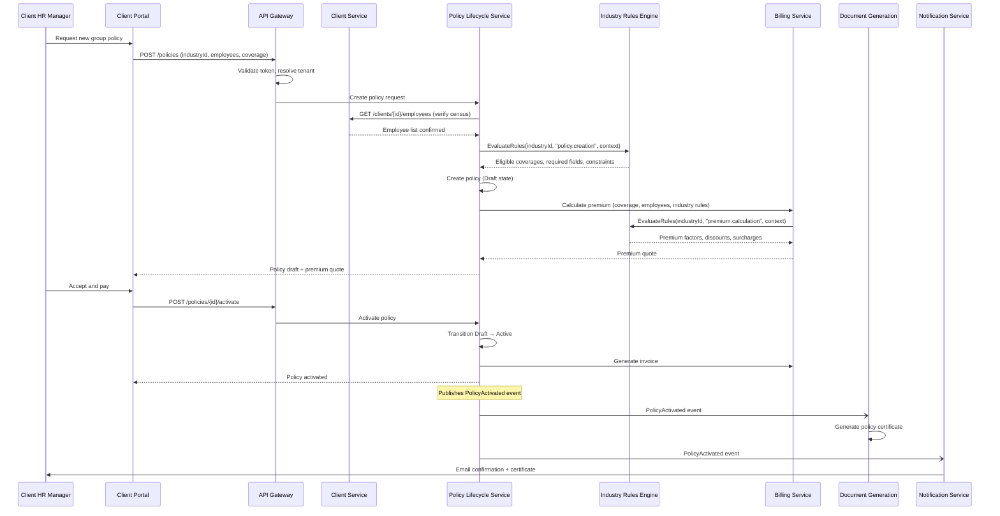
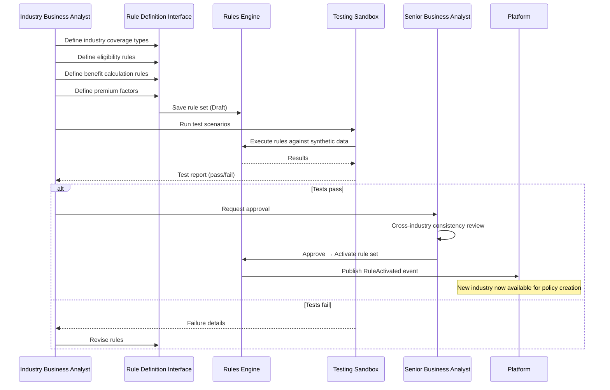
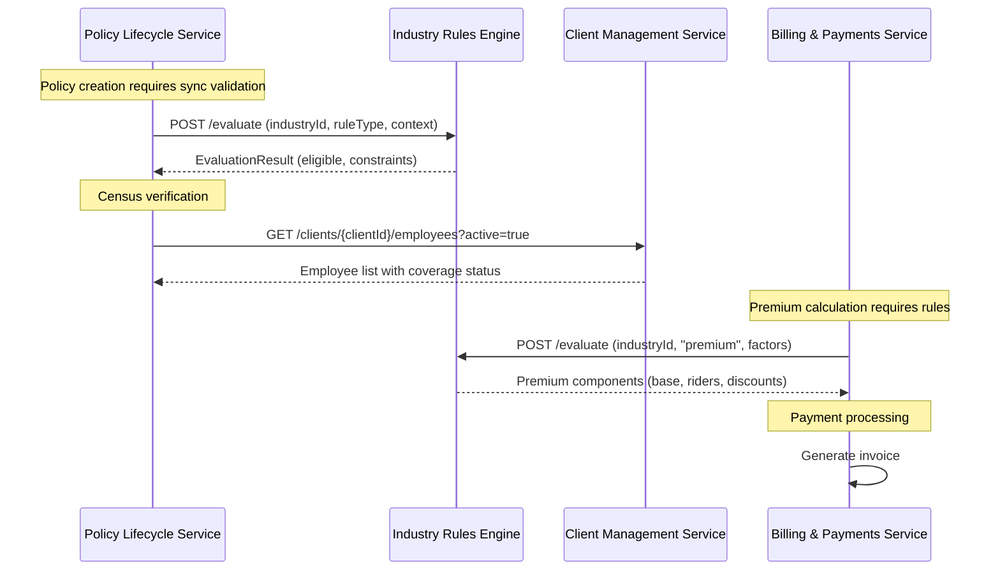

# Integration Patterns — Insurance Policy Management Platform

## Description
Defines how the platform's modules communicate with each other and with external systems, using event-driven and synchronous patterns to support multi-industry policy management.

## Event-Driven Architecture (Inter-Module)



## End-to-End Policy Creation Flow (Sequence)



## Industry Onboarding Flow



## Synchronous API Calls (Cross-Service)



## External System Integration

```mermaid
graph TB
    subgraph Platform["Insurance Policy Management Platform"]
        CLIENT[Client Management Service]
        BILLING[Billing & Payments Service]
        REPORT[Reporting Service]
        NOTIF[Notification Service]
        DOC[Document Generation]
    end

    subgraph External["External Systems"]
        HR_SYS[Client HR Systems<br/>Per-industry varied formats]
        PAY_GW[Payment Gateway<br/>Premium + Claims disbursement]
        REINSURE[Reinsurance Partners<br/>Treaty + Facultative]
        REG[Regulatory Authority<br/>Compliance filings]
        GOV[Government Portal<br/>Tax/Benefits reporting]
        EMAIL[Email/SMS Gateway]
        DOC_ARCH[Document Archive<br/>Long-term storage]
    end

    CLIENT -->|REST API + SFTP<br/>Census sync (batch nightly + webhook real-time)| HR_SYS
    BILLING -->|REST API + PCI-DSS<br/>Payment processing| PAY_GW
    BILLING -->|REST API + mTLS<br/>Ceded risk reporting| REINSURE
    REPORT -->|REST API + mTLS<br/>Quarterly filings| REG
    REPORT -->|SFTP + PGP<br/>Annual benefits reporting| GOV
    NOTIF -->|SMTP/TLS + SMS API<br/>Multi-channel delivery| EMAIL
    DOC -->|S3 API<br/>Document archival| DOC_ARCH
```

## Integration Patterns Summary

| Pattern | Usage | Rationale |
|---------|-------|-----------|
| **Pub/Sub (Kafka)** | Inter-service event notifications | Loose coupling, independent scaling, event replay |
| **Synchronous gRPC** | Rule evaluation during policy/claim creation | Low-latency, type-safe, required for transaction integrity |
| **API Gateway** | All client-to-service calls | Centralized auth, rate limiting, tenant resolution |
| **Circuit Breaker** | External system calls (HR, Payment, Regulatory) | Fault tolerance, graceful degradation |
| **Saga Pattern** | Claims processing (validate → adjudicate → pay) | Distributed transaction consistency |
| **CQRS** | Reporting service | Separate read models for analytics and compliance |
| **Retry + Dead Letter Queue** | Failed event processing | Guaranteed delivery with error isolation |
| **Batch Integration** | Census sync (nightly), regulatory reports (quarterly) | Bulk data transfer for non-real-time scenarios |
| **Webhook** | Real-time census updates from client HR | Immediate enrollment/termination propagation |
| **Event Sourcing** | Policy lifecycle | Complete audit trail, point-in-time reconstruction |

## Data Flow Metrics

| Stage | Expected Throughput | Target Latency |
|-------|-------------------|----------------|
| Policy creation (incl. rule evaluation) | 500 policies/hour peak | < 3 seconds |
| Rule evaluation (single call) | 10,000 evaluations/hour | < 200ms |
| Claim submission to acknowledgment | 200 claims/hour | < 1 second |
| Claim auto-adjudication | 70% of eligible claims | < 5 seconds |
| Premium calculation | 1,000 quotes/hour | < 500ms |
| Census sync (batch) | 50,000 records/nightly batch | < 2 hours |
| Notification delivery | 5,000 notifications/hour | < 30 seconds |
