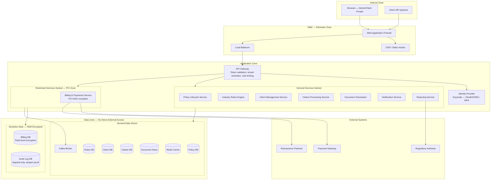
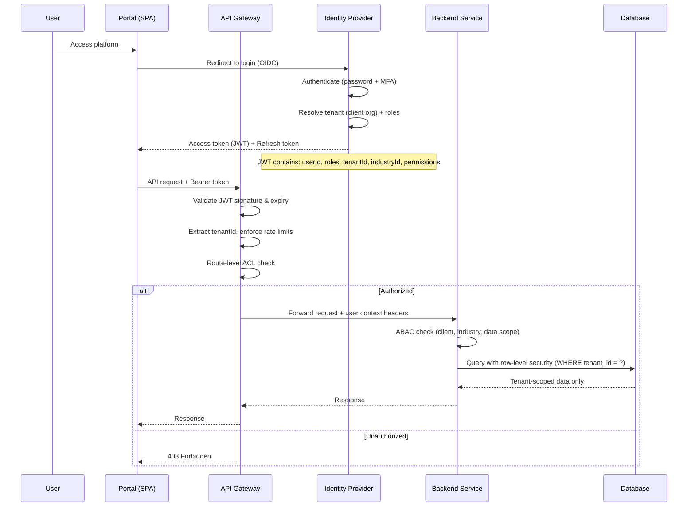

# Security Architecture Overlay — Insurance Policy Management Platform

## Description
Cross-cutting security architecture showing network zones, authentication flows, encryption boundaries, multi-tenant isolation, and regulatory compliance for an insurance platform handling sensitive PII/PHI data across multiple client organizations and industries.

## Network Security Zones



## Authentication & Authorization Flow



## RBAC Model

```mermaid
graph LR
    subgraph Roles
        R1[INSURED_EMPLOYEE]
        R2[CLIENT_HR_MANAGER]
        R3[POLICY_ADMINISTRATOR]
        R4[CLAIMS_ADJUSTER]
        R5[INDUSTRY_BUSINESS_ANALYST]
        R6[COMPLIANCE_OFFICER]
        R7[PLATFORM_ADMIN]
    end

    subgraph Modules
        M1[Self-Service Portal]
        M2[Client Management]
        M3[Policy Administration]
        M4[Claims Processing]
        M5[Rules Engine]
        M6[Billing & Payments]
        M7[Reporting & Compliance]
        M8[System Configuration]
    end

    R1 -->|view own coverage, submit claims| M1
    
    R2 -->|manage employees, view group policies| M2
    R2 -->|view policies, request endorsements| M3
    R2 -->|submit claims on behalf| M4
    
    R3 -->|full CRUD policies| M3
    R3 -->|view claims| M4
    R3 -->|view billing| M6
    
    R4 -->|review, approve/deny claims| M4
    R4 -->|view policies (read-only)| M3
    
    R5 -->|define rules, manage adapters| M5
    R5 -->|view policies (read-only)| M3
    
    R6 -->|audit all modules| M7
    R6 -->|read-only all| M3
    R6 -->|read-only all| M4
    R6 -->|read-only all| M6
    
    R7 -->|full access| M8
    R7 -->|audit| M7
```

## Multi-Tenant Data Isolation

| Isolation Layer | Mechanism | Scope |
|----------------|-----------|-------|
| **API Gateway** | Tenant ID extracted from JWT, injected as header | Per-request |
| **Service Layer** | Tenant context propagated via request context; all queries scoped | Per-request |
| **Database (Row-Level Security)** | PostgreSQL RLS policies: `WHERE tenant_id = current_setting('app.tenant_id')` | Per-query |
| **Cache (Key Prefix)** | Redis keys prefixed with `tenant:{id}:` — no cross-tenant cache access | Per-key |
| **Kafka (Topic Partitioning)** | Events carry tenantId in envelope; consumers filter by assigned tenants | Per-message |
| **Document Store** | Separate collections per tenant OR tenant field with index | Per-document |
| **Encryption Keys** | Per-tenant encryption keys for sensitive fields (managed via Key Vault) | Per-tenant |

## Encryption Strategy

| Layer | Method | Key Management |
|-------|--------|----------------|
| In transit (external) | TLS 1.3 | PKI certificates, auto-rotation via cert-manager |
| In transit (internal) | mTLS | Service mesh certificates (Istio/Linkerd) |
| At rest (general) | AES-256 (database-level TDE) | Cloud KMS / Key Vault managed |
| At rest (billing) | AES-256 (field-level) | HSM-backed keys, PCI-DSS compliant |
| At rest (PII fields) | AES-256 (column-level) | Per-tenant keys, Key Vault |
| Documents | AES-256 (object-level) | Per-document keys wrapped by tenant master key |
| Backups | AES-256 | Offline master key, split knowledge custody |
| Kafka messages | Envelope encryption | Topic-level keys, rotated monthly |

## Compliance Controls

| Requirement | Implementation |
|-------------|----------------|
| **LGPD/GDPR (Data Privacy)** | Consent management, data minimization, right to erasure, DPO role |
| **Insurance Regulatory** | Policy lifecycle audit trail, solvency reporting, actuarial data retention |
| **PCI-DSS (Payments)** | Isolated billing zone, tokenized card data, quarterly ASV scans |
| **SOC 2 Type II** | Continuous monitoring, access reviews, change management |
| **Data residency** | All data stored in-country; no cross-border replication without consent |
| **Right to erasure** | Soft-delete with legal hold; hard-delete after retention period |
| **Access logging** | All API calls logged: user, action, resource, tenant, timestamp |
| **Penetration testing** | Quarterly external pen tests, continuous DAST/SAST scanning |
| **Key rotation** | Encryption keys rotated every 90 days; immediate rotation on compromise |
| **Incident response** | Automated alerts on anomalous access, 72-hour breach notification |

## Security Controls by Role

| Role | Data Access Scope | MFA Required | IP Restriction |
|------|-------------------|--------------|----------------|
| Platform Admin | All tenants, system config | Yes (hardware key) | Office network only |
| Compliance Officer | All tenants (read-only) | Yes | Office network only |
| Policy Administrator | Assigned clients/industries | Yes | Company network |
| Claims Adjuster | Assigned claims queue | Yes | Company network |
| Industry Business Analyst | Rules for assigned industry only | Yes | Company network |
| Client HR Manager | Own organization's data only | Yes (TOTP) | Client's network |
| Insured Employee | Own policy and claims only | Optional (TOTP) | Any |
