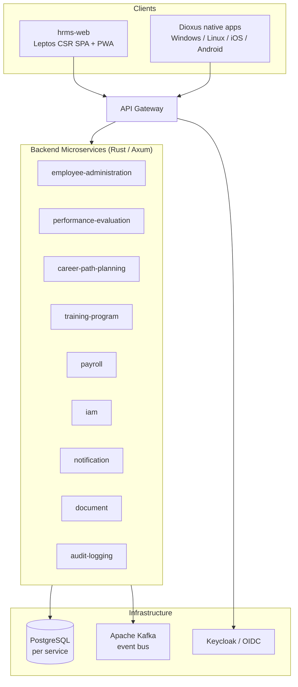

# Bank HRMS — National Bank Human Resources Management System

Enterprise HRMS for a national bank (2,400 branches, 16,000+ employees), built entirely in
**Rust** as a set of independent, event-driven microservices and a multi-platform frontend.

---

## ⚠️ Project Status: Structure Only

> **This repository is a compilable architectural skeleton — the business logic is NOT implemented.**

Every crate builds and every workspace passes `cargo check`/`clippy`, but domain and handler
bodies are intentionally stubbed with `todo!()` / placeholder markup. This project exists to lock
in the **architecture, module boundaries, and wiring**, not to run real workloads.

| ✅ What IS done (skeleton) | ❌ What is NOT done (deferred) |
|---|---|
| Repo/workspace topology, crate boundaries | Business logic (all `todo!()` bodies) |
| Hexagonal layering: ports, adapters, use-case signatures | Real persistence (SQL queries), migrations content |
| DTOs / contracts, REST route tables | Real authentication / OIDC flows |
| Service `main.rs` composition & startup wiring | Kafka publish/consume logic |
| Frontend routing, shells, state contexts, component tree | Real UI markup, styling beyond design tokens |
| Compiles clean across all workspaces | Tests, CI/CD, container/K8s manifests |

> **Note on the diagrams:** the C4 documents in this folder describe the *conceptual reference
> architecture* using a generic enterprise stack (Spring Boot / .NET). The **actual implementation
> here is Rust** (Axum, sqlx, Leptos, Dioxus). The diagrams remain accurate at the component and
> integration level; only the language/framework labels differ.

---

## Overview

- **Domain:** HR for a national bank — Employee Administration, Performance Evaluation, Career Path
  Planning, Training, Payroll, plus platform services (IAM, Notification, Document, Audit Logging).
- **Backend style:** **hexagonal architecture** (ports & adapters) with a **repo-per-service**
  microservice layout. Each service is its own Cargo workspace and owns its data and Kafka topic.
- **Frontend style:** Rust across every platform — a Leptos web SPA and Dioxus-based native apps
  (Windows, Linux `.deb`, iOS, Android) sharing framework-agnostic client crates.
- **Communication:** REST via an API gateway (synchronous) + Apache Kafka (asynchronous events).

### Architecture at a glance



See also the reference C4 diagrams and the high-level image
[`Bank-Hr-Management-System.png`](Bank-Hr-Management-System.png).

---

## Backend

Nine service workspaces plus one shared workspace. Each service is a Cargo workspace containing an
`app` binary crate and a `contracts` library crate.

| Service | Responsibility | Kafka topic |
|---------|----------------|-------------|
| [`employee-administration/`](employee-administration/) | Employee CRUD lifecycle, org structure, documents (reference template) | `employee.lifecycle` |
| [`performance-evaluation/`](performance-evaluation/) | Evaluation campaigns, reviews, objectives | `evaluation.lifecycle` |
| [`career-path-planning/`](career-path-planning/) | Career trajectories, competencies, succession | `career.lifecycle` |
| [`training-program/`](training-program/) | Course catalog, enrollment, certifications | `training.lifecycle` |
| [`payroll/`](payroll/) | Salary engine, dual-authorization runs, tax, payslips | `payroll.lifecycle` |
| [`iam/`](iam/) | Users, roles, Keycloak directory federation | `iam.lifecycle` |
| [`notification/`](notification/) | Email / SMS / push dispatch, template rendering | `notification.lifecycle` |
| [`document/`](document/) | Blob storage, document generation & retrieval | `document.lifecycle` |
| [`audit-logging/`](audit-logging/) | Append-only audit trail, query | `audit.lifecycle` |

### Shared crates — [`hrms-shared/`](hrms-shared/)

| Crate | Purpose |
|-------|---------|
| `hrms-kernel` | Core domain primitives (ids, `Email`, `Money`, `Clock`, `IdGenerator`) |
| `hrms-platform` | Config, telemetry, health routes, graceful shutdown, `AppError` |
| `hrms-auth` | Shared `Role` model |
| `hrms-persistence` | `DbPool` + connection helper (sqlx / PostgreSQL) |
| `hrms-messaging` | `EventPublisher` port + in-memory implementation |
| `hrms-api-kit` | Shared HTTP/API helpers |

### Hexagonal layering (per service `app/src`)

```
domain/         # entities, value objects, ports (traits) — pure, no I/O
application/    # use cases orchestrating the domain via ports
infrastructure/ # adapters: repositories (sqlx), Kafka publishers, external gateways
presentation/   # Axum handlers + route tables (DTO <-> domain)
bootstrap/      # dependency composition and router assembly
config.rs       # typed configuration
main.rs         # startup: config -> telemetry -> wiring -> axum::serve (graceful shutdown)
```

**Stack:** Axum 0.8, sqlx 0.8 (PostgreSQL), Apache Kafka, `async_trait` on ports,
`thiserror` (domain) / `anyhow` (edges). Identity via Keycloak / OIDC.

---

## Frontend

Seven workspaces: three framework-agnostic shared crates, a Leptos web app, a Dioxus shared UI
library, and four thin native launchers. Native apps use a **shared-core + thin-launcher** topology
so there is zero UI duplication; the target platform is chosen via Cargo feature flags.

| Workspace | Purpose | Tech / platform |
|-----------|---------|-----------------|
| [`hrms-ui-shared/`](hrms-ui-shared/) | `hrms-api-client` (REST + DTOs), `hrms-design-tokens`, `hrms-auth-client` (OIDC/PKCE) | Framework-agnostic Rust |
| [`hrms-web/`](hrms-web/) | Web SPA + PWA (client-rendered, offline) | Leptos 0.8 CSR (Trunk, wasm) |
| [`hrms-ui-core/`](hrms-ui-core/) | Shared native UI (routes, screens, components) | Dioxus 0.7 (library) |
| [`hrms-desktop-windows/`](hrms-desktop-windows/) | Windows launcher → `.msi`/`.exe` | Dioxus desktop |
| [`hrms-desktop-linux/`](hrms-desktop-linux/) | Linux launcher → `.deb` | Dioxus desktop |
| [`hrms-mobile-ios/`](hrms-mobile-ios/) | iOS launcher → `.app`/`.ipa` | Dioxus mobile |
| [`hrms-mobile-android/`](hrms-mobile-android/) | Android launcher → `.apk`/`.aab` | Dioxus mobile (cdylib) |

Feature modules mirror the backend domains: `employee_admin`, `performance_eval`,
`career_planning`, `training`, `payroll`, `iam`, `notifications`. The frontend `hrms-api-client`
DTOs mirror the backend `contracts` crates so the two stay in sync without a build-time dependency.

---

## Repository layout

```
RhSystemArchitecture-CS/
├── architecture-plan.md            # architecture decisions + diagram inventory
├── c4-context.md                   # C4 system context (reference)
├── c4-container.md                 # C4 containers (reference)
├── c4-component-*.md               # C4 component diagrams (reference)
├── integration-patterns.md         # event/sync integration patterns
├── security-architecture.md        # security overlay (zero-trust, RBAC/ABAC)
│
├── hrms-shared/                    # backend shared crates (workspace)
├── employee-administration/        # backend service (workspace)
├── performance-evaluation/         # backend service (workspace)
├── career-path-planning/           # backend service (workspace)
├── training-program/               # backend service (workspace)
├── payroll/                        # backend service (workspace)
├── iam/                            # backend service (workspace)
├── notification/                   # backend service (workspace)
├── document/                       # backend service (workspace)
├── audit-logging/                  # backend service (workspace)
│
├── hrms-ui-shared/                 # frontend shared crates (workspace)
├── hrms-web/                       # Leptos web SPA + PWA (workspace)
├── hrms-ui-core/                   # Dioxus shared native UI (workspace)
├── hrms-desktop-windows/           # native launcher (workspace)
├── hrms-desktop-linux/             # native launcher (workspace)
├── hrms-mobile-ios/                # native launcher (workspace)
└── hrms-mobile-android/            # native launcher (workspace)
```

Each top-level unit is an **independent Cargo workspace** (a stand-in for a separate git
repository). Cross-workspace dependencies currently use local `path` dependencies; these are meant
to switch to pinned git tags once each unit is split into its own repository.

---

## Conventions

- **Toolchain:** Rust edition **2024**, `rust-version = 1.85`.
- **Stubs:** domain/handler bodies are `todo!()`; UI screens render placeholders with `TODO` notes.
- **`#![allow(dead_code)]`** at crate roots while wiring exists but stubs don't yet consume it.
- **DTO mirroring:** frontend `hrms-api-client` DTOs mirror backend `contracts` shapes.
- **License:** `Proprietary` (as declared in the workspace manifests).

---

## Build & verify

Each workspace builds independently. From a workspace directory:

```bash
# Backend services + shared, and frontend shared crates (host target)
cargo check --workspace
cargo clippy --workspace

# hrms-web (Leptos, WebAssembly)
cargo check  --target wasm32-unknown-unknown
cargo clippy --target wasm32-unknown-unknown

# hrms-ui-core (Dioxus shared UI, validated via the web feature on wasm)
cargo check  --no-default-features --features web --target wasm32-unknown-unknown

# Native launchers (manifest resolution on this host)
cargo metadata --no-deps --format-version 1 >/dev/null
```

### Tooling

```bash
rustup target add wasm32-unknown-unknown
cargo install trunk         # hrms-web dev/build
cargo install dioxus-cli    # `dx` for native build/bundle
```

### Platform prerequisites for full native builds

| Target | Requirements |
|--------|--------------|
| Linux desktop / `.deb` | GTK + WebKitGTK dev libs (e.g. `libwebkit2gtk-4.1-dev`, `libgtk-3-dev`, `libglib2.0-dev`) |
| Windows desktop | Windows toolchain (uses WebView2) |
| iOS | macOS + Xcode + `aarch64-apple-ios*` targets |
| Android | Android SDK + NDK + JDK + `aarch64-linux-android` (and friends) |

> On a plain Linux host without the GTK/mobile SDKs, the desktop/mobile apps are validated at the
> manifest/shared-UI level (the shared `hrms-ui-core` compiles for wasm); full native bundling
> requires the toolchains above.

---

## Documentation index

| Document | Description |
|----------|-------------|
| [`architecture-plan.md`](architecture-plan.md) | Architectural decisions, tech stack, module breakdown |
| [`c4-context.md`](c4-context.md) | System context (actors, external systems) |
| [`c4-container.md`](c4-container.md) | Runtime containers |
| [`c4-component-employee-admin.md`](c4-component-employee-admin.md) | Employee Administration components |
| [`c4-component-performance-eval.md`](c4-component-performance-eval.md) | Performance Evaluation components |
| [`c4-component-payroll.md`](c4-component-payroll.md) | Payroll components |
| [`integration-patterns.md`](integration-patterns.md) | Event-driven & synchronous integration patterns |
| [`security-architecture.md`](security-architecture.md) | Security overlay (zero-trust, RBAC/ABAC, encryption) |

---

## Roadmap / next steps

Turning this skeleton into a running system means, per service and per frontend module:

1. Implement domain logic and use cases (replace `todo!()` bodies).
2. Implement repository adapters (real sqlx queries) and fill migration scripts.
3. Wire authentication / OIDC and enforce RBAC/ABAC.
4. Implement Kafka publishers/consumers and event handling.
5. Build out real UI screens and API/OIDC client logic in the frontends.
6. Add tests, observability, CI/CD, and container/Kubernetes manifests.
