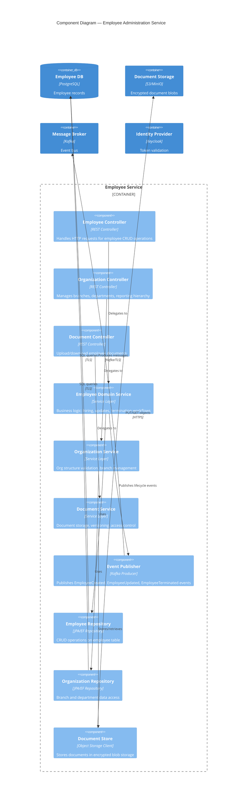

# C4 Component Diagram — Employee Administration Service

## Description
Internal components of the Employee Administration microservice, showing controllers, domain services, and repository layers.

## Domain Events Published

| Event | Trigger | Consumers |
|-------|---------|-----------|
| `EmployeeCreated` | New hire completed | Payroll, Training, Career |
| `EmployeeUpdated` | Profile/position change | Payroll, Evaluation |
| `EmployeeTerminated` | Offboarding completed | Payroll, All modules |
| `OrgStructureChanged` | Branch/dept reorganization | Evaluation, Reporting |
