# C4 Component Diagram — Payroll Service

## Description
Internal components of the Payroll microservice — the most security-sensitive module, isolated in its own network zone.

```mermaid
C4Component
    title Component Diagram — Payroll Service

    Container_Boundary(payroll_svc, "Payroll Service") {
        Component(salary_ctrl, "Salary Controller", "REST Controller", "Salary structure queries, adjustments")
        Component(payment_ctrl, "Payment Controller", "REST Controller", "Payment run triggers, status queries")
        Component(leave_ctrl, "Leave Controller", "REST Controller", "Leave requests, approvals, balance queries")
        Component(payslip_ctrl, "Payslip Controller", "REST Controller", "Payslip generation and retrieval")
        
        Component(salary_engine, "Salary Computation Engine", "Service Layer", "Calculates gross/net: base + bonuses + commissions - deductions")
        Component(tax_engine, "Tax Engine", "Service Layer", "Applies tax rules, withholding calculations, regulatory compliance")
        Component(leave_svc, "Leave Management Service", "Service Layer", "Accrual rules, balance tracking, approval workflow")
        Component(payment_svc, "Payment Service", "Service Layer", "Generates payment files, schedules disbursements")
        Component(payslip_svc, "Payslip Generator", "Service Layer", "PDF generation, digital signature, distribution")
        
        Component(event_consumer, "Event Consumer", "Kafka Consumer", "Listens for EmployeeCreated/Updated/Terminated")
        Component(audit_logger, "Audit Logger", "Cross-cutting", "Logs all payroll operations for compliance")
        
        Component(payroll_repo, "Payroll Repository", "JPA/EF Repository", "Salary, payment, leave data access")
    }

    ContainerDb(payroll_db, "Payroll DB", "PostgreSQL", "Salary records, payments, leave balances — encrypted at rest")
    Container(broker, "Message Broker", "Kafka", "Event bus")
    System_Ext(banking, "Core Banking", "SWIFT/ACH payment processing")
    System_Ext(tax, "Tax Authority", "Regulatory reporting API")

    Rel(salary_ctrl, salary_engine, "Delegates to")
    Rel(payment_ctrl, payment_svc, "Delegates to")
    Rel(leave_ctrl, leave_svc, "Delegates to")
    Rel(payslip_ctrl, payslip_svc, "Delegates to")
    
    Rel(salary_engine, tax_engine, "Applies tax rules")
    Rel(salary_engine, payroll_repo, "Reads salary structure")
    Rel(payment_svc, salary_engine, "Gets computed amounts")
    Rel(payment_svc, banking, "Sends payment instructions", "SFTP/mTLS")
    Rel(tax_engine, tax, "Submits declarations", "HTTPS/mTLS")
    Rel(payslip_svc, salary_engine, "Gets breakdown data")
    Rel(leave_svc, payroll_repo, "Reads/writes leave data")
    
    Rel(event_consumer, broker, "Subscribes", "Kafka/TLS")
    Rel(payroll_repo, payroll_db, "SQL", "TLS + field-level encryption")
    Rel(audit_logger, payroll_db, "Writes audit trail", "TLS")
```

## Security Constraints (Payroll-Specific)

| Constraint | Implementation |
|-----------|----------------|
| Network isolation | Payroll runs in dedicated VPC/subnet, no direct internet access |
| Field-level encryption | Salary amounts, bank account numbers encrypted with HSM-managed keys |
| Dual authorization | Payment runs require two HR managers to approve |
| Audit trail | Every read/write operation logged with user, timestamp, IP |
| Data retention | Payment records retained 10 years per banking regulations |
