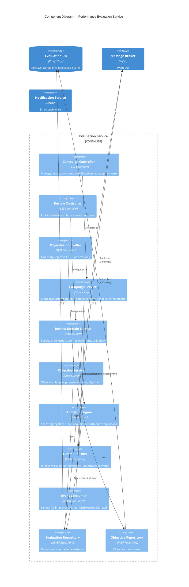
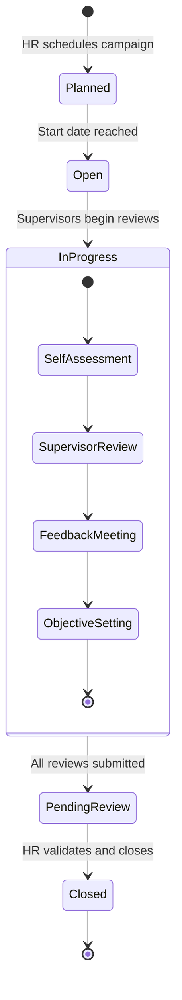

# C4 Component Diagram — Performance Evaluation Service

## Description
Internal components of the Performance Evaluation microservice.

```mermaid
C4Component
    title Component Diagram — Performance Evaluation Service

    Container_Boundary(eval_svc, "Evaluation Service") {
        Component(campaign_ctrl, "Campaign Controller", "REST Controller", "Manages evaluation campaign lifecycle (create, open, close)")
        Component(review_ctrl, "Review Controller", "REST Controller", "Individual review submission and retrieval")
        Component(objective_ctrl, "Objective Controller", "REST Controller", "Quarterly objective CRUD and tracking")
        
        Component(campaign_svc, "Campaign Service", "Service Layer", "Campaign scheduling, status management, deadline enforcement")
        Component(review_svc, "Review Domain Service", "Service Layer", "Feedback collection, scoring algorithms, validation")
        Component(objective_svc, "Objective Service", "Service Layer", "Objective lifecycle, progress tracking, alignment")
        Component(analytics_svc, "Analytics Engine", "Service Layer", "Score aggregation, trend analysis, department comparisons")
        Component(event_publisher, "Event Publisher", "Kafka Producer", "Publishes EvaluationCompleted, ObjectivesSet events")
        Component(event_consumer, "Event Consumer", "Kafka Consumer", "Listens for EmployeeCreated, OrgStructureChanged")
        
        Component(eval_repo, "Evaluation Repository", "JPA/EF Repository", "Review and campaign persistence")
        Component(objective_repo, "Objective Repository", "JPA/EF Repository", "Objective data access")
    }

    ContainerDb(eval_db, "Evaluation DB", "PostgreSQL", "Reviews, campaigns, objectives, scores")
    Container(broker, "Message Broker", "Kafka", "Event bus")
    Container(notification, "Notification Service", "Service", "Email/push alerts")

    Rel(campaign_ctrl, campaign_svc, "Delegates to")
    Rel(review_ctrl, review_svc, "Delegates to")
    Rel(objective_ctrl, objective_svc, "Delegates to")
    
    Rel(campaign_svc, eval_repo, "Uses")
    Rel(campaign_svc, event_publisher, "Campaign opened/closed events")
    Rel(review_svc, eval_repo, "Uses")
    Rel(review_svc, analytics_svc, "Triggers analysis")
    Rel(objective_svc, objective_repo, "Uses")
    
    Rel(analytics_svc, eval_repo, "Reads historical data")
    Rel(event_consumer, broker, "Subscribes", "Kafka/TLS")
    Rel(event_publisher, broker, "Publishes", "Kafka/TLS")
    Rel(eval_repo, eval_db, "SQL", "TLS")
    Rel(objective_repo, eval_db, "SQL", "TLS")
```

## Evaluation Workflow

```mermaid
stateDiagram-v2
    [*] --> Planned : HR schedules campaign
    Planned --> Open : Start date reached
    Open --> InProgress : Supervisors begin reviews
    InProgress --> PendingReview : All reviews submitted
    PendingReview --> Closed : HR validates and closes
    Closed --> [*]
    
    state InProgress {
        [*] --> SelfAssessment
        SelfAssessment --> SupervisorReview
        SupervisorReview --> FeedbackMeeting
        FeedbackMeeting --> ObjectiveSetting
        ObjectiveSetting --> [*]
    }
```
