# C4 Container Diagram — Bank HRMS

## Description
Shows the high-level runtime containers that compose the HRMS — applications, services, databases, and infrastructure components.

```mermaid
C4Container
    title Container Diagram — Bank HRMS

    Person(user, "Bank User", "HR staff, supervisors, or employees")

    System_Boundary(hrms, "HRMS") {
        Container(spa, "Web Application", "Angular/React SPA", "Single-page application accessible from any browser across all branches")
        Container(api_gateway, "API Gateway", "Kong/NGINX", "Routes requests, rate limiting, SSL termination, token validation")
        
        Container(employee_svc, "Employee Service", "Spring Boot/.NET", "Employee lifecycle management — CRUD, org structure")
        Container(evaluation_svc, "Evaluation Service", "Spring Boot/.NET", "Performance review campaigns, feedback, objectives")
        Container(career_svc, "Career Planning Service", "Spring Boot/.NET", "Career path definitions, competency matrix, gap analysis")
        Container(training_svc, "Training Service", "Spring Boot/.NET", "Training needs, programs, external provider integration")
        Container(payroll_svc, "Payroll Service", "Spring Boot/.NET", "Salary computation, leave, tax, payment generation")
        
        Container(notification_svc, "Notification Service", "Spring Boot/.NET", "Email, SMS, push notification dispatch")
        Container(reporting_svc, "Reporting Service", "Spring Boot/.NET", "Dashboards, analytics, regulatory reports")
        
        ContainerDb(employee_db, "Employee DB", "PostgreSQL", "Employee records, org structure, documents")
        ContainerDb(evaluation_db, "Evaluation DB", "PostgreSQL", "Reviews, objectives, scores")
        ContainerDb(payroll_db, "Payroll DB", "PostgreSQL", "Salaries, payments, tax records")
        ContainerDb(training_db, "Training DB", "PostgreSQL", "Courses, enrollments, certifications")
        
        Container(cache, "Cache", "Redis", "Session store, frequently accessed data")
        Container(broker, "Message Broker", "Apache Kafka", "Async event bus between services")
        Container(idp, "Identity Provider", "Keycloak", "OAuth2/OIDC, RBAC, MFA, SSO")
    }

    System_Ext(ad, "Active Directory", "Corporate directory")
    System_Ext(banking_core, "Core Banking", "Payment processing")
    System_Ext(email_sys, "Email System", "SMTP relay")

    Rel(user, spa, "Uses", "HTTPS")
    Rel(spa, api_gateway, "API calls", "HTTPS/JSON")
    Rel(api_gateway, idp, "Validates tokens", "HTTPS")
    
    Rel(api_gateway, employee_svc, "Routes", "gRPC/HTTPS")
    Rel(api_gateway, evaluation_svc, "Routes", "gRPC/HTTPS")
    Rel(api_gateway, career_svc, "Routes", "gRPC/HTTPS")
    Rel(api_gateway, training_svc, "Routes", "gRPC/HTTPS")
    Rel(api_gateway, payroll_svc, "Routes", "gRPC/HTTPS")
    Rel(api_gateway, reporting_svc, "Routes", "gRPC/HTTPS")
    
    Rel(employee_svc, employee_db, "Reads/Writes", "SQL/TLS")
    Rel(evaluation_svc, evaluation_db, "Reads/Writes", "SQL/TLS")
    Rel(payroll_svc, payroll_db, "Reads/Writes", "SQL/TLS")
    Rel(training_svc, training_db, "Reads/Writes", "SQL/TLS")
    
    Rel(employee_svc, broker, "Publishes events", "Kafka protocol")
    Rel(evaluation_svc, broker, "Publishes/Subscribes", "Kafka protocol")
    Rel(payroll_svc, broker, "Subscribes to employee events", "Kafka protocol")
    Rel(notification_svc, broker, "Subscribes to all events", "Kafka protocol")
    
    Rel(idp, ad, "Federates identity", "LDAP/SAML")
    Rel(payroll_svc, banking_core, "Payment instructions", "SFTP/API")
    Rel(notification_svc, email_sys, "Sends emails", "SMTP/TLS")
```

## Container Responsibilities

| Container | Scaling Strategy | Data Ownership |
|-----------|-----------------|----------------|
| Web Application | CDN-distributed static assets | None (stateless) |
| API Gateway | Horizontal, multi-region | None (stateless) |
| Employee Service | Horizontal (read-heavy) | Employee records |
| Evaluation Service | Burst scaling during review periods | Evaluation data |
| Career Planning Service | Low scale (HR-only access) | Career plans |
| Training Service | Medium scale | Training catalog |
| Payroll Service | Isolated, high-security zone | Payroll/financial data |
| Message Broker | Clustered, partitioned by topic | Event log |
| Identity Provider | HA pair, session-aware | User sessions, roles |
