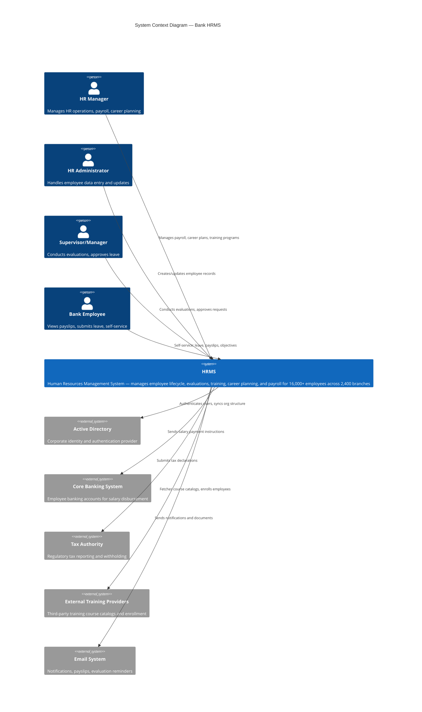

# C4 System Context Diagram — Bank HRMS

## Description
Shows the HRMS system in context with its external actors and neighboring systems.

## Key Observations

- **4 actor types** with different access levels and needs
- **5 external system integrations** requiring secure APIs
- The HRMS is the central system connecting people management to financial and regulatory systems
- All communication crosses the bank's security boundary, requiring encrypted channels
