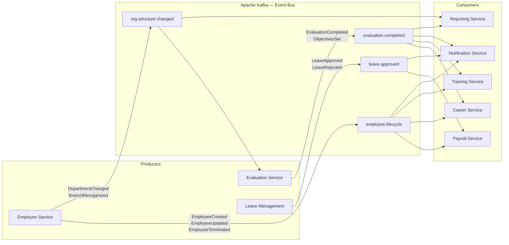
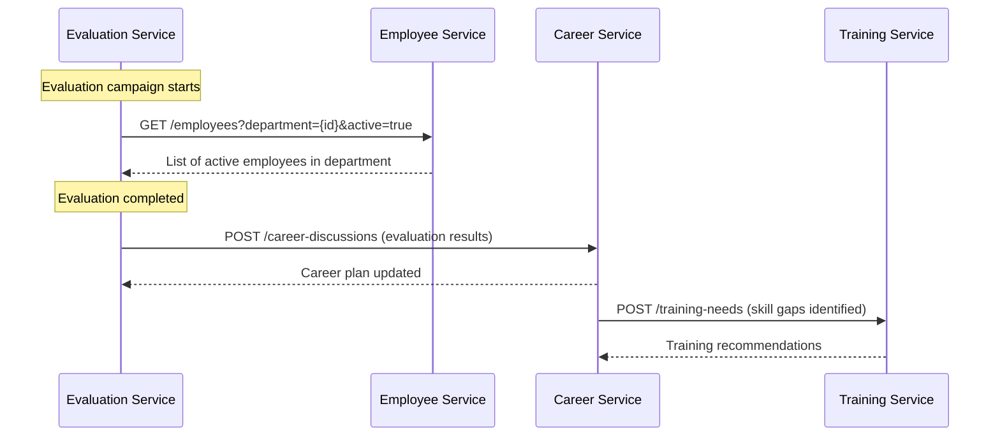
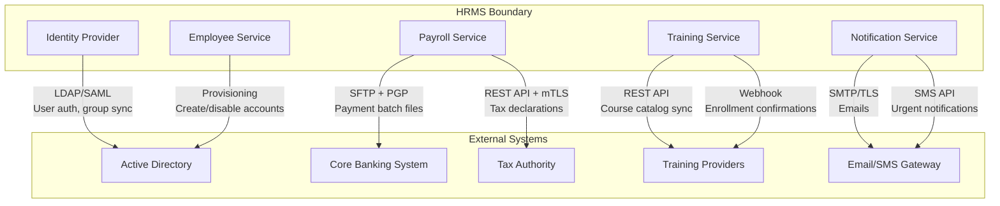
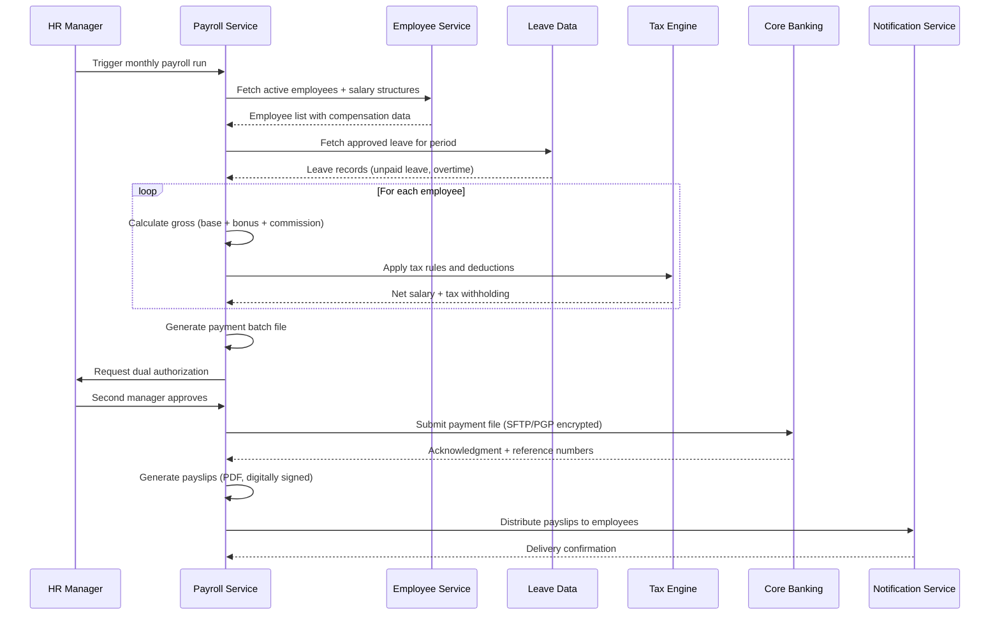

# Integration Patterns — Bank HRMS

## Description
Defines how the 5 HRMS modules communicate with each other and with external systems, using event-driven and synchronous patterns.

## Event-Driven Architecture (Inter-Module)

## Synchronous API Calls (Cross-Module Queries)

## External System Integration

## Integration Patterns Summary

| Pattern | Usage | Rationale |
|---------|-------|-----------|
| **Event Sourcing** | Employee lifecycle events | Complete audit trail, temporal queries |
| **Pub/Sub (Kafka)** | Inter-module notifications | Loose coupling, independent scaling |
| **API Gateway** | All client-to-service calls | Centralized auth, rate limiting, routing |
| **Circuit Breaker** | External system calls | Fault tolerance for banking/tax APIs |
| **Saga Pattern** | Payment processing | Distributed transaction across payroll + banking |
| **CQRS** | Reporting service | Separate read models optimized for analytics |
| **Retry + Dead Letter** | Failed event processing | Guaranteed delivery with error isolation |
| **Batch Integration** | Payroll to Core Banking | Nightly payment file generation via SFTP |
| **Webhook** | Training providers | Real-time enrollment status updates |

## Data Flow — Monthly Payroll Run

