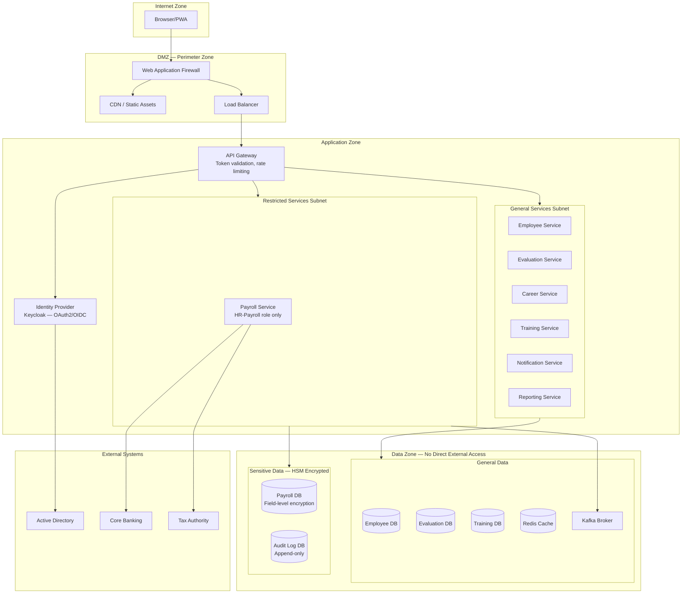
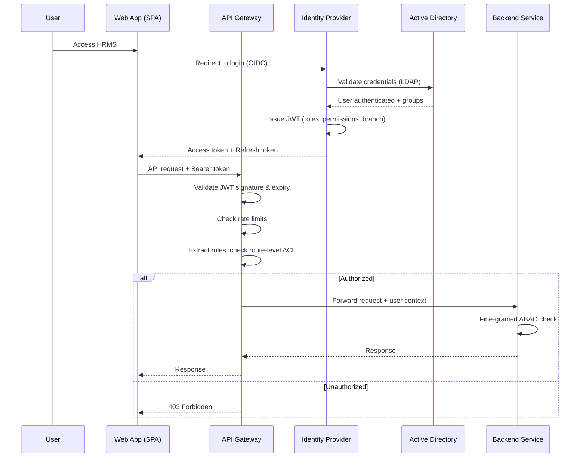
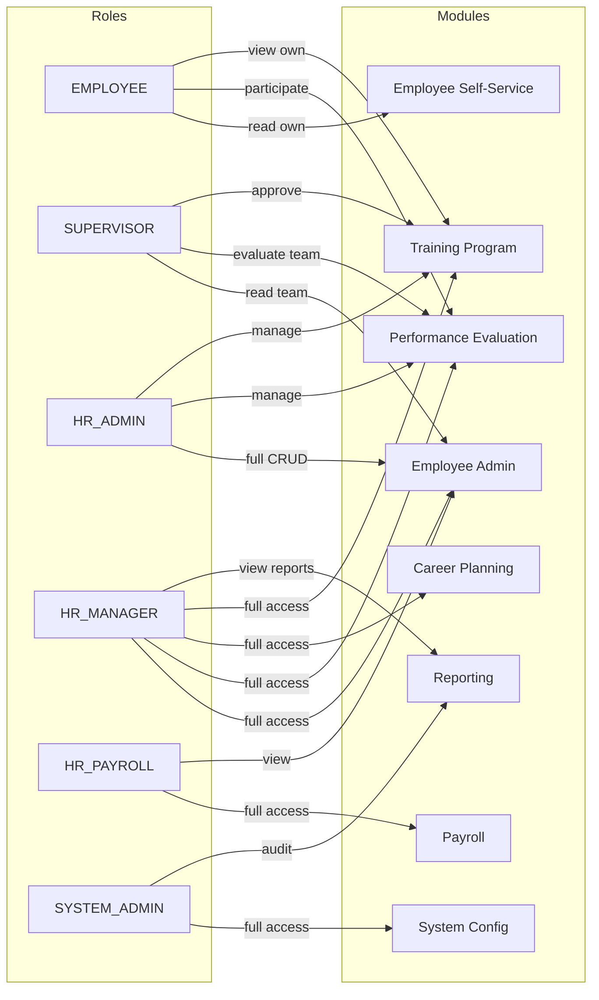

# Security Architecture Overlay — Bank HRMS

## Description
Cross-cutting security architecture showing network zones, authentication flows, encryption boundaries, and access control enforcement points.

## Network Security Zones

## Authentication & Authorization Flow

## RBAC Model

## Encryption Strategy

| Layer | Method | Key Management |
|-------|--------|----------------|
| In transit (external) | TLS 1.3 | PKI certificates, auto-rotation |
| In transit (internal) | mTLS | Service mesh certificates (Istio/Linkerd) |
| At rest (general) | AES-256 (database-level) | Key vault managed |
| At rest (payroll) | AES-256 (field-level) | HSM-backed keys |
| Documents | AES-256 (object-level) | Per-document keys wrapped by master key |
| Backups | AES-256 | Offline master key + split knowledge |

## Compliance Controls

| Control | Implementation |
|---------|----------------|
| **Data residency** | All data stored in-country; no cross-border replication |
| **Right to erasure** | Soft-delete with retention policy; hard-delete after legal hold |
| **Access logging** | All API calls logged with user, action, resource, timestamp |
| **Penetration testing** | Quarterly external pen tests; continuous internal scanning |
| **Incident response** | Automated alerts on anomalous access patterns |
| **Key rotation** | Encryption keys rotated every 90 days |
