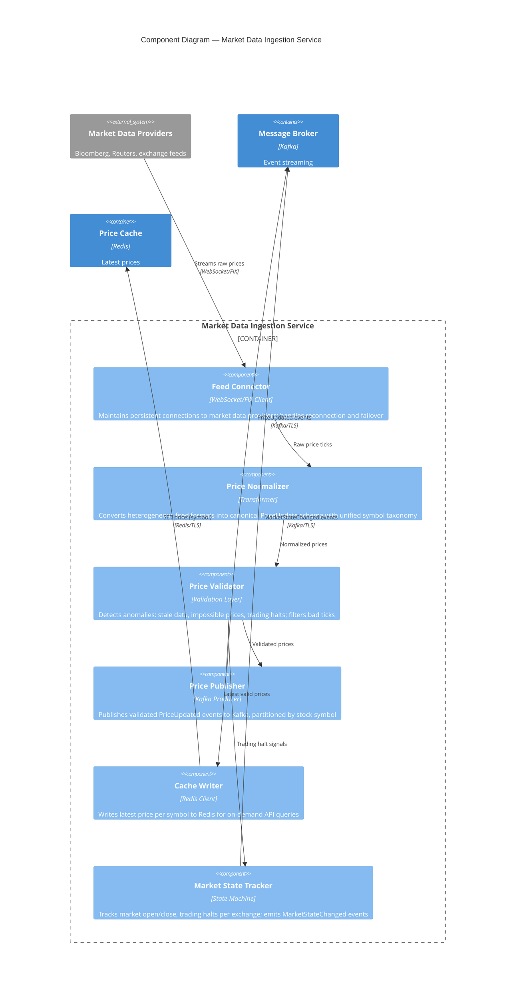

# C4 Component Diagram — Market Data Ingestion Service

## Description
Internal components of the Market Data Ingestion microservice, showing feed connectors, normalizers, and publishers that transform raw market data into canonical price events.

## Domain Events Published

| Event | Trigger | Consumers |
|-------|---------|-----------|
| `PriceUpdated` | Valid price tick received for a symbol | Alert Rule Engine, Price Cache |
| `MarketOpened` | Exchange trading session begins | Alert Rule Engine (activate rules) |
| `MarketClosed` | Exchange trading session ends | Alert Rule Engine (deactivate rules) |
| `TradingHalted` | Individual stock trading halt detected | Alert Rule Engine (pause rules for symbol) |
| `TradingResumed` | Halt lifted for a stock | Alert Rule Engine (resume rules for symbol) |
| `FeedDisconnected` | Connection lost to a data provider | System Admin (monitoring alert) |
| `FeedReconnected` | Connection re-established after outage | System Admin (monitoring resolved) |

## Data Flow Characteristics

| Metric | Value |
|--------|-------|
| Inbound throughput | ~50,000–200,000 ticks/second (market hours) |
| Symbols tracked | 5,000–10,000 across multiple exchanges |
| Kafka partitions | 64–128 (partitioned by symbol hash) |
| Latency target | < 50ms from feed to Kafka publish |
| Availability | 99.95% during market hours |
| Feed failover | Active-passive per provider; < 5s switchover |
