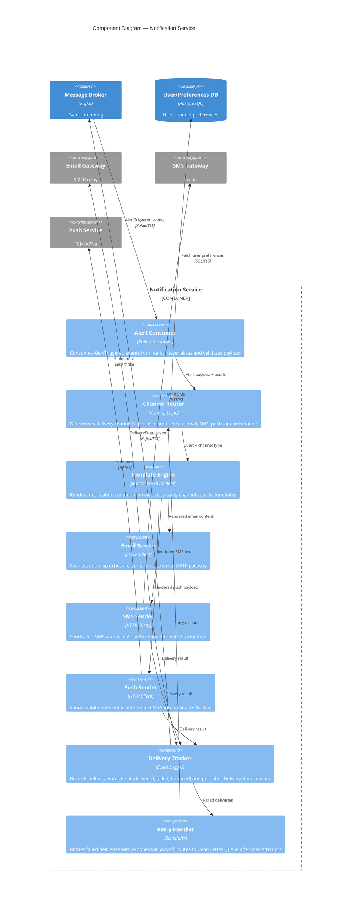

# C4 Component Diagram — Notification Service

## Description
Internal components of the Notification Service, showing how triggered alerts are consumed, routed to the appropriate delivery channel(s), dispatched, and tracked for delivery status.

## Delivery Guarantees

| Aspect | Design |
|--------|--------|
| **Semantics** | At-least-once delivery — idempotency key per alert+user prevents duplicate notifications |
| **Deduplication** | SHA-256 hash of (ruleId + userId + triggerTimestamp) stored in Redis with TTL |
| **Retry policy** | Exponential backoff: 1s → 5s → 30s → 5min; max 5 attempts |
| **Dead Letter Queue** | After max retries, message routed to DLQ for manual investigation |
| **Quiet hours** | Channel Router respects per-user quiet hours; defers delivery to next active window |
| **Rate limiting** | Max 10 notifications/minute per user across all channels; excess queued |
| **Circuit breaker** | Per-channel circuit breaker (Resilience4j pattern); opens after 5 consecutive failures |

## Notification Templates

| Channel | Format | Constraints |
|---------|--------|-------------|
| Email | HTML + plain text fallback | Subject: "[Alert] {symbol} {condition}"; body includes price, timestamp, link to portfolio |
| SMS | Plain text | Max 160 characters: "{symbol} hit €{price} ({condition}). View: {shortUrl}" |
| Push | Title + body + deep link | Title: "{symbol} Alert"; body: "Price {direction} €{threshold}"; tap opens app |

## Domain Events Published

| Event | Trigger | Consumers |
|-------|---------|-----------|
| `NotificationSent` | Successful dispatch to any channel | Alert History (audit), Analytics |
| `NotificationFailed` | All retry attempts exhausted | Admin Monitoring, DLQ processor |
| `NotificationDeferred` | Quiet hours active; delivery postponed | Scheduler (re-enqueue at window open) |
