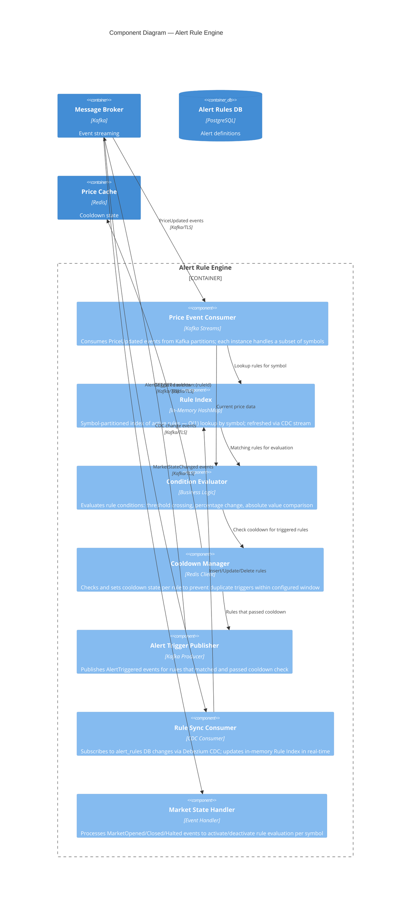
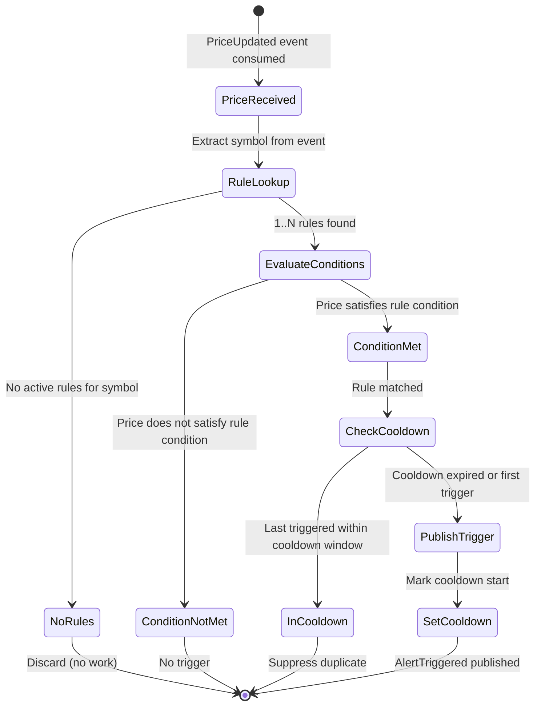

# C4 Component Diagram — Alert Rule Engine

## Description
Internal components of the Alert Rule Engine service, showing how price events are consumed, rules are matched, conditions evaluated, and alert triggers published. This is the core intelligence of the system — designed for high throughput and low latency.

## Rule Evaluation Flow

## Supported Condition Types

| Condition | Expression | Example |
|-----------|-----------|---------|
| **Price Above** | `price > threshold` | "Alert me if AAPL rises above €150" |
| **Price Below** | `price < threshold` | "Alert me if TSLA drops below €200" |
| **Percentage Change Up** | `changePercent > threshold` | "Alert me if MSFT gains more than 5% today" |
| **Percentage Change Down** | `changePercent < -threshold` | "Alert me if AMZN loses more than 3%" |
| **Price Crossing** | `prevPrice < target && price >= target` | "Alert me when GOOG crosses €140" |

## Scaling Strategy

| Aspect | Design |
|--------|--------|
| Partitioning | Kafka partitions keyed by symbol hash — each engine instance owns a partition subset |
| Rule capacity | ~100K–1M rules per instance (in-memory HashMap, ~200 bytes/rule) |
| Horizontal scale | Add Kafka consumer instances = linear throughput increase |
| Rebalancing | Kafka consumer group rebalance on scale-up; rule index rebuilds from CDC snapshot |
| Latency target | < 10ms from price event received to AlertTriggered published |
| Throughput | 50K–200K evaluations/second per instance |
