# C4 Container Diagram — Stock Price Alerts

## Description
Shows the high-level runtime containers that compose the Stock Price Alert system — applications, services, databases, message broker, and cache infrastructure.

```mermaid
C4Container
    title Container Diagram — Stock Price Alerts

    Person(customer, "Retail Customer", "Defines alerts and receives notifications")

    System_Boundary(alertSystem, "Stock Price Alert System") {
        Container(webApp, "Web/Mobile App", "React / React Native", "Customer-facing UI for managing alerts, viewing history, and configuring preferences")
        Container(apiGateway, "API Gateway", "Kong/NGINX", "Routes requests, rate limiting, JWT validation, SSL termination")

        Container(alertMgmtApi, "Alert Management API", "Spring Boot", "CRUD operations for alert rules, user preferences, alert history queries")
        Container(marketDataSvc, "Market Data Ingestion Service", "Spring Boot", "Connects to external feeds, normalizes prices, publishes PriceUpdated events")
        Container(ruleEngine, "Alert Rule Engine", "Spring Boot + Kafka Streams", "Evaluates price events against customer rules, triggers matched alerts")
        Container(notificationSvc, "Notification Service", "Spring Boot", "Routes and dispatches alerts via email, SMS, and push channels")
        Container(userSvc, "User Service", "Spring Boot", "Customer profiles, notification preferences, channel verification")

        Container(broker, "Message Broker", "Apache Kafka", "Event streaming: price updates, alert triggers, notification requests")
        ContainerDb(alertDb, "Alert Rules DB", "PostgreSQL", "Alert definitions, conditions, cooldown state, history")
        ContainerDb(userDb, "User/Preferences DB", "PostgreSQL", "Customer profiles, verified channels, subscription tiers")
        Container(priceCache, "Price Cache", "Redis", "Latest prices per symbol, cooldown tracking, session store")
    }

    System_Ext(marketData, "Market Data Providers", "Real-time price feeds")
    System_Ext(emailGateway, "Email Gateway", "SMTP relay")
    System_Ext(smsGateway, "SMS Gateway", "Twilio")
    System_Ext(pushService, "Push Service", "FCM/APNs")

    Rel(customer, webApp, "Uses", "HTTPS")
    Rel(webApp, apiGateway, "API calls", "HTTPS/JSON")

    Rel(apiGateway, alertMgmtApi, "Routes", "HTTPS")
    Rel(apiGateway, userSvc, "Routes", "HTTPS")

    Rel(marketData, marketDataSvc, "Streams prices", "WebSocket/FIX")
    Rel(marketDataSvc, broker, "Publishes PriceUpdated", "Kafka protocol")
    Rel(marketDataSvc, priceCache, "Writes latest prices", "Redis protocol")

    Rel(ruleEngine, broker, "Consumes PriceUpdated, publishes AlertTriggered", "Kafka protocol")
    Rel(ruleEngine, priceCache, "Reads cooldown state", "Redis protocol")
    Rel(ruleEngine, alertDb, "Loads rules via CDC", "SQL/TLS")

    Rel(notificationSvc, broker, "Consumes AlertTriggered", "Kafka protocol")
    Rel(notificationSvc, userDb, "Reads user preferences", "SQL/TLS")
    Rel(notificationSvc, emailGateway, "Sends emails", "SMTP/TLS")
    Rel(notificationSvc, smsGateway, "Sends SMS", "HTTPS")
    Rel(notificationSvc, pushService, "Sends push", "HTTPS")

    Rel(alertMgmtApi, alertDb, "Reads/Writes rules", "SQL/TLS")
    Rel(alertMgmtApi, priceCache, "Reads current prices", "Redis protocol")
    Rel(userSvc, userDb, "Reads/Writes profiles", "SQL/TLS")
```

## Container Responsibilities

| Container | Scaling Strategy | Data Ownership |
|-----------|-----------------|----------------|
| Web/Mobile App | CDN for static assets; edge caching | None (stateless) |
| API Gateway | Horizontal, multi-instance | None (stateless) |
| Alert Management API | Horizontal (read-heavy workload) | Alert rules, history |
| Market Data Ingestion Service | 1 instance per feed provider; failover pair | None (publishes to Kafka) |
| Alert Rule Engine | Horizontally scaled by Kafka partitions (by symbol hash) | In-memory rule cache |
| Notification Service | Horizontal, stateless workers | Delivery status log |
| User Service | Horizontal (low write, high read) | User profiles, preferences |
| Message Broker (Kafka) | Clustered, partitioned by symbol | Event log (retention: 7 days) |
| Alert Rules DB | Primary + read replicas | Alert definitions, conditions |
| User/Preferences DB | Primary + read replica | Customer data |
| Price Cache (Redis) | Clustered, sharded by symbol | Latest prices, cooldowns |
