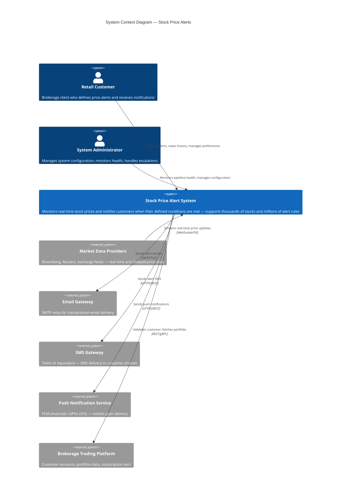

# C4 System Context Diagram — Stock Price Alerts

## Description
Shows the Stock Price Alert system in context with its external actors and neighboring systems.

## Key Observations

- **2 actor types**: retail customers (thousands) who define and receive alerts; administrators who maintain the system
- **1 inbound data source**: Market Data Providers streaming prices for thousands of stocks in real-time
- **3 outbound notification channels**: email, SMS, and push — each with distinct delivery characteristics and SLAs
- **1 internal system integration**: Brokerage Trading Platform for customer validation and subscription enforcement
- All market data enters the system boundary via secure streaming protocols (WebSocket/FIX)
- All notification dispatch crosses the boundary via encrypted channels (TLS/HTTPS)
