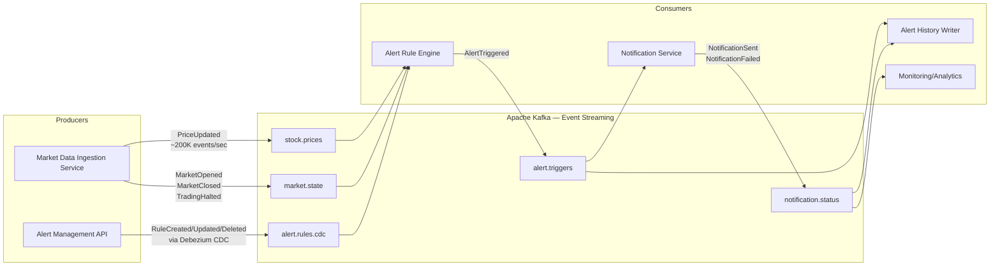
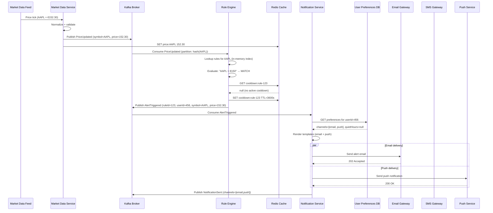
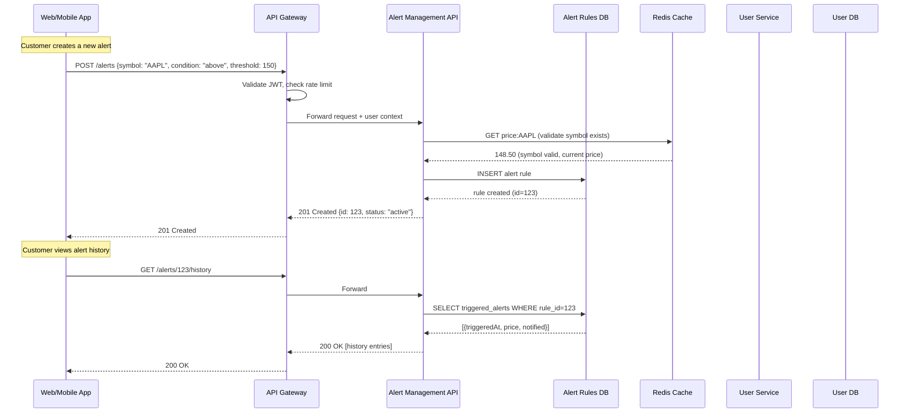
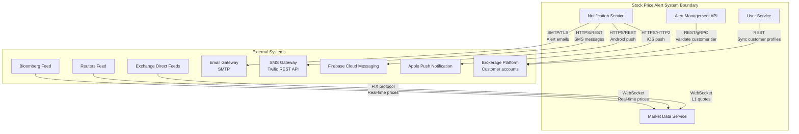

# Integration Patterns — Stock Price Alerts

## Description
Defines how the Stock Price Alert system modules communicate with each other and with external systems, using event-driven streaming and synchronous API patterns.

## Event-Driven Architecture (Core Pipeline)

## End-to-End Alert Flow (Sequence)

## Synchronous API Calls

## External System Integration

## Integration Patterns Summary

| Pattern | Usage | Rationale |
|---------|-------|-----------|
| **Pub/Sub (Kafka)** | Price updates → Rule Engine → Notifications | Loose coupling, independent scaling, replay capability |
| **CDC (Debezium)** | Alert rules DB → Rule Engine in-memory cache | Real-time sync without polling; no dual-write complexity |
| **Fan-out** | One PriceUpdated → multiple rule evaluations | Single price event triggers evaluation of all rules for that symbol |
| **Circuit Breaker** | Notification → external gateways (email/SMS/push) | Fault tolerance when providers are degraded |
| **Retry + DLQ** | Failed notification delivery | Guaranteed delivery with error isolation |
| **Idempotent Consumer** | Notification deduplication | At-least-once Kafka delivery may produce duplicates |
| **Competing Consumers** | Multiple Rule Engine instances per partition group | Horizontal scaling of rule evaluation |
| **Event Sourcing** | Alert trigger history | Complete audit trail of all triggers and deliveries |
| **API Gateway** | All client-to-service calls | Centralized auth, rate limiting, routing |
| **Saga (Choreography)** | Price → Evaluate → Notify → Track | No central orchestrator; each service reacts to events |

## Data Flow Metrics

| Stage | Throughput | Latency (p99) |
|-------|-----------|---------------|
| Feed → Kafka | 200K events/sec | < 50ms |
| Kafka → Rule evaluation | 200K evaluations/sec | < 10ms |
| Rule match → AlertTriggered | ~1K–10K triggers/sec (market dependent) | < 5ms |
| AlertTriggered → Notification sent | ~1K–10K/sec | < 500ms (email), < 200ms (push) |
| End-to-end (price change → customer notified) | — | < 2 seconds |
