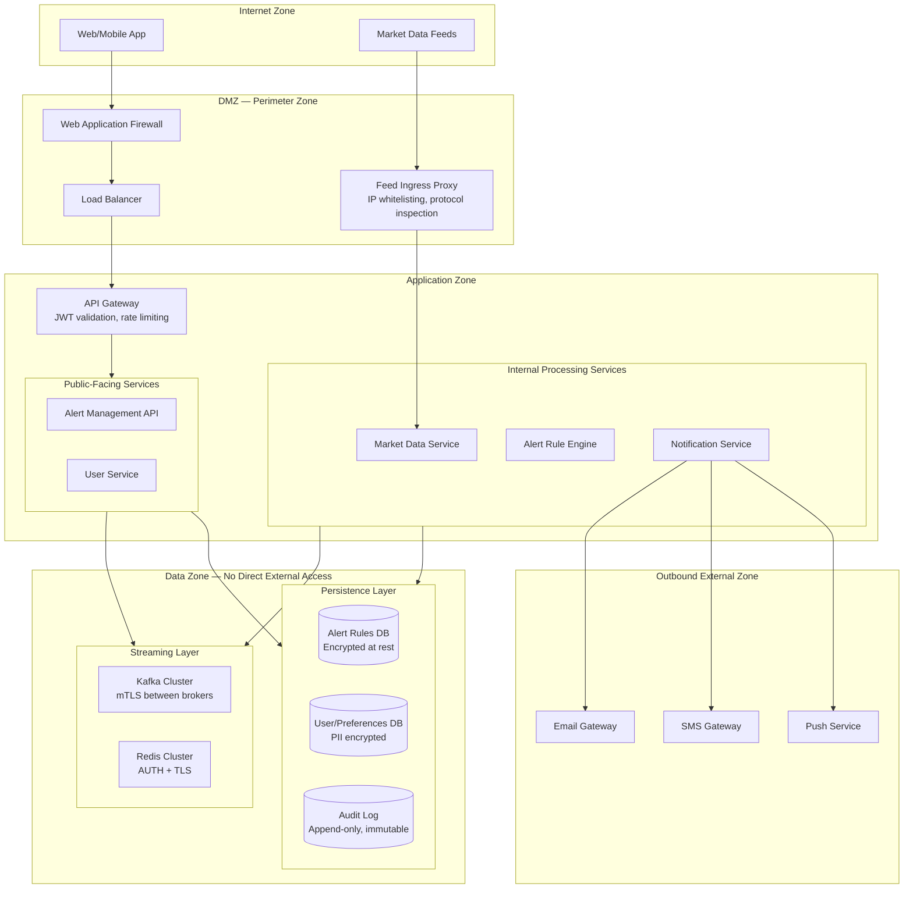
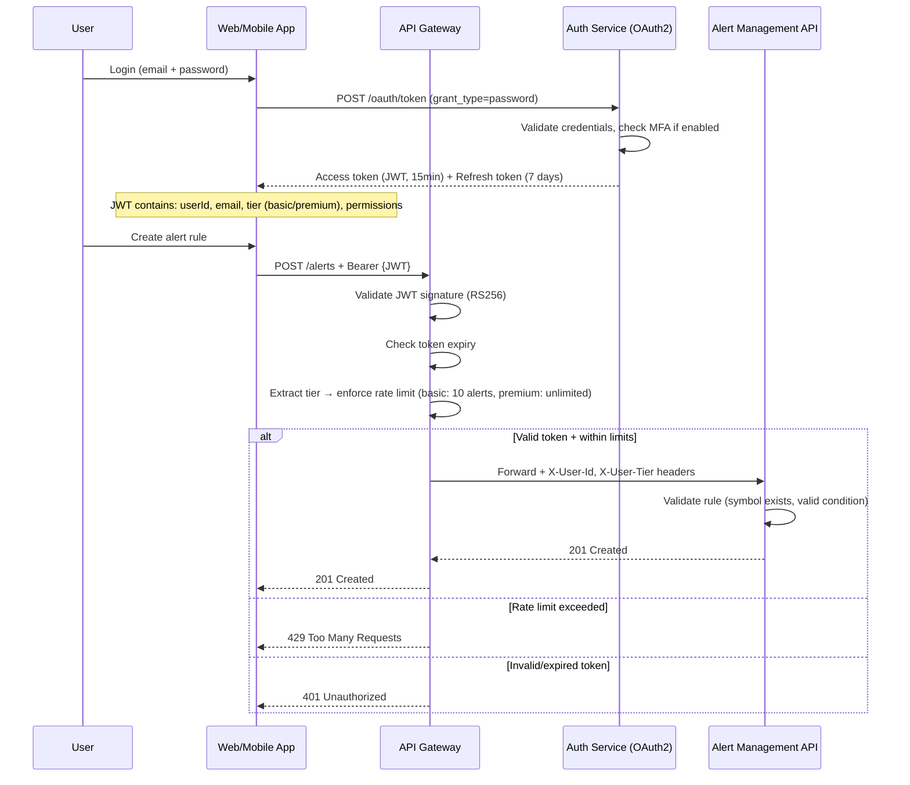
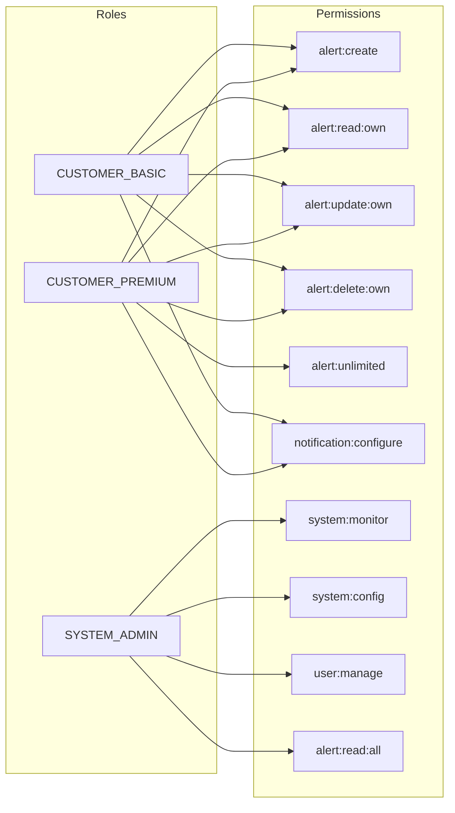

# Security Architecture Overlay — Stock Price Alerts

## Description
Cross-cutting security architecture showing network zones, authentication flows, encryption boundaries, and access control enforcement points for the Stock Price Alert system.

## Network Security Zones

## Authentication & Authorization Flow

## RBAC Model

## Tier-Based Access Control

| Tier | Max Alerts | Notification Channels | Alert Types | Rate Limit |
|------|-----------|----------------------|-------------|------------|
| **Basic** | 10 active | Email only | Price above/below | 5 req/min |
| **Premium** | Unlimited | Email + SMS + Push | All condition types | 60 req/min |
| **Admin** | N/A | N/A | Full system access | 120 req/min |

## Encryption Strategy

| Layer | Mechanism | Scope |
|-------|-----------|-------|
| **In transit (external)** | TLS 1.3 | All client ↔ API communication |
| **In transit (internal)** | mTLS | Service-to-service, Kafka broker-to-broker |
| **At rest (database)** | AES-256 (Transparent Data Encryption) | All PostgreSQL databases |
| **At rest (PII fields)** | Application-level field encryption | Email, phone, device tokens in User DB |
| **Kafka events** | Envelope encryption | AlertTriggered events contain userId — encrypted payload |
| **Redis cache** | AUTH + TLS | In-transit encryption; no PII stored in cache |
| **Secrets management** | HashiCorp Vault / K8s Secrets | API keys, DB credentials, JWT signing keys |

## Security Controls Summary

| Threat | Mitigation |
|--------|-----------|
| **Brute-force login** | Rate limiting + account lockout after 5 failed attempts + MFA |
| **JWT token theft** | Short-lived tokens (15min), refresh token rotation, token binding |
| **Alert enumeration** | Users can only access their own alerts (row-level security) |
| **Notification spam** | Per-user rate limits, cooldown periods, quiet hours |
| **Market data tampering** | Feed ingress via whitelisted IPs only; protocol-level validation |
| **SQL injection** | Parameterized queries, ORM layer, input validation |
| **DDoS on API** | WAF + rate limiting at gateway + auto-scaling |
| **Insider threat** | Admin actions logged to append-only audit DB; least-privilege IAM |
| **Data breach** | Field-level encryption for PII; encryption keys rotated quarterly |

## Compliance & Audit

| Requirement | Implementation |
|-------------|---------------|
| **Audit trail** | All alert CRUD, trigger events, and admin actions logged to immutable audit DB |
| **Data retention** | Alert history: 2 years; audit logs: 5 years; price data: 90 days |
| **Right to deletion (GDPR)** | User deletion cascades to alerts, preferences, and notification history; audit logs anonymized |
| **Breach notification** | Automated detection pipeline; < 72h disclosure SLA |
